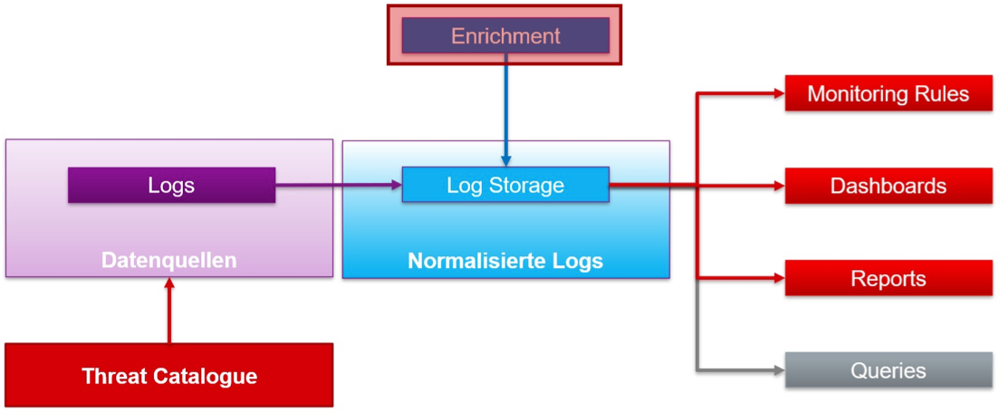
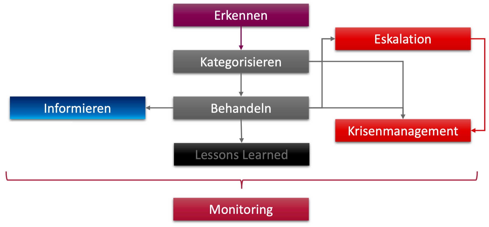
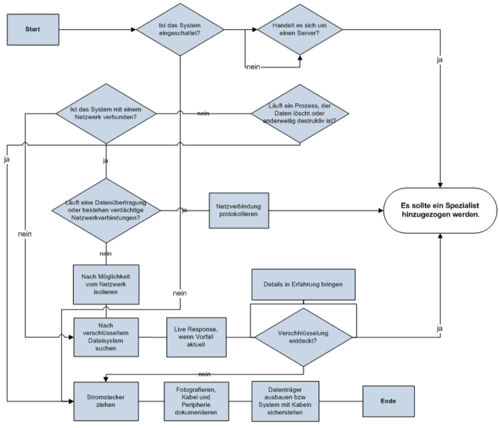

# RISich - Reaktive Informationssicherheit

- [RISich - Reaktive Informationssicherheit](#risich---reaktive-informationssicherheit)
  
  * [1 Grenzen präventiver Sicherheit: Einführung und Grundlagen](#1-grenzen-pr-ventiver-sicherheit--einf-hrung-und-grundlagen)
    
    + [Lernziele](#lernziele)
    + [Vorbereitung](#vorbereitung)
      - [Internet-Protokollfamilie](#internet-protokollfamilie)
        * [ISO/OSI-Referenzmodell](#iso-osi-referenzmodell)
        * [Netzwerkkomponenten](#netzwerkkomponenten)
      - [Das TCP/IP-Referenzmodell](#das-tcp-ip-referenzmodell)
        * [Aufbau eines IP-Pakets](#aufbau-eines-ip-pakets)
        * [IPv6](#ipv6)
      - [Transmission Control Protokoll TCP](#transmission-control-protokoll-tcp)
        * [3-Phasen Handshake](#3-phasen-handshake)
      - [User Datagram Protocol UDP](#user-datagram-protocol-udp)
      - [DHCP und NAT](#dhcp-und-nat)
        * [DHCP](#dhcp)
        * [NAT](#nat)
    + [Sicherheitsprobleme](#sicherheitsprobleme)
    + [Vertraulichkeit, Integrität und Verbindlichkeit](#vertraulichkeit--integrit-t-und-verbindlichkeit)
      - [Vertraulichkeit](#vertraulichkeit)
      - [Integrität](#integrit-t)
      - [Verbindlichkeit](#verbindlichkeit)
      - [Sicherheitsprobleme von IP](#sicherheitsprobleme-von-ip)
        * [IP-Spoofing](#ip-spoo-ng)
        * [Denial-of-Service](#denial-of-service)
      - [Routing-Angriffe](#routing-angriffe)
      - [Sicherheitsprobleme von ICMP - Internet Control Message Protocol](#sicherheitsprobleme-von-icmp---internet-control-message-protocol)
      - [Sicherheitsprobleme von ARP - Address Resolution Protocols](#sicherheitsprobleme-von-arp---address-resolution-protocols)
      - [Sicherheitsprobleme mit IPv6](#sicherheitsprobleme-mit-ipv6)
      - [Sicherheitsprobleme von UDP und TCP](#sicherheitsprobleme-von-udp-und-tcp)
        + [Verbindungsübernahme](#verbindungs-bernahme)
          * [Fazit](#fazit)
      - [Sicherheitsprobleme von Netzdiensten](#sicherheitsprobleme-von-netzdiensten)
        * [Sicherheitsprobleme von DNS](#sicherheitsprobleme-von-dns)
        * [Cachingproblem - Poisoning-Angriff](#cachingproblem---poisoning-angriff)
      - [Sicherheitsprobleme von NFS - Network File System](#sicherheitsprobleme-von-nfs---network-file-system)
        * [Design- und Implementierungsfehler](#design--und-implementierungsfehler)
        * [Administrative Fehler](#administrative-fehler)
    + [Präsenz](#pr-senz)
      - [Lernziele](#lernziele-1)
      - [Agenda](#agenda)
      - [Wiederholung Begriffswelt IT Sicherheit](#wiederholung-begriffswelt-it-sicherheit)
        * [IT-System](#it-system)
        * [Grundlegende Schutzziele](#grundlegende-schutzziele)
        * [Weitere Begrifflichkeiten](#weitere-begrifflichkeiten)
        * [Risikoanalyse Schematischer Ablauf](#risikoanalyse-schematischer-ablauf)
        * [Klassen von Gefährdungsfaktoren](#klassen-von-gef-hrdungsfaktoren)
        * [Weitere Begrifflichkeiten](#weitere-begrifflichkeiten-1)
        * [Sicherheitspolitik](#sicherheitspolitik)
        * [Sicherheitsmassnahme, -mechanismus](#sicherheitsmassnahme---mechanismus)
        * [Sicherheitsarchitektur](#sicherheitsarchitektur)
      - [Grenzen präventiver Sicherheit](#grenzen-pr-ventiver-sicherheit)
        * [Preventive & Detective Controls](#preventive---detective-controls)
      - [Prinzipielle IT Sicherheitsstrategien](#prinzipielle-it-sicherheitsstrategien)
        * [Angriffe vermeiden](#angriffe-vermeiden)
        * [Angriffen entgegenwirken](#angriffen-entgegenwirken)
        * [Angriffe erkennen](#angriffe-erkennen)
      - [Sicherheitskette](#sicherheitskette)
      - [Authentifikation](#authentifikation)
      - [Autorisation (Zugriffsrechte)](#autorisation--zugriffsrechte-)
      - [Anforderungen an Zugriffskontroll-Mechanismen](#anforderungen-an-zugriffskontroll-mechanismen)
      - [Zugriffskontrolle in Netzen durch Firewalls](#zugriffskontrolle-in-netzen-durch-firewalls)
      - [Paketfilter](#paketfilter)
      - [Applikationsspezifische Proxies (application level Applikationsspezifische gateway)](#applikationsspezifische-proxies--application-level-applikationsspezifische-gateway-)
      - [Cyber Security Attacks: Targeted Attacks](#cyber-security-attacks--targeted-attacks)
        * [Begriffe](#begriffe)
        * [Building Blocks](#building-blocks)
        * [Target](#target)
        * [Attack Vector](#attack-vector)
        * [Payload](#payload)
          + [Malware](#malware)
          + [Malware Recycling](#malware-recycling)
          + [Anti-Virus](#anti-virus)
        * [Typisches Beispiel eines gezielten Angriffs](#typisches-beispiel-eines-gezielten-angriffs)
      - [Ransomware](#ransomware)
        * [Verschlüsselungstrojaner (Ransomware, Erpressungstrojaner)](#verschl-sselungstrojaner--ransomware--erpressungstrojaner-)
        * [Präventive Massnahmen (Quelle: MELANI)](#pr-ventive-massnahmen--quelle--melani-)
        * [Massnahmen nach einem erfolgreichen Angriff](#massnahmen-nach-einem-erfolgreichen-angriff)
        * [Für Unternehmen empfiehlt MELANI zusätzlich](#f-r-unternehmen-emp-ehlt-melani-zus-tzlich)
      - [Advanced Persistent Threat (APT)](#advanced-persistent-threat--apt-)
        * [Anatomie eines Advanced Persistent Threat](#anatomie-eines-advanced-persistent-threat)
        * [Gruppenarbeit: Ransomware](#gruppenarbeit--ransomware)
        * [Gruppenarbeit: Ransomware Musterlösung](#gruppenarbeit--ransomware-musterl-sung)
      - [Kill Chain](#kill-chain)
        * [Hase und Igel](#hase-und-igel)
        * [Threat Actors:](#threat-actors-)
        * [Gefahrenlage:](#gefahrenlage-)
        * [Cyber Kill Chain](#cyber-kill-chain)
        * [Cyber Kill Chain – Alternative Darstellung](#cyber-kill-chain---alternative-darstellung)
        * [Formal: Angriffsphasen](#formal--angri-sphasen)
        * [Phase 1: Information Gathering](#phase-1--information-gathering)
        * [Phase 2: Initial Entry](#phase-2--initial-entry)
        * [Phase 2: Initial Entry (Beispiel)](#phase-2--initial-entry--beispiel-)
        * [Phase 3: Post Exploitation](#phase-3--post-exploitation)
        * [Phase 4: Lateral Movement](#phase-4--lateral-movement)
        * [Phase 5: Data ExfiltraHon](#phase-5--data-ex-ltrahon)
        * [Entdeckung von ATPs](#entdeckung-von-atps)
      - [Methoden der Angriffserkennung](#methoden-der-angri-serkennung)
        * [Angriffserkennung: Best Practice](#angriffserkennung--best-practice)
        * [Analyse-/Erkennungsansätze](#analyse--erkennungsans-tze)
        * [Anomalieerkennung](#anomalieerkennung)
        * [Politik-basierte Erkennung](#politik-basierte-erkennung)
        * [Missbrauchserkennung](#missbrauchserkennung)
      - [Diskussion](#diskussion)
        * [Anomalieerkennung](#anomalieerkennung-1)
        * [Politik-basierte Erkennung](#politik-basierte-erkennung-1)
        * [Missbrauchserkennung](#missbrauchserkennung-1)
        * [Hybride / Kombinationen: Stand der Technik](#hybride---kombinationen--stand-der-technik)
      - [Summary](#summary)
        * [Nicht-Traditionelle Analysen](#nicht-traditionelle-analysen)
        * [Post-Intrusion Investigation](#post-intrusion-investigation)
    + [Nachbearbeitung](#nachbearbeitung)
      - [Angriffserkennung (Intrusion Detection)](#angriffserkennung--intrusion-detection-)
      - [Intrusion-Detection-Systeme (IDS)](#intrusion-detection-systeme--ids-)
      - [Audits](#audits)
        * [zustandsbasierten Audit](#zustandsbasierten-audit)
        * [transitions- bzw. aktionsbasierter Audit](#transitions--bzw-aktionsbasierter-audit)
      - [Audit-Records / Audit-Trail](#audit-records---audit-trail)
      - [Anomalieerkennung (Anomaly Detection)](#anomalieerkennung--anomaly-detection-)
      - [Missbrauchserkennung (Misuse Detection)](#missbrauchserkennung--misuse-detection-)
      - [Systemmodell und Informationsarten](#systemmodell-und-informationsarten)
      - [Attackensprachen (Attack Languages)](#attackensprachen--attack-languages-)
      - [Fehlalarme](#fehlalarme)
  
  * [2 Angriffs- und Betrugs-Erkennung: Grundlegende Ansätze](#2-angriffs--und-betrugs-erkennung--grundlegende-ans-tze)
    
    + [Lernziele](#lernziele-2)
    + [Vorbereitung](#vorbereitung-1)
      - [Aufgabe Honeypot Analyse (ca. 7h)](#aufgabe-honeypot-analyse--ca-7h-)
        * [Ziel](#ziel)
        * [Auftrag](#auftrag)
      - [Event-Condition-Action-Regeln (ECA-Regeln)](#event-condition-action-regeln--eca-regeln-)
      - [Ereignisse – Begriffseinführung](#ereignisse---begriffseinf-hrung)
      - [Dimensionen der Semantik von Signaturen](#dimensionen-der-semantik-von-signaturen)
      - [Ereignismuster](#ereignismuster)
      - [Typ und Reihenfolge](#typ-und-reihenfolge)
      - [Häufigkeit](#h-ufigkeit)
      - [Kontinuität](#kontinuit-t)
      - [Nebenläufigkeit](#nebenl-ufigkeit)
      - [Kontextbedingungen](#kontextbedingungen)
      - [Selektion der Schrittinstanzen](#selektion-der-schrittinstanzen)
      - [Konsum von Schrittinstanzen](#konsum-von-schrittinstanzen)
      - [Aktionsfolgen und Aktionssemantik](#aktionsfolgen-und-aktionssemantik)
      - [Auswahl von Schrittkombinationen](#auswahl-von-schrittkombinationen)
      - [Schrittkombinationen](#schrittkombinationen)
      - [Zusammenfassung](#zusammenfassung)
    + [Modell für Angriffssignaturen](#modell-f-r-angriffssignaturen)
    + [Präsenz](#pr-senz-1)
      - [Angriffs- und Betrugserkennung](#angriffs--und-betrugserkennung)
        * [Lernziele](#lernziele-3)
        * [Agenda](#agenda-1)
      - [Angriffs- und Betrugserkennung](#angriffs--und-betrugserkennung-1)
        * [Intrusion](#intrusion)
        * [Intrusion Detection System](#intrusion-detection-system)
        * [HIDS - Host Intrusion Detection System](#hids---host-intrusion-detection-system)
        * [NIDS - Network Intrusion Detection System](#nids---network-intrusion-detection-system)
      - [Angriffs- und Betrugserkennung](#angriffs--und-betrugserkennung-2)
        * [Technik](#technik)
        * [Operationales Modell eines Intrusion-DetectionSystems](#operationales-modell-eines-intrusion-detectionsystems)
        * [Architektur und Komponenten eines IDS](#architektur-und-komponenten-eines-ids)
        * [IDS - Intrusion-Detection-Systeme](#ids---intrusion-detection-systeme)
        * [IDMEF - Intrusion Detection Message Exchange Format](#idmef---intrusion-detection-message-exchange-format)
        * [Probleme und Herausforderungen](#probleme-und-herausforderungen)
      - [Angriffs- und Betrugserkennung](#angri-s--und-betrugserkennung)
        * [Audit](#audit)
        * [Zustands-basiertes Audit](#zustands-basiertes-audit)
        * [Transitions-oder Aktions-basiertes Audit](#transitions-oder-aktions-basiertes-audit)
        * [Architekturelle Unterscheidung von Audit-FunkBonen](#architekturelle-unterscheidung-von-audit-funkbonen)
        * [Anforderungen an Audit-Funktionen](#anforderungen-an-audit-funktionen)
        * [Kontrollen: Quantität](#kontrollen--quantit-t)
        * [Kontrollen: Abdeckung](#kontrollen--abdeckung)
      - [Angriffs- und Betrugserkennung](#angri-s--und-betrugserkennung-1)
        * [Knowledge Discovery in Databases (KDD)](#knowledge-discovery-in-databases--kdd-)
        * [Data Mining](#data-mining)
        * [Clusteranalyse](#clusteranalyse)
        * [Klassifikation/Vorhersage](#klassifikation-vorhersage)
        * [Detection of Abnormal Behavior](#detection-of-abnormal-behavior)
          + [Detection of Abnormal Behavior – Properties](#detection-of-abnormal-behavior---properties)
        * [Automatic Anomaly Detection – Overview](#automatic-anomaly-detection---overview)
      - [Generisches Anomalie Detection System](#generisches-anomalie-detection-system)
      - [Klassifikation von Anomalies](#klassi-kation-von-anomalies)
        * [Anomaly Detection](#anomaly-detection)
        * [Missbrauchserkennung](#missbrauchserkennung-2)
        * [Herausforderungen](#herausforderungen)
      - [Angriffs- und Betrugserkennung](#angriffs--und-betrugserkennung-3)
        * [Definition (Michael Meier)](#definition--michael-meier-)
        * [Client vs. Server Honeypot](#client-vs-server-honeypot)
        * [High vs. Low Interaction Honeypots](#high-vs-low-interaction-honeypots)
        * [Low Interaction Honeypots](#low-interaction-honeypots)
        * [High Interaction Honeypots](#high-interaction-honeypots)
        * [Honeynet](#honeynet)
        * [High Interaction Server Honeypots](#high-interaction-server-honeypots)
        * [Beispiel1 : Low Interaction Server Honeypot](#beispiel1---low-interaction-server-honeypot)
        * [Low Interaction Server Honeypots -MalwareKollektoren](#low-interaction-server-honeypots--malwarekollektoren)
        * [Beispiel 2: Low Interaction Server Honeypots](#beispiel-2--low-interaction-server-honeypots)
        * [Client Honeypots / Honey Clients](#client-honeypots---honey-clients)
        * [Client Honeypots –Architektur und Funktionsweise](#client-honeypots--architektur-und-funktionsweise)
    + [Nachbearbeitung](#nachbearbeitung-1)
  
  * [3 SIEM Konzepte und Komponenten für KMU](#3-siem-konzepte-und-komponenten-f-r-kmu)
    
    + [Lernziele](#lernziele-4)
    + [Vorbereitung](#vorbereitung-2)
    + [Splunk 101](#splunk-101)
      - [Introduction to Splunk](#introduction-to-splunk)
      - [Navigating Splunk](#navigating-splunk)
      - [Splunk Apps](#splunk-apps)
      - [Answer the questions below](#answer-the-questions-below)
      - [Adding Data](#adding-data)
      - [Answer the questions below](#answer-the-questions-below-1)
        * [Upload the tutorial data](#upload-the-tutorial-data)
        * [Use the Add Data wizard](#use-the-add-data-wizard)
        * [Splunk Queries](#splunk-queries)
        * [Answer the questions below](#answer-the-questions-below-2)
      - [Sigma Rules](#sigma-rules)
        * [Answer the questions below](#answer-the-questions-below-3)
      - [Dashboards & Visualizations](#dashboards---visualizations)
      - [Answer the questions below](#answer-the-questions-below-4)
      - [Alerts](#alerts)
      - [Answer the questions below](#answer-the-questions-below-5)
        * [Alert examples](#alert-examples)
        * [Scheduled alert example](#scheduled-alert-example)
          + [Alert example summary](#alert-example-summary)
          + [Set up the alert](#set-up-the-alert)
        * [Real-time alert example](#real-time-alert-example)
          + [Alert example summary](#alert-example-summary-1)
          + [Set up the alert](#set-up-the-alert-1)
          + [Throttle the real-time alert](#throttle-the-real-time-alert)
        * [Custom trigger condition example](#custom-trigger-condition-example)
          + [Alert example summary](#alert-example-summary-2)
          + [Set up the alert](#set-up-the-alert-2)
        * [Conclusion](#conclusion)
    + [Präsenz](#pr-senz-2)
      - [SIEM Konzepte und Komponenten für KMU](#siem-konzepte-und-komponenten-f-r-kmu)
        * [Agenda](#agenda-2)
        * [Lernziele](#lernziele-5)
      - [Grundlegende Ansätze](#grundlegende-ans-tze)
        * [SIEM: Begriff](#siem--begri-)
        * [SIEM: Eigenschaften](#siem--eigenschaften)
        * [SIEM: Typische Features](#siem--typische-features)
        * [SIEM: BIG 3](#siem--big-3)
        * [Was kann SIEM nicht?](#was-kann-siem-nicht-)
        * [SIEM Produkt](#siem-produkt)
        * [SIEM Produkte: Bewegter Markt](#siem-produkte--bewegter-markt)
        * [SIEM Architecture (SPLUNK)](#siem-architecture--splunk-)
      - [SIEM Komponenten](#siem-komponenten)
        * [Logs (Definition)](#logs--definition-)
        * [Machine Data (Definition)](#machine-data--definition-)
        * [Datenquellen](#datenquellen)
        * [Threat Catalogue (DefiniKon)](#threat-catalogue--de-nikon-)
        * [Typical Corporate Environment](#typical-corporate-environment)
        * [Defense in Depth](#defense-in-depth)
        * [Bottom-up Ansatz](#bottom-up-ansatz)
        * [Top-Down Ansatz: Threat Catalogue](#top-down-ansatz--threat-catalogue)
        * [Integration](#integration)
        * [Log Daten und Normalisierung](#log-daten-und-normalisierung)
        * [Kontextinformationen](#kontextinformationen)
        * [Kontext – Enrichment](#kontext---enrichment)
        * [Kontext – Beispiele](#kontext---beispiele)
        * [Monitoring Rules](#monitoring-rules)
        * [Monitoring Rules: Normalisierung](#monitoring-rules--normalisierung)
        * [Dashboards](#dashboards)
        * [Reports](#reports)
        * [Queries](#queries)
        * [SIEM: The Big Picture](#siem--the-big-picture)
        * [Log Management](#log-management)
        * [Log Collection: Optionen](#log-collection--optionen)
        * [Logs von Produktivdaten](#logs-von-produktivdaten)
        * [Logs von Sicherungsdaten](#logs-von-sicherungsdaten)
        * [Logs von Archivdaten](#logs-von-archivdaten)
        * [Log Management Herausforderungen](#log-management-herausforderungen)
        * [Mehrwert durch Log Management](#mehrwert-durch-log-management)
        * [Mehrwert durch Log Management](#mehrwert-durch-log-management-1)
        * [Best Practices für das Log-Management](#best-practices-f-r-das-log-management)
        * [Log Management Infrastructure (NIST)](#log-management-infrastructure--nist-)
        * [Features of the Infrastructure (NIST)](#features-of-the-infrastructure--nist-)
        * [Roles/Responsibilities in Log Management (NIST)](#roles-responsibilities-in-log-management--nist-)
        * [Syslog](#syslog)
        * [Syslog RFC 3164](#syslog-rfc-3164)
        * [Herkunft von Syslog Meldungen](#herkunft-von-syslog-meldungen)
        * [Syslog-ng](#syslog-ng)
      - [Vorgehen zum Aufbau und Einführung](#vorgehen-zum-aufbau-und-einf-hrung)
        * [Wo liegen die Probleme bei einer SIEM Evaluation?](#wo-liegen-die-probleme-bei-einer-siem-evaluation-)
        * [SOC Lifecycle](#soc-lifecycle)
        * [Die Evaluation](#die-evaluation)
        * [Anforderungen definieren](#anforderungen-definieren)
        * [Use Cases festlegen (mit Stakeholder)](#use-cases-festlegen--mit-stakeholder-)
        * [Interessante Use Cases](#interessante-use-cases)
        * [Analyse der Logdaten und deren Quellsysteme](#analyse-der-logdaten-und-deren-quellsysteme)
        * [Netzwerk/Storage](#netzwerk-storage)
        * [System und Sicherheitsanforderungen](#system-und-sicherheitsanforderungen)
        * [Team](#team)
        * [Sind die Anforderungen spezifisch genug?](#sind-die-anforderungen-spezifisch-genug-)
        * [Evaluation](#evaluation)
        * [Proof of Concept durchführen](#proof-of-concept-durchf-hren)
        * [Umsetzung](#umsetzung)
        * [Gruppenarbeit: Use Case Spezifikation](#gruppenarbeit--use-case-spezifikation)
          + [Musterlösung: Use Case Spezifikation](#musterl-sung--use-case-spezifikation)
      - [Managed SIEM Service](#managed-siem-service)
        * [Managed Security Services: Optionen](#managed-security-services--optionen)
        * [Self-Hosted, Self-Managed](#self-hosted--self-managed)
        * [Self-Hosted, MSSP-Managed](#self-hosted--mssp-managed)
        * [Self-Hosted, Jointly-Managed](#self-hosted--jointly-managed)
        * [Cloud, MSSP-Managed](#cloud--mssp-managed)
        * [Cloud, Jointly-Managed](#cloud--jointly-managed)
        * [Hybrid-Model, Jointly-Managed](#hybrid-model--jointly-managed)
        * [Why SIEM implementation fail?](#why-siem-implementation-fail-)
    + [Nachbearbeitung](#nachbearbeitung-2)
  
  * [4 Vorfallbehandlung: Organisation, Rahmenbedingungen und Kommunikation](#4-vorfallbehandlung--organisation--rahmenbedingungen-und-kommunikation)
    
    + [Lernziele](#lernziele-6)
    
    + [Vorbereitung](#vorbereitung-3)
      
      - [**Response-Strategie**](#--response-strategie--)
      
      - [**Gegenangriffe vermeiden!**](#--gegenangriffe-vermeiden---)
      
      - [**Honeypots**](#--honeypots--)
      
      - [Backtracing](#backtracing)
        
        * [Spoof Detection](#spoof-detection)
    
    + [Präsenz](#pr-senz-3)
      
      - [Vorfallbehandlung](#vorfallbehandlung)
      - [Agenda](#agenda-3)
      - [Lernziele](#lernziele-7)
      - [Security Operations Center – SOC](#security-operations-center---soc)
        * [SOC: Ziele](#soc--ziele)
        * [SOC: Big Picture](#soc--big-picture)
        * [SOC: Rollen](#soc--rollen)
        * [Positionen im SOC](#positionen-im-soc)
        * [Governance Modell](#governance-modell)
        * [SOC Organisation: Umfassendes SOC](#soc-organisation--umfassendes-soc)
        * [SOC Organisation: Kleines SOC](#soc-organisation--kleines-soc)
        * [SOC Organisation: Grosses SOC](#soc-organisation--grosses-soc)
        * [SOC: Zusammenspiel](#soc--zusammenspiel)
        * [SOC: Big Picture (Detailliert)](#soc--big-picture--detailliert-)
        * [Typische SOC Architektur](#typische-soc-architektur)
      - [CERT / CSIRT: Aufbau, Einordnung und Aufgaben](#cert---csirt--aufbau--einordnung-und-aufgaben)
        * [Unterschied SOC / CERT / CSIRT / CIRT](#unterschied-soc---cert---csirt---cirt)
        * [Arten von CERTs](#arten-von-certs)
        * [Warum ein CERT für das eigene Unternehmen?](#warum-ein-cert-f-r-das-eigene-unternehmen-)
        * [CERT Einführung (Vorschlag ENISA)](#cert-einf-hrung--vorschlag-enisa-)
        * [Mission Statement](#mission-statement)
        * [S-CERT](#s-cert)
          + [Prävention, um Schäden zu verhindern:](#pr-vention--um-sch-den-zu-verhindern-)
          + [Reaktion, zur Hilfe im Notfall:](#reaktion--zur-hilfe-im-notfall-)
          + [Nachhaltigkeit, um das erforderliche Sicherheitsniveau zu halten:](#nachhaltigkeit--um-das-erforderliche-sicherheitsniveau-zu-halten-)
        * [Bestimmen der Zielgruppe](#bestimmen-der-zielgruppe)
        * [CERT Servicekatalog](#cert-servicekatalog)
        * [Einbindung in die Organisation](#einbindung-in-die-organisation)
        * [Beispiele für organisatorische Einbettung](#beispiele-f-r-organisatorische-einbettung)
        * [Organiationsstruktur](#organiationsstruktur)
        * [Aufgaben des Experten](#aufgaben-des-experten)
        * [Beziehung zu anderen Teams](#beziehung-zu-anderen-teams)
        * [Was wird gemeldet?](#was-wird-gemeldet-)
        * [Kosten für ein CERT](#kosten-f-r-ein-cert)
        * [Kritische Erfolgsfaktoren](#kritische-erfolgsfaktoren)
        * [Sichtbarkeit und QS](#sichtbarkeit-und-qs)
        * [Nutzen eines CSIRT](#nutzen-eines-csirt)
        * [Literatur](#literatur)
      - [Security Incident Management: Konzepte, Ansätze, Methoden, Werkzeuge und Techniken](#security-incident-management--konzepte--ans-tze--methoden--werkzeuge-und-techniken)
        * [Vorfallbehandlung (aka: Security Incident Management)](#vorfallbehandlung--aka--security-incident-management-)
        * [Incident Management & Handling](#incident-management---handling)
        * [Security Incident Management Standards](#security-incident-management-standards)
        * [ISO/IEC 27035:](#iso-iec-27035-)
        * [NIST 800-61:](#nist-800-61-)
        * [Post-Incident Activity is crucial as learning and improving](#post-incident-activity-is-crucial-as-learning-and-improving)
        * [Security Incident Management Prozess: Vorgehensmodell](#security-incident-management-prozess--vorgehensmodell)
          + [Beispiel: IT Infrastructure Library (ITIL)](#beispiel--it-infrastructure-library--itil-)
          + [Beispiel: ENISA](#beispiel--enisa)
          + [Beispiel: SOC Incident Management Prozess](#beispiel--soc-incident-management-prozess)
        * [Gemeinsame Sprache: Kategorisierung](#gemeinsame-sprache--kategorisierung)
          + [Kategorisierung: Quellen](#kategorisierung--quellen)
        * [Risikobewertung](#risikobewertung)
      - [Informationsfluss](#informationsfluss)
        * [Eingehende Informationsflüsse](#eingehende-informationsfl-sse)
        * [Ausgehende Informationsflüsse](#ausgehende-informationsfl-sse)
        * [Incident- & Krisenmanagement](#incident----krisenmanagement)
        * [Eskalationskriterien](#eskalationskriterien)
        * [Eskalationsstufen (1/4)](#eskalationsstufen--1-4-)
        * [Eskalationsstufen (2/4)](#eskalationsstufen--2-4-)
        * [Eskalationsstufen (3/4)](#eskalationsstufen--3-4-)
        * [Eskalationsstufen (4/4)](#eskalationsstufen--4-4-)
        * [Dokumentieren, Messen & Reporting](#dokumentieren--messen---reporting)
        * [Nach dem Incident](#nach-dem-incident)
        * [Continuous Service Improvement](#continuous-service-improvement)
        * [Tabletop Exercise (1/2)](#tabletop-exercise--1-2-)
        * [Tabletop Exercise (2/2)](#tabletop-exercise--2-2-)
    
    + [Nachbearbeitung](#nachbearbeitung-3)
  
  * [5 IT Forensik](#5-it-forensik)
    
    + [Lernziele](#lernziele-8)
    + [Vorbereitung](#vorbereitung-4)
    + [Präsenz](#pr-senz-4)
      - [Agenda](#agenda-4)
      - [Lernziele](#lernziele-9)
      - [Einführung](#einf-hrung)
        * [Definition](#definition)
        * [Forensik](#forensik)
        * [Teilgebiete der Forensik](#teilgebiete-der-forensik)
        * [Forensik und BCM](#forensik-und-bcm)
        * [Historie](#historie)
        * [Spur](#spur)
        * [Indiz, Beweis](#indiz--beweis)
        * [Aufgaben der Forensik im Einzelnen](#aufgaben-der-forensik-im-einzelnen)
        * [Das Locardsche Austauschprinzip: Einführung](#das-locardsche-austauschprinzip--einf-hrung)
        * [Das Locardsche Austauschprinzip: Übersicht](#das-locardsche-austauschprinzip---bersicht)
        * [Das Locardsche Austauschprinzip: Zitat](#das-locardsche-austauschprinzip--zitat)
        * [IT-Forensik](#it-forensik)
        * [Kurzabriss: Tools](#kurzabriss--tools)
        * [Sieben W-Fragen der Kriminalistik](#sieben-w-fragen-der-kriminalistik)
        * [Anforderungen an IT-Forensik (BSI Leitfaden)](#anforderungen-an-it-forensik--bsi-leitfaden-)
        * [Chain of Custody](#chain-of-custody)
      - [Prinzipien und Vorgehensmodelle](#prinzipien-und-vorgehensmodelle)
        * [Zum Begriff 'Digitale Forensik'](#zum-begriff--digitale-forensik-)
        * [Digitale Spur](#digitale-spur)
        * [Wo entstehen digitale Spuren?](#wo-entstehen-digitale-spuren-)
        * [Beispiele für lokale digitale Spuren](#beispiele-f-r-lokale-digitale-spuren)
        * [Beispiele für nicht-lokale digitale Spuren](#beispiele-f-r-nicht-lokale-digitale-spuren)
        * [Digitale Spuren vs. Physische Spuren](#digitale-spuren-vs-physische-spuren)
        * [Beispiel für Interpretationsebenen: Text-Datei](#beispiel-f-r-interpretationsebenen--text-datei)
        * [Vermeidbare vs unvermeidbare digitale Spuren](#vermeidbare-vs-unvermeidbare-digitale-spuren)
        * [Manipulation und Zuordnung digitaler Spuren](#manipulation-und-zuordnung-digitaler-spuren)
        * [Forensische Vorteile digitaler Spuren](#forensische-vorteile-digitaler-spuren)
        * [Forensische Nachteile digitaler Spuren](#forensische-nachteile-digitaler-spuren)
        * [Grösse der Zustandsmenge](#gr-sse-der-zustandsmenge)
        * [Klassifikation digitaler Spuren](#klassifikation-digitaler-spuren)
        * [Übertragung von Locards Prinzip auf digitale Spuren](#-bertragung-von-locards-prinzip-auf-digitale-spuren)
        * [Vorgehensmodelle](#vorgehensmodelle)
        * [CFFTPM](#cfftpm)
        * [BSI-Vorgehensmodell: Übersicht](#bsi-vorgehensmodell---bersicht)
        * [BSI-Vorgehensmodell: Phase 1 + Phase 2](#bsi-vorgehensmodell--phase-1---phase-2)
        * [BSI-Vorgehensmodell: Phase 3 + Phase 4](#bsi-vorgehensmodell--phase-3---phase-4)
        * [BSI-Vorgehensmodell: Phase 5 + Phase 6](#bsi-vorgehensmodell--phase-5---phase-6)
        * [Digital Investigation Process Model](#digital-investigation-process-model)
        * [Digital Crime Scene Investigation Phases](#digital-crime-scene-investigation-phases)
        * [Digital Evidence Searching Phase](#digital-evidence-searching-phase)
        * [Event Reconstruction Phase](#event-reconstruction-phase)
        * [Live Response Analyse](#live-response-analyse)
        * [Post Mortem Analyse](#post-mortem-analyse)
        * [System laufen lassen oder ausschalten?](#system-laufen-lassen-oder-ausschalten-)
        * [Forensische Images](#forensische-images)
        * [Vorgehensmodell für mobile Endgeräte (NIST)](#vorgehensmodell-f-r-mobile-endger-te--nist-)
      - [Datenträgeranalyse](#datentr-geranalyse)
        * [Erstellung der Arbeitskopien](#erstellung-der-arbeitskopien)
        * [Sektor, Partitionierung](#sektor--partitionierung)
      - [Dateisystemanalyse](#dateisystemanalyse)
        * [Grundlagen](#grundlagen)
        * [Beispiele für Dateisysteme](#beispiele-f-r-dateisysteme)
        * [Kategorien von Brian Carrier](#kategorien-von-brian-carrier)
        * [Kategorien von Brian Carrier](#kategorien-von-brian-carrier-1)
      - [Memory Forensic](#memory-forensic)
      - [Netzwerk Forensik](#netzwerk-forensik)
      - [Mobile Device Forensik](#mobile-device-forensik)
        * [Reverse Engineering](#reverse-engineering)
      - [Forensic Readiness](#forensic-readiness)
        * [Forensik in der Firma](#forensik-in-der-firma)
        * [Forensic Readiness](#forensic-readiness-1)
        * [10 Steps to Forensic Readiness (Robert Rowlingson, QinetiQ Ltd.)](#10-steps-to-forensic-readiness--robert-rowlingson--qinetiq-ltd-)
        * [Problembereiche](#problembereiche)
        * [Incident Response vs. Investigative Process](#incident-response-vs-investigative-process)
        * [Schlussbemerkungen](#schlussbemerkungen)
    + [Nachbearbeitung](#nachbearbeitung-4)
  
  * [Prüfungsvorbereitung (Aufwand individuell)](#pr-fungsvorbereitung--aufwand-individuell-)
    
    + [1 Grenzen präventiver Sicherheit (20 Punkte)](#1-grenzen-pr-ventiver-sicherheit--20-punkte-)
      - [1.1 Begrifflichkeiten (5 Punkte)](#11-begrifflichkeiten--5-punkte-)
      - [1.2 Hauptfrage (15 Punkte)](#12-hauptfrage--15-punkte-)
    + [2 Angriffs- und Betrugserkennung (20 Punkte)](#2-angriffs--und-betrugserkennung--20-punkte-)
      - [2.1 Begrifflichkeiten (5 Punkte)](#21-begrifflichkeiten--5-punkte-)
      - [2.2 Hauptfrage (15 Punkte)](#22-hauptfrage--15-punkte-)
    + [3 SIEM Konzepte und Komponenten für KMU (20 Punkte)](#3-siem-konzepte-und-komponenten-f-r-kmu--20-punkte-)
      - [3.1 Begrifflichkeiten (5 Punkte)](#31-begrifflichkeiten--5-punkte-)
      - [3.2 Hauptfrage (15 Punkte)](#32-hauptfrage--15-punkte-)
    + [4 Vorfallbehandlung](#4-vorfallbehandlung)
      - [4.1 Begrifflichkeiten (5 Punkte)](#41-begrifflichkeiten--5-punkte-)
      - [4.2 Hauptfrage (16 Punkte)](#42-hauptfrage--16-punkte-)
    + [5 IT Forensik](#5-it-forensik-1)
      - [5.1 Begrifflichkeiten (5 Punkte)](#51-begrifflichkeiten--5-punkte-)
      - [5.2 Hauptfrage (16 Punkte)](#52-hauptfrage--16-punkte-)

**“Security is a process, not a product”**

Cyber Security Labors, benötigen Sie Zugriff auf den FTP Server (sftp://sftp2.securnite.com).
Mit den folgenden Zugangsdaten können Sie sich mit dem FTP-Server verbinden und das Docker-Image herunterladen.

---

## 1 Grenzen präventiver Sicherheit: Einführung und Grundlagen

### Lernziele

- Ich kenne typische Bedrohungen und Massnahmen im Bereich Cybersecurity.
- Ich kann die Herausforderungen von APTs und Targeted Attacks erklären.
- Ich kann Praxisbeispiele von typischen Attacken nennen und die richtigen präventiven Massnahmen treffen.
- Ich kann die Grenzen präventiver Massnahmen aufzeigen.
- Ich weiss, wie ich Angriffe auf Netzwerk- oder Systemebene erkennen kann.

### Vorbereitung

- Lesen C. Eckert: Kapitel 3, Unterkapitel 14.2 bis einschliesslich 14.5 (ca. 5h) Aufgabe
- Lesen: Analyse des Spionagefalls bei der RUAG (ca. 5h) Aufgabe
- Repetition OWASP TOP 10 aus dem Modul Informationssicherheit (ca. 6h) Aufgabe
- [Multiple Choice Fragen zur Wiederholung Modul ISichTest](https://moodle.ffhs.ch/mod/quiz/view.php?id=3844554)

#### Internet-Protokollfamilie

##### ISO/OSI-Referenzmodell


##### Netzwerkkomponenten


#### Das TCP/IP-Referenzmodell


##### Aufbau eines IP-Pakets


##### IPv6

Der Sicherheitsstandard IPSec (siehe Kapitel 14.3) ist ursprünglich im Zusammenhang mit IPv6 entwickelt worden. In IPv6 ist die Unterstützung von IPSec zwar zwingend vorgeschrieben, dessen Nutzung bleibt jedoch den Netzadministratoren überlassen. IPSec bietet mit den beiden Protokollen AH (Authentication Header) und ESP Encapsulatinng Security Payload die Möglichkeit, IP-Pakete zu verschlüsseln (ESP) und die Absenderauthentizität des Pakets über einen MAC-Code (AH) zu prüfen. Zur Unterstützung von IPSec verwendet IPv6 IPSec entsprechende Extension Header, also einen Authentication Header und einen ESP Header.

#### Transmission Control Protokoll TCP

##### 3-Phasen Handshake


#### User Datagram Protocol UDP

#### DHCP und NAT

##### DHCP

Damit ein Rechner über das Internet Daten versenden und empfangen kann, muss er eine IP-Adresse besitzen (vgl. Seite 108). Da der Bereich der verfügbaren IP-Adressen in der Version IPv4 jedoch begrenzt ist (IP-Adressen haben nur eine Länge von 32-Bit), ist es wünschenswert, entweder erst beim Netzzugang dynamisch eine IP-Adresse zu erhalten, die dann nur eine gewisse Zeit gültig ist, oder den gleichen Adressbereich für verschiedene Netzdomänen verwenden zu können. Die dynamische Zuordnung von IP-Adressen ist die Aufgabe des Dynamic Host Configuration Protocols (DHCP), dessen Funktionsweise in den RFCs 5 2131 und 2132 spezifiziert ist. Beim Aufbau der Netzverbindung, das ist zum Beispiel beim Booten des Systems, fragt der DHCP-Client des Rechners in einer Broadcastnachricht nach einer eindeutigen IP-Adresse. Alle DHCP-Server, die diese Nachricht empfangen, antworten mit einem IP-Adressen-Angebot. Der Client nimmt das erste Angebot, das er empfängt, an und fordert über eine RequestNachricht diese IP-Adresse vom Anbieter an. Der anbietende DHCP-Server vergibt die IP-Adresse und macht dies durch ein Acknowledgement bekannt.

Jede solche dynamisch zugeteilte IP-Adresse ist jedoch nur für eine gewisse Zeitspanne gültig, sie ist sozusagen für eine gewisse Zeit gemietet (engl. lease). Falls der DHCP-Client nicht rechtzeitig eine Verlängerung der Gültigkeit beantragt, ist die IP-Adresse nach Ablauf der Gültigkeitsdauer für den Client nicht mehr verwendbar und der Server kann sie erneut vergeben.

##### NAT

Die Wiederverwendung von IP-Adressen einer Netzwerk-Domäne wird vom Network Address Translation Protokoll (NAT) unterstützt. Bei der Netzwerkadressübersetzung wird auf einem Router oder Server eine NAT-Tabelle verwaltet. Der Router bzw. Server ist ein Gateway zum Internet, das eine global eindeutige IP-Adresse besitzt. Eine solche Komponente, die die Adressumsetzung durchführt, wird auch häufig als NAT-Box bezeichnet. Eine NAT-Box hat die Aufgabe, in den Datenpaketen, die von einem Rechner innerhalb der Netzdomäne an das Internet weitergeleitet werden sollen, die nur lokal gültige Absender-IP-Adresse durch eine global eindeutige IP-Adresse zu ersetzen. Die Zuordnung zwischen globaler Adresse und domänenlokaler Adresse wird in der NAT-Tabelle verwaltet, so dass die NAT-Box Antwort-Pakete von Rechnern aus dem Internet, die nur die globale Adresse kennen, korrekt an den lokalen Rechner weiterleiten kann. Dies ist zum Beispiel beim WWW-Zugriff des Domänen-Rechners notwendig.


### Sicherheitsprobleme

### Vertraulichkeit, Integrität und Verbindlichkeit

#### Vertraulichkeit

Weder die Nutzdaten noch die Verwaltungsdaten (Headerdaten) eines IPPakets werden vor der Übertragung verschlüsselt. Das bedeutet, dass auf allen Kommunikationsverbindungen sowie in allen Vermittlungsstellen diese Daten im Klartext vorliegen. Nutzdaten können z.B. vertrauliche Passwörter, die für ein entferntes Login benötigt werden 6 , vertrauliche Firmendaten oder personenbezogene, vertrauliche Daten beinhalten; sie werden vor unautorisiertem Lesen nicht geschützt. Die Offenlegung aller Verkehrsdaten kann von Angreifern für die Durchführung von Verkehrsflussanalysen ausgenutzt werden. Das bedeutet, dass anhand der Sende- und Empfangsadressen Zugriffs- und Kommunikationsprofile erstellbar sind. Anonymität wird somit ebenfalls nicht gewährleistet.

#### Integrität

Das Internet-Protokoll stellt auch keine Mechanismen wie der Hashfunktionen oder Message Authentication Codes zur Überprüfung der Integrität der übertragenen Nutzdaten zur Verfügung, so dass es dem Empfänger eines Nachrichtenpaketes nicht möglich ist, unautorisierte Modifikationen zu erkennen und Maßnahmen zur Abwehr der daraus resultierenden Angriffe zu ergreifen. Die in den Standardprotokollen verwendeten Prüfsummenverfahren wie CRC dienen zur Erkennung von Bitübertragungsfehlern, sind aber ungeeignet, gezielte Manipulationen zu erkennen, da ein Angreifer mit den manipulierten Daten auch deren korrekte Prüfsumme berechnen und in das Datenpaket integrieren kann.

#### Verbindlichkeit

Die Identifikation der Kommunikationspartner erfolgt anhand der in den IP-Paketen eingetragenen, jedoch nicht fälschungssicheren IP-Adressen. Weitere Maßnahmen, wie digitale Signaturen, um transferierte Daten den absendenden Prozessen bzw. Benutzern zuzuordnen, werden nicht ergriffen. Das hat zur Konsequenz, dass IP-basierte Aktionen ohne zusätzliche Maßnahmen nicht verbindlich sind.

Bedrohungen der Vertraulichkeit, Integrität und Verfügbarkeit des IPProtokolls gehen auch von den so genannten Routing-Angriffen aus, auf die wir im Folgenden noch kurz eingehen.

#### Sicherheitsprobleme von IP

##### IP-Spoofing

Beim Address Spoofing erzeugt der Angreifer synthetisch hergestellte IP-Pakete mit gefälschter IP-Sendeadresse, um zum Beispiel in einem fremden Netzwerk Pakete einer internen Station oder die Identität eines spezifischen Rechners vorzutäuschen.

##### Denial-of-Service

Zur Durchführung der oben erwähnten Denial-of-Service Angriffe wurden so genannte Zombie-Rechner verwendet. Dabei handelt es sich um Unix-, Linux- oder auch Windows-basierte PCs oder Servermaschinen innerhalb des Internets, die von einem Angreifer unterwandert und zur Durchführung der DoS-Angriffe vorbereitet wurden.

DDoS

UDP-flood Angriff

SYN-flood-Angriff

Smurf-Angriff

#### Routing-Angriffe

Strict Source

Loose Source

RIP - Routing Information Protocol

#### Sicherheitsprobleme von ICMP - Internet Control Message Protocol

Verbindungsabbruch - Angriffe zum Abbruch von Verbindungen

Denial-of-Service - Angriffe zur Erhöhung der Netzlast

source quench - DDoS - Dedizierte Denial-of-Service Angriffe

Ping-to-death - DDoS - Dedizierte Denial-of-Service Angriffe

redirect - Gezieltes Umleiten von Paketen

#### Sicherheitsprobleme von ARP - Address Resolution Protocols

Maskierung - ARP-Cache-Poisoning

Broadcast-Sturm - Denial-of-Service-Angriffe

#### Sicherheitsprobleme mit IPv6

Suchraumverkleinerung

Extension Header

ICMPv6

NDP - Neighbor Discovery Protocol

Implementierung

#### Sicherheitsprobleme von UDP und TCP

verbindungsloses UDP

Sequenznummerangriff unter TCP


###### Verbindungsübernahme

Session Hijacking

desynchronisieren

##### Fazit

Die Sicherheitsprobleme von TCP, UDP sowie IP verdeutlichen, dass die IP-Protokollfamilie ungeeignet ist, um darauf sicherheitskritische Anwendungsdienste, wie Internet-Homebanking oder E-Commerce Anwendungen, ohne zusätzliche Sicherheitsfunktionen aufzusetzen.

#### Sicherheitsprobleme von Netzdiensten

Zu den größten Gefährdungen bei der Nutzung der Internetdienste zählen der Verlust der Vertraulichkeit durch ein unautorisiertes Lesen der übertragenen Daten und der Verlust der Integrität durch die Manipulation der Daten.

Sniffer - (u.a. snoop, ethload, nfswatch)

Replay

##### Sicherheitsprobleme von DNS

DNS-Spoofing


Angriffsabwehr:

Zur Abwehr dieser Angriffe wird in aktuellen Versionen der angesprochenen r-Dienste ein doppeltes Reverse Lookup durchgeführt. Das bedeutet, dass ausgehend von dem vom DNS-Server ermittelten Domänennamen die zugehörige IP-Adresse in der Forward-Zonen-Datenbank erfragt wird und auf diese Weise die Fälschung erkannt werden kann.

##### Cachingproblem - Poisoning-Angriff


Die Sicherheitsprobleme von DNS haben erneut verdeutlicht, dass eine Authentifikation allein auf der Basis von IP-Adressen und Domänennamen unzureichend ist.

#### Sicherheitsprobleme von NFS - Network File System

Das Network File System NFS von Sun Microsystems ist ein verteiltes Dateisystem, das den entfernten Zugriff auf Dateien, die auf einem Server verwaltet werden, ermöglicht.


##### Design- und Implementierungsfehler

Mount-Protokoll

Zugriffskontrolle

NFS-Maskierungsangriff

zustandsloser Server

##### Administrative Fehler

Datei-Export

Schreib-Rechte

blob (binary large object)

### Präsenz

Programm

- 10'    Begrüssung und Agenda
- 10'    Besprechen von Fragen aus der Vorbereitung
- 5'    Festlegung der Gruppen für die Gruppenarbeit in PVA sowie für die Nacharbeit bzw. Vorbereitung verschiedener PVA
- 25'    Gruppenarbeit: Begriffswelt IT Sicherheit
- 15'    Übung/ Gruppenarbeit: Überblick präventiver Massnahmen der Informationssicherheit
- 10'    Präsentation: Targeted attacks (Beispiel Spher phishing)
- 15'    Pause
- 15'    Lehrgespräch: APT (Hintergrund, Adversary Model, Intrusion Kill Chain)
- 30'    Gruppenarbeit  Ransomware
- 15'    Diskussion: Grenzen präventiver Sicherheit (Änderungen vorbehalten)
- 10'    Lehrgespräch: Intrusion tolerance vs. Angriffserkennung & Abwehr
- 15'    Didaktischer Puffer: Fragerunde/Diskussionsrunde zur PVA und bereits gestellter Übungsaufgaben in den Räumlichkeiten der FFHS bis zum planmässigen Ende der PVA.

APT - Advanced persistent threat

https://en.wikipedia.org/wiki/Advanced_persistent_threat

CMDB - Configuration Management Database

https://de.wikipedia.org/wiki/Configuration_Management_Database

#### Lernziele

- Ich kenne typische Bedrohungen und Massnahmen im Bereich Cybersecurity.
- Ich kann die Herausforderungen von APTs und Targeted Attacks erklären.
- Ich kann Praxisbeispiele von typischen Attacken nennen und die richtigen präventiven Massnahmen treffen.
- Ich kann die Grenzen präventiver Massnahmen aufzeigen.
- Ich weiss, wie ich Angriffe auf Netzwerk- oder Systemebene erkennen kann.

#### Agenda

- Wiederholung Begriffswelt IT Sicherheit 
- Präventive Massnahmen der Informationssicherheit 
- Zugriffskontrolle 
- Cyber Security: Targeted Attacks, Ransomware, APT 
- Kill Chain 
- Methoden der Angriffserkennung

#### Wiederholung Begriffswelt IT Sicherheit

##### IT-System

- IT-System: technisches System mit der Fähigkeit zur Speicherung und Verarbeitung von Informationen 
- Information wird durch Daten repräsentiert und ergibt sich durch eine festgelegte Interpretation der Daten 
- Objekte: repräsentieren Informationen
  - passive Objekte (z.B. Dateien): Fähigkeit zur Speicherung von Informationen 
  - aktive Objekte (z.B. Prozesse): Fähigkeit zur Speicherung und Verarbeitung von Informationen 
  - Assets: Informationen und Objekte, die sie repräsentieren sind die schützenswerten Güter (asset) eines Systems
- Subjekte: Benutzer oder aktive Objekte die im Auftrag von Benutzern aktiv sind (z.B. Prozesse, Server, Prozeduren)
- Zugriffe: Interaktionen zwischen einem Subjekt und einem Objekt durch die Informationsfluss auftritt
- Zugriff auf Datenobjekt ist gleichzeitig Zugriff auf die dadurch repräsentierte Information

##### Grundlegende Schutzziele

- Definition: Vertraulichkeit (confidentiality) 
  - keine unautorisierte Kenntnisnahme 
- Definition: Integrität (integrity)
  - keine unautorisierte unbemerkte Datenmanipulation
- Definition: Verfügbarkeit (availability) 
  - autorisierte Subjekte können ihre Berechtigung ohne unautorisierte Beeinträchtigung wahrnehmen 
- Definition: Zurechenbarkeit (accountability)
  - sicherheitsrelevante Aktivitäten eines Subjekts sind diesem eindeutig zurechenbar

##### Weitere Begrifflichkeiten

- Schwachstelle (weakness): Schwäche eines Systems, an dem es verwundbar ist
  - Diebstahlgefahr mobiler Geräte physische Schwachstelle 
  - Naturkatastrophen sind natürliche Schwachstellen 
  - Programme mit fehlender Eingabeüberprüfung sind softwarebedingte Schwachstellen
- Verwundbarkeit (vulnerability): Schwachstelle, über die die Sicherheitsdienste umgangen, getäuscht oder unautorisiert modifiziert werden können 
- Exploit: Vorgehensweise (z.B. Software oder Folge von Befehlen) zur Ausnutzung einer Verwundbarkeit 
- Zero-Day-Exploit: Exploit, der eingesetzt wird, bevor es einen Patch als Gegenmaßnahme gibt.
  - Entwickler haben dadurch keine Zeit („null Tage“ englisch zero day), die Software so zu verbessern, dass der Exploit unwirksam wird, um so deren Nutzer zu schützen.
- Bedrohung (threat): potentieller Verlust eines Schutzziels durch Ausnutzung von Schwachstellen oder Exploits
- Risiko einer Bedrohung (risk): Eintrittswahrscheinlichkeit (oder relative Häufigkeit) eines Schadensereignisses und Höhe des potentiellen Schadens

##### Risikoanalyse Schematischer Ablauf


##### Klassen von Gefährdungsfaktoren

| **Höhere Gewalt** |
| ----------------- |
| •Blitzschlag      |
| •Feuer            |
| •Überschwemmung   |
| •Erdbeben         |
| •Demonstration    |
| •Streik           |

| **Fahrlässigkeit**       |
| ------------------------ |
| •Irrtum                  |
| •Fehlbedingung           |
| •unsachgemäße Behandlung |

| **Vorsatz**   |
| ------------- |
| •Manipulation |
| •Einbruch     |
| •Hacking      |
| •Vandalismus  |
| •Spionage     |
| •Sabotage     |

| **Technisches Versagen** |
| ------------------------ |
| •Stromausfall            |
| •Hardware‐Ausfall        |
| •Fehlfunktion            |

| **Organisatorische Mängel** |
| --------------------------- |
| •unberechtigter Zugriff     |
| •Raubkopie                  |
| •ungeschultes Personal      |

##### Weitere Begrifflichkeiten

- Angriff (attack, intrusion) nicht autorisierter Zugriff bzw. Zugriffsversuch
- Klassen von Angriffen
- passive Angriffe
  - Sniffing (Abhören, Belauschen) 
- aktive Angriffe 
  - Spoofing (Vortäuschen falscher Identitäten) 
  - Denial of Service (gezielte Beeinträchtigungen der Verfügbarkeit)

##### Sicherheitspolitik

- Definition: Sicherheitspolitik (security policy): Menge von technischen und organisatorischen Regeln, Verhaltensrichtlinien, Verantwortlichkeiten, Rollen und Maßnahmen, um Schutzziele zu erreichen.

##### Sicherheitsmassnahme, -mechanismus

- Definition: Sicherheitsmaßnahme, -mechanismus (safeguard, security measure):
  - Bestandteil der Systemarchitektur, der festgelegte Schutzziele durchsetzt und 
  - die Verwaltung sicherheitsrelevanter Informationen und Konzepte realisiert

##### Sicherheitsarchitektur


#### Grenzen präventiver Sicherheit

##### Preventive & Detective Controls

- Kontrollen werden grob in zwei Kategorien unterteilt: 
- Preventive Control (Vorgelagerte Kontrolle) 
  - Eine Kontrolle, welche verhindert, dass ein Ereignis eintritt 
- Detective Control (Nachgelagerte Kontrolle)
  - Eine Kontrolle, welche erkennt, dass ein Ereignis eingetreten ist

| Preventive                    | Detective                           |
| ----------------------------- | ----------------------------------- |
| Abgeschlossene Türen          | Einbruchsalarm                      |
| 4-Augen Prinzip bei Buchungen | Kontrolle der ausgehenden Zahlungen |
| Firewall                      | Intrusion Detection System          |
| ISMS                          | Internal Audit                      |
| Access Control                | Logs                                |

- Preventive Controls sind vorzuziehen, aber nicht immer möglich

#### Prinzipielle IT Sicherheitsstrategien

##### Angriffe vermeiden

- Verringern des Risikos durch Reduktion der Exposure 

- Beispiele:
  
  - Nicht alle IT-Systeme ans Internet anschließen 
  - So wenig wie möglich Daten generieren 
  - Keine Technologie mit Schwachstellen verwenden (z.B. Browser, Betriebssysteme, Internet-Dienste, ...) --> Schwachstellenampel vom BSI

- Bewertung der Strategie ‚Vermeidung‘:
  
  - Vermeidung von Angriffen ist die beste IT-Sicherheitsstrategie 
  - Ist nur begrenzt umsetzbar, wenn wir IT mit allen Vorteilen nutzen wollen

##### Angriffen entgegenwirken

- IT Sicherheitstechnologien mit hoher Wirkung gegen Angriffe einsetzen 

- Beispiele:
  
  - Verschlüsselung, Sicherheitssoftware (Antivirus, Firewall, Authentisierung / Autorisierung, …)

- Bewertung der Strategie ‚Entgegenwirken‘:
  
  - Meistverwendete IT Sicherheitsstrategie 
  - Es gibt nicht genug wirkungsvolle und vertrauenswürdige IT-Sicherheitstechnologie: die Industrie lebt ‚Security by design‘ noch nicht nachhaltig und Regierungen arbeiten teils auch aktiv gegen Security (z.B. schlechte Zufallszahlengeneratoren oder Zurückhalten von Zero Day Expoits) Beispiele, bei denen ein hoher Nachholbedarf besteht:
    - Verschlüsselungssicherheitssysteme (Datei-, Festplatten-, E-Mail-Verschlüsselung, VPN-Systeme, SSL, ...), Authentikationsverfahren (Challenge-Response, globale Identität, Föderation, ...), Vertrauenswürdige IT-Systeme (Security Kernel, Isolierung & Separierung, …), ...

##### Angriffe erkennen

- Angriffe, die nicht verhindert werden (können) sollen zumindest so schnell als möglich erkannt werden, damit der Schaden minimiert Prinzipielle Sicherheitsstrategien werden kann.  

- Beispiele:
  
  - IT-Sicherheitssysteme, die Warnungen erzeugen, wenn Angriffe mit Hilfe von Angriffssignaturen oder Generell IT-Sicherheitssysteme, Anomalien erkannt werden: Intrusion Detection Systems, Security Incident and Event Management  (SIEM) Systeme, …

- Bewertung der Strategie ‚Erkennen‘:
  
  - Grundsätzlich sehr hilfreich, hat leider aber Grenzen.


#### Sicherheitskette


#### Authentifikation

- Verifikation der korrekten Zuordnung von Merkmalen wie Identität zu Subjekten und/oder Objekten 
- Voraussetzung für andere Schutzmaßnahmen 
- Authentifizierte Benutzer werden durch Prozesse repräsentiert, die zugehörige Nutzerkennung tragen 
- Verifikation soll auf praktisch unfälschbaren Merkmalen beruhen
  - geheimes Wissen: Passwort, PIN, TAN, ... (Something you know)
  - persönlicher Besitz: Token, SmartCard, ...  (Something you have)
  - biometrische Merkmale: Fingerabdruck, Iris, Schreibdynamik, ...  (Something you are)
- Kombination von Merkmalen erhört die Sicherheit (Multifaktor Authentisierung)

#### Autorisation (Zugriffsrechte)

- Zugriffsrecht: Zugriffsmethode, die einem Subjekt auf ein Objekt gewährt wird 
- Einfluss der Modellierungsgranularität bei der Zugriffskontrolle
  - Objekte: Effizienz/Handhabbarkeit vs. Sicherheit (Datei vs. Datei-Streams) 
  - Subjekte: Effizienz/Handhabbarkeit vs. Sicherheit (Person vs. Rolle) 
  - Rechte: Komplexität/Handhabbarkeit vs. Sicherheit (Schreiben vs. anhängendes Schreiben)
- Vergabe von Rechten:
  - Einzelberechtigungen: einfach, hohe Flexibilität, unübersichtlich 
  - Rollenprofile: gut administrierbar, wenig Überautorisierung, aufwendig
- ‚Need to know‘ Prinzip

#### Anforderungen an  Zugriffskontroll-Mechanismen

- Eindeutige, fälschungssichere Identifikation von Subjekten und Objekten
- Keine unautorisierte Manipulation der Zugriffsrechte und Mechanismen
- Vollständige Mediation aller Zugriffe (Unumgehbarkeit) 
- Atomizität der Abfolge von
- Behandlung von Widersprüchen


#### Zugriffskontrolle in Netzen durch Firewalls

- Notwendigkeit der Abgrenzung zwischen Netzen verschiedener Vertrauenswürdigkeit und Sicherheitsanforderungen 
- Kontrollierte Durchlässigkeit an Netzgrenzen durch Zugriffskontrolle (Firewall) 
- Eine Firewall
  - besteht aus Hard- und Software, die zwei oder mehr Netze koppelt 
  - und durchsetzt, dass jeglicher Verkehr zwischen den Netzen durch die Firewall geleitet wird. 
  - Realisiert eine Sicherheitspolitik:
    - Zugriffsrestriktionen für Paketweiterleitung 
    - Protokollierungsanforderungen
    - Authentifizierungsanforderungen

#### Paketfilter


#### Applikationsspezifische Proxies (application level Applikationsspezifische gateway)


#### Cyber Security Attacks: Targeted Attacks

##### Begriffe

- Im Gegensatz zum Phishing („Fischen“), welches viele Empfänger anspricht, ist Spear Phishing („Speerfischen“) eine gezielte Phishing Attacke auf ausgewählte Ziele, welche sich durch Personalisierung und einen höheren Grad an Glaubwürdigkeit auszeichnet.
- Spear Phishing ist einer der am häufigsten verwendeten initialen Angriffsvektoren für sogenannte „Targeted Attacks“
- Targeted Attacks sind zielgerichtete Attacken auf Unternehmen mit dem Ziel eines langfristigen Zugriffs auf Informationen

> A targeted attack refers to a type of threat in which threat actors actively pursue and compromise a target entity’s infrastructure while maintaining anonymity. These attackers have a certain level of expertise and have sufficient resources to conduct their schemes over a long-term period. They can adapt, adjust, or improve their attacks to counter their victim’s defenses.

> Phishing is the act of attempting to acquire sensitive information by posing as a trustworthy entity. Spear phishing is an email or electronic communications scam targeted towards a specific individual, organization or business. Although often intended to steal data for malicious purposes, cybercriminals may also intend to install malware on a targeted user’s computer.

##### Building Blocks


##### Target


- Viele Unternehmen veröffentlichen (teils gewollt, teils ungewollt) Basisinformationen über ihre Mitarbeiter:
  - Name 
  - Telefonnummer 
  - E-Mail-Adresse 
  - Abteilung 
  - evtl. auch Fachbereiche oder Spezialisierungen
- Manche Informationen (z.B. Geschäftsleitung und Verwaltungsrat) müssen kommuniziert werden 
- Andere Informationen lassen sich aus (Firmen-) Webseiten, Social Networks oder dem Darknet gewinnen

##### Attack Vector


##### Payload

###### Malware

- Der Angreifer benötigt in der Regel irgendeine Form von Software (Malware) für den Remote-Zugriff
- Malware kann eigens entwickelt sein (Custom Malware) oder „recycled“ werden

###### Malware Recycling

- Malware Baukästen erlauben Angreifern das automatisierte Generieren von unterschiedlich „aussehenden“ Malware Arten
- Software die Malware vor Anti-Viren Lösungen versteckt kann am Markt gekauft werden

###### Anti-Virus

- Die Umgehung eines typischen Viren-Scanners ist mit entsprechendem Know-How relativ einfach
- Entsprechende Software Produkte ermöglichen dies auch unerfahrenen Angreifern

##### Typisches Beispiel eines gezielten Angriffs


#### Ransomware

##### Verschlüsselungstrojaner (Ransomware, Erpressungstrojaner)

- Definition (MELANI):
  - Bei Verschlüsselungstrojanern (auch „Erpressungstrojaner“ genannt) handelt es sich um eine bestimmte Familie von Schadsoftware (Malware), welche Dateien auf dem Computer des Opfers sowie auf verbundenen Netzlaufwerken (Network shares) verschlüsselt und somit für das Opfer unbrauchbar macht.
  - Die Ransomware zeigt danach dem Opfer einen „Sperrbildschirm“ an, wobei dieser das Opfer auffordert, eine bestimmte Summe in Form von Bitcoins (eine Internetwährung) an die Angreifer zu bezahlen, damit die Dateien wieder entschlüsselt werden.
  - Einfallstor für solche Verschlüsselungstrojaner sind insbesondere verseuchte E-Mail und gehackte Webseiten.
- Auswirkung und Gefahren
  - Unbrauchbarmachen von Daten auf dem Computer --> Worst Case: Konkurs (!) 
  - Finanzieller Schaden bei Bezahlung des Lösegeldes

##### Präventive Massnahmen (Quelle: MELANI)

- Regelmässiges Backup Ihrer Daten. Die Sicherungskopie muss offline, d.h. auf einem externen Medium sein. Stellen Sie daher sicher, dass Sie das Medium, auf welche Sie die Sicherungskopie erstellen, nach dem Backup-Vorgang vom Computer trennen.
- Vorsicht bei verdächtigen E-Mails, bei E-Mails, welche Sie unerwartet bekommen, oder welche von einem unbekannten Absender stammen: Befolgen Sie keine Anweisungen, öffnen Sie keinen Anhang, folgen Sie keinen Links.
- Sowohl Betriebssysteme als auch alle auf den Computern installierten Applikationen (z. B. Adobe Reader, Adobe Flash, Sun Java etc.) müssen konsequent auf den neuesten Stand gebracht werden. Falls vorhanden, am besten mit der automatischen Update-Funktion.
- Aktueller Virenschutz 
- Aktuelle Personal Firewall

##### Massnahmen nach einem erfolgreichen Angriff

- Im Falle einer Infektion empfehlen wir, den Computer sofort von allen Netzwerken zu trennen. Danach Neuinstallation des Systems und Ändern aller Passwörter.
- Danach können die Backup-Daten wieder zurückgespielt werden.
  - Wenn kein Backup der Daten vorliegt, die verschlüsselten Daten behalten und sichern, damit Sie sie allenfalls später noch entschlüsseln können, sollte hierzu eine Lösung gefunden werden.
- In jedem Falle empfiehlt MELANI den Vorfall der Koordinationsstelle zur Bekämpfung der Internetkriminalität (KOBIK) zur Kenntnis zu bringen und Anzeige bei der lokalen Polizeidienststelle zu erstatten.
- Verzichten Sie darauf, ein Lösegeld zu bezahlen: es gibt keine Garantie die Schlüssel für die Entschlüsselung zu bekommen.

##### Für Unternehmen empfiehlt MELANI zusätzlich

- Verwendung von Windows AppLocker 
  
  - Durch Windows AppLocker können Sie definieren, welche Programme auf den Computer in Ihrem Unternehmen ausgeführt werden dürfen.

- Verwendung des Microsoft Enhanced Mitigation Experience Toolkit (EMET) 
  
  - verhindert, dass bekannte / unbekannte Sicherheitslücken in SW in Ihrem Unternehmen ausgenutzt und z.B. für die Installation von Malware verwendet werden kann.

- Blockieren von gefährlichen Anhängen auf Ihrem E-Mail-Gateway, z.B.:
  
  - .js (JavaScript), .jar (Java), .bat (Batch file), .exe (Windows executable), .cpl (Control Panel), .scr (Screensaver), .com (COM file), .pif (Program Information File), .vbs (Visual Basic Script), .ps1 (Windows PowerShell) auch dann, wenn diese in Archiv-Dateien (z.B. ZIP, RAR) oder in verschlüsselten Archive-Dateien (z.B. Passwortgeschütze ZIP) an Empfänger in Ihrem Unternehmen versendet werden.
  - abuse.ch stellt „Blocklists“ zur Verfügung 
  - Zudem Anhänge, welche Makros enthalten (z.B. Word, Excel oder PowerPoint Anhänge, welche Makros enthalten).

#### Advanced Persistent Threat (APT)

> An advanced persistent threat (APT) is a stealthy computer network threat actor, typically a na-on state or state-sponsored group, which gains unauthorized access to a computer network and remains undetected for an extended period. In recent -mes, the term may also refer to non-state sponsored groups conduc-ng large-scale targeted intrusions for specific goals.

- Advanced
  
  - Die Angreifer verfügen über umfassende Hintergrundinformationen ihres Opfers und dessen Umgebung (IT-Intrastruktur, Technologien, Personen, ...)
  - Sie haben komplexe Angriffstechnologien und -taktiken zur Verfügung (Open Source, kommerziell, staatlich)

- Persistent
  
  - Die Angreifer verfolgen spezifische Ziele 
  - Um möglichst lange unentdeckt zu bleiben, lassen sie sich Zeit

- Threat
  
  - Die Gefahr von APTs ist hoch, da hier Fähigkeiten und Absicht kombiniert sind 
  - Es handelt sich um koordinierte Aktionen hochqualifizierter Angreifer, die über substantielle Mittel verfügen

##### Anatomie eines Advanced Persistent Threat


##### Gruppenarbeit: Ransomware

- Sie sind Teil eines Teams, das eine mittelständige Firma dabei unterstützt, die Auswirkungen einer Ransomware Attacke zu bekämpfen 
- Die von Ihnen und Ihrem Team getroffenen Massnahmen haben die weitere Verbreitung der Schadsoftware unterbunden aber so gut wie alle Server sind verschlüsselt.
1. Welche Schritte empfehlen Sie, um der Firma wieder operatives Arbeiten zu ermöglichen?
2. Welche Sicherheitsmassnahmen empfehlen Sie der Firma um Wiederholungen solcher Attacken zu vermeiden? Aufgrund der Firmengrösse müssen die Massnahmen umsichtig und – vor allem! – günstig sein.

##### Gruppenarbeit: Ransomware Musterlösung

- Mögliche Schritte zurück zur Normalität:
  
  - Versicherung kontaktieren, falls Cyberversicherung abgeschlossen war 
  - Identifikation von (unverschlüsselten) Backups 
  - Identifikation von Install Images für Server und Clients 
  - Einrichten eines Netzwerk Perimeters für einen Wiederaufbau in einer geschützten, nicht infizierten Umgebung
  - Risikobasierter Wiederaufbau der IT: geschäftskritische Services zuerst (BCM Plan verwenden, falls vorhanden) 
  - Entscheidung durch Management: wie wird mit den nicht wiederherstellbaren Daten oder Services umgegangen?

- Sicherheitsmassnahmen
  
  - Rudimentärer Perimeterschutz durch zumindest eine Firewall 
  - Patching von Servern und Clients 
  - Regelmässiges Backup auf nicht mit dem Netzwerk verbundene Speichermedien 
  - Falls und soweit Services durch Dritte erbracht werden (z.B. Mail): prüfen, welche Sicherungsmassnahmen (z.B. Blocken von Anhängen, Makros usw) bezogen werden können 
  - Security Awareness Training für Mitarbeiter

#### Kill Chain

Einige Fakten zur Gefahrenlage


##### Hase und Igel

- Angreifer sind im Vorteil
  
  - Der Gegner muss nur einmal richtig raten während der Verteidiger immer richtig liegen muss

- Aktuelle Sicherheitsmassnahmen sind oft nicht effektiv gegenüber gezielten Angriffen
  
  - Stetig neue Sicherheitslücken und verdeckte Angriffsstrategien
  - Blacklists/Signaturen erkennen höchstens bekannte Gefahren
  - Schwachstelle Mensch: Social Engineering
  - Verschwindender Perimeter: Cloud, Mobile, BYOD

- Existierende Security Tools sind nicht fähig zeitnah von Threat und Vulnerability Intelligence zu profitieren
  
  - Wie viel Information kann heute tatsächlich von Security Tools verwendet werden?


##### Threat Actors:

Motivation – Ausgereiftheit – Taktiken


##### Gefahrenlage:

Verdeckte, gezielte und mehrstufige Angriffe


##### Cyber Kill Chain

- Computer scientists at Lockheed-Martin corporation described a new "intrusion kill chain" framework or model to defend computer networks in 2011.

| Reconnaissance       | Research, identification, and selection of targets                                                                                                  |
| -------------------- | --------------------------------------------------------------------------------------------------------------------------------------------------- |
| Weaponization        | Pairing remote access malware with exploit into a deliverable payload (e.g. Adobe PDF and Microsoft Office files)                                   |
| Delivery             | Transmission of weapon to target (e.g. via email attachments, websites, or USB drives)                                                              |
| Exploitation         | Once delivered, the weapon's code is triggered, exploiting vulnerable applications or systems                                                       |
| Installation         | The weapon installs a backdoor on a target's system allowing persistent access                                                                      |
| Command & Control    | Outside server communicates with the weapons providing "hands on keyboard access" inside the target's network.                                      |
| Actions on Objective | The attacker works to achieve the objective of the intrusion, which can include exfiltration or destruction of data, or intrusion of another target |


##### Cyber Kill Chain – Alternative Darstellung


##### Formal: Angriffsphasen


##### Phase 1: Information Gathering

- Ziel: Mögliche Opfer / Zielsysteme ermitteln
  - Rolle in der Firma/Verantwortlichkeiten, Projekte
  - Besuchte Veranstaltungen 
  - Hobbies, Bekannte Personen
- Technische Ebene: 
  - Welches OS, welcher Webbrowser
  - Welche Applikationen 
  - Welche Security-Software

##### Phase 2: Initial Entry

- Ziel: Client-System(e) mit Schadcode infizieren 
- Methoden:
  - Ausnutzen von Schwachstellen beim Surfen 
  - Präparierte E-Mailanhänge
  - Manipulieren von Internet-Downloads 
  - Infektion über lokale Speichermedien 
  - Watering Hole Attacke: Angreifer kompromittieren Webseiten, die ihre Opfer mit hoher Wahrscheinlichkeit irgendwann besuchen. 
  - Der Angriff wird nur dann ausgeführt, wenn: 
    - IP-Adresse des Besuchers stimmt, 
    - Sprach- und Browserversion stimmt, 
    - Security-Software nicht installiert ist


##### Phase 2: Initial Entry (Beispiel)

- Sehr gezielter Angriff (APT) via präpariertem PDF-Dokument 
- Betroffen: Regierungsstellen, Think Tanks und Unternehmen in min. 23 europäischen Ländern
- Nutzte eine unbekannte Schwachstelle in Adobe Reader 
- Die installierte Malware kommunizierte via Twitter und Google Search mit der Aussenwelt


Sandbox-Abbruch notwendig


##### Phase 3: Post Exploitation

- Ziel: Lokal Rechte ausweiten / Code nachladen / festsetzen

- Methoden:
  
  - Falsche Berechtigungen bei Dateien / Verzeichnissen 
  - Falsch konfigurierte Dienste 
  - Exoten und Entwickler-/Admin PCs 
  - Klartextpasswörter 
  - Fehlende Verschlüsselung der Harddisk (Insider-Threat)

##### Phase 4: Lateral Movement

- Ziel: Ausbreitung auf interne Systeme

- Methoden:
  
  - Passwörter auf Shares, Passwort Wiederverwendung 
  - Schwachstellen und Fehlkonfigurationen im internen Netzwerk 
  - Pass-the-Hash Angriffe (Antiviren-SW deaktivieren oder umgehen) 
  - Social Engineering des Helpdesks

##### Phase 5: Data ExfiltraHon

- Ziel: Daten sammeln und exfiltrieren

- Methoden:
  
  - Via Webbrowser 
  - Via automatisierter E-Mails oder DNS- / ICMP-Tunneling 
  - Via lokaler Speichermedien 
  - Data Leakage Prevention schützt nur bedingt

##### Entdeckung von ATPs

- APT werden entdeckt, weil

- Angreifer Fehler machen 
  
  - Zu „laut“ sind 
  - Kommissar Zufall

#### Methoden der Angriffserkennung

Wie können wir der Gefahrenlage entgegentreten?


##### Angriffserkennung: Best Practice

- Dafür sorgen, dass Daten zur Verfügung stehen (z.B. Logs, Neflow Daten) 
- Massnahmen regelmässig technisch mit realistischen Tests prüfen 
- Aufbau von Enterprise Incident Response Möglichkeiten 
- Incident Response Übungen 
- Internes und externes Kontaktnetz aufbauen und pflegen 
- Paradigmenwechsel: Intranet ≠ sicheres Netz 
- Schwachstellen rasch beheben: Patching 
- Bau der Architektur mit der Gefahr im Hinterkopf (‚Security by Design‘)

##### Analyse-/Erkennungsansätze


##### Anomalieerkennung

- Suche nach Abweichungen von “normalem” Verhalten 

- zugrundeliegende Annahmen
  
  - „normales“ Benutzer-spezifisches Verhalten kann (statistisch) beschrieben werden 
  - Angriffe weichen signifikant von „normalem“ Verhalten ab 
  - Abweichungen vom „normalen“ Verhalten repräsentieren Attacken

- Prozedur
  
  - Initialisierung: Erstellen/Lernen von normalen Verhaltensprofilen 
  - Laufzeit
    - Vergleich von aktuellem Verhalten mit Profilen Anzeige von Abweichungen als Angriff

- Implementierungstechniken
  
  - statistische Methoden 
  
  - Neuronale Netze 
  
  - genetische Algorithmen 
  
  - Support Vector Machines 
  
  - Data Mining 
  
  - Analogien zum menschlichen Immunsystem ...


##### Politik-basierte Erkennung

- Suche nach Abweichungen von spezifizierten sicherheitskonformen Aktivitäten (ähnlich Konformitätstests im Protocol Engineering) 

- Prozedur
  
  - Initialisierung: Manuelle/automatische Erstellung Spezifikationen sicherheitskonformer Aktivitäten (typischerweise basierend auf verfügbaren Spezifikationen von Netzwerkprotokollen)

- Laufzeit
  
  - Test, ob Audit-Daten den Spezifikationen entsprechen 
  - Anzeige von Abweichungen als Angriff

- (Akademische) Beispiele für diesen Ansatz
  
  - DPEM (Distributed Program Execution Monitor) 
  - ANIDA (Aachen Network Intrusion Detection Architecture)

- Implementierungstechnik
  
  - ähnlich Compiler-Technik 
  - verwendete Spezifikationen repräsentieren eine Grammatik 
  - Parser prüft die Konformität der Audit-Daten mit den Spezifikationen


##### Missbrauchserkennung

- Suche nach Mustern von Angriffen (ähnlich Viren-Scannern) 
  
  Prozedur
  
  - Initialisierung: Manuelle/Automatische Erstellung von Mustern/Modellen bekannter Angriffe (Signaturen)

- Laufzeit
  
  - Durchsuchen der Audit-Dateien nach Instanzen der Signaturen 
  - Anzeige von Übereinstimmungen als Angriff

- Implementierungstechniken
  
  - (regelbasierte) Expertensystem 
  - dedizierte Techniken


#### Diskussion

##### Anomalieerkennung

- kein (explizites) Wissen über Angriffe erforderlich 
- unbekannte Angriffe können prinzipiell erkannt werden
- Problem: Auswahl Verhaltens-spezifischer Merkmale 
- Sicherheitskonformität während der Lernphase muss sichergestellt werden
- inhärente Unschärfe der Techniken resultiert in hoher False Positive Rate
- basiert auf der Hypothese, dass Angriffe in Anomalien resultieren (führt zu False Negatives)
- Erkennungsergebnisse signalisieren Anomalien, aber nicht was genau geschehen ist

##### Politik-basierte Erkennung

- zuverlässigere Ergebnisse als Anomalieerkennung 
- erfordert vollständige Spezifikation aller sicherheitskonformen Aktivitäten und Zustände

##### Missbrauchserkennung

- geringe False-Positive-Rate (abhängig von der Signaturqualität)
- erfordert (explizites) Wissen über Angriffe (Signaturen) 
- beschränkt auf bekannte Angriffe

##### Hybride / Kombinationen: Stand der Technik


#### Summary

##### Nicht-Traditionelle Analysen

- Umfassendes Monitoring
  
  - Lücken schliessen in Bezug auf verdeckte Datenkanäle

- Gewinn eigener Security Intelligence
  
  - Lokale Analysen um gezielte Angriffe zu erkennen und Limitationen von Blacklists/Signaturen auszugleichen

- Zunehmender Fokus auf verhaltensbasierte Methoden
  
  - Netzwerks, Geräte, Benutzer Kinesik

##### Post-Intrusion Investigation

- Aufbewahrung von Log- und Attributionsdaten
  
  - IP Adressen —> MAC    Gerät
  
  - DNS Anfragen und Antworten
  
  - Authentifizierungsdaten

- Big Data Platformen & Lösungsansätze für historische und forensische Analysen von Hinweisen auf Kompromittierung
  
  - Ermöglichen rascher Untersuchung und Überprüfen von Hypothesen

> Erhaltung und Stärkung des Wettbewerbvorteils durch Cyber Security Technologien, welche der neuartigen Gefahrenlage gewachsen sind - für die eigene Organisation und Kunden!


### Nachbearbeitung

- Lesen Lehrbuch Meier, M.: Intrusion Detection effektiv! Kapitel 1, Kapitel 2 und Kapitel 3 (ca. 7h) Aufgabe

#### Angriffserkennung (Intrusion Detection)

Schutzziele:

- **Vertraulichkeit** - Schutz vor unautorisierter Kenntnisnahme von Informationen.

- **Integrität** - Schutz vor unautorisierter unbemerkter Modifikation von Informationen.

- **Verfügbarkeit** - Schutz vor unautorisierter Vorenthaltung von Informationen oder Ressourcen.

- Zurechenbarkeit - Verursacher von Aktionen und Ereignissen sind ermittelbar.

Präventive Mechanismen realisieren Maßnahmen, die eine Beeinträchtigung von informationstechnischen Ressourcen verhindern.

- Verschlüsselungsverfahren
- Zugriffskontrollverfahren
- Zugangskontrollen wie Firewalls


CERT/CC (Computer Emergence Response Team / Coordination Center)


Defense Advanced Research Projects Agency (DARPA)

Intrusion Detection Working Group (IDWG)

Internet Engineering Task Force (IETF)

#### Intrusion-Detection-Systeme (IDS)

Intrusion-Detection-and-Response-Systemen (IDRS)

- Häufig werden tausende von Alarmen pro Tag erzeugt, von denen 99% Fehlalarme sind.

Ziel des Einsatzes von Intrusion-Detection-Systemen ist eine möglichst frühzeitige Erkennung von Angriffen, um den Schaden zu minimieren und Angreifer identifizieren zu können. Darüber hinaus erlauben IDS das Sammeln von Informationen über neue Angriffstechniken, die zur Verbesserungen präventiver Maßnahmen genutzt werden können. Dazu analysieren IDS Daten über Abläufe und Zustände von IT-Systemen. Im Folgenden wird der allgemeine Aufbau von IDS beschrieben.

- Ereigniskomponenten stellen Informationen über das zu schützende System bereit. Systemfunktionen zur Protokollierung sicherheitsrelevanter Aktivitäten sind Beispiele für Ereigniskomponenten.

- Analysekomponenten realisieren die eigentliche Erkennung von Angriffen und analysieren dazu die von den Ereigniskomponenten protokollierten Informationen.

- Datenbankkomponenten speichern weitere zur Analyse erforderliche Informationen sowie Zwischenergebnisse.

- Reaktionskomponenten führen auf Veranlassung durch andere Komponenten Gegenmaßnahmen durch.

#### Audits

##### zustandsbasierten Audit

Beim zustandsbasierten Audit werden, typischerweise regelmäßig, Informationen über den Zustand bzw. über Teilzustände des IT-Systems, z. B. die Auslastung bestimmter Ressourcen, aufgezeichnet. Durch eine spätere Analyse dieser Informationen werden die Zustände des IT-Systems als sicherheitskonform oder sicherheitsverletzend klassifiziert. Problematisch bei diesem Ansatz ist, dass eine periodische vollständige Aufzeichnung des Zustandes eines IT-Systems zu großen schwer handhabbaren Datenmengen führt. Aus diesem Grund werden in der Praxis nur Informationen über kritische oder signifikante Teilzustände aufgezeichnet.

##### transitions- bzw. aktionsbasierter Audit

Ein transitions- bzw. aktionsbasierter Audit-Mechanismus zeichnet Informationen über sicherheitsrelevante Aktivitäten im IT-System auf. Typischerweise umfassen diese Informationen

- wer, 
- wann, 
- welche Aktion, 
- wie (erfolgreich bzw. erfolglos)

ausgeführt hat sowie aktionsspezifische Zusatzinformationen wie z.B. Parameter (vgl. [So99]). Durch Analyse dieser Audit-Daten wird später entschieden, ob durch die protokollierten Aktionen ein sicherheitskritischer Systemzustand erreicht wurde.

#### Audit-Records / Audit-Trail

Zur Diskussion und Bewertung dieser binären Klassifikationsverfahren werden typischerweise vier Werte herangezogen:

- Wahr-Positive (True Positives): Beobachtungen, die korrekt als positiv (sicherheitsverletzend) klassifiziert wurden.

- Wahr-Negative (True Negatives): Beobachtungen, die korrekt als negativ (sicherheitskonform) klassifiziert wurden.

- Falsch-Positive (False Positives): Beobachtungen, die inkorrekt als positiv (sicherheitsverletzend) klassifiziert wurden.

- Falsch-Negative (False Negatives): Beobachtungen, die inkorrekt als negativ (sicherheitskonform) klassifiziert wurden.

#### Anomalieerkennung (Anomaly Detection)

Bei der Anomalieerkennung wird angenommen, dass ein normales Verhalten existiert und geeignet mess- oder beschreibbar ist. Diese Analysetechnik verwendet Referenzinformationen über normales Verhalten und vergleicht diese mit den in Audit-Daten dokumentierten Ereignissen. Abweichungen werden als Sicherheitsverletzungen angezeigt.


Zur Erzeugung der erforderlichen Referenzinformationen, die normales Verhalten repräsentieren, werden zwei grundlegende Ansätze unterschieden:

- das Erlernen bzw. Messen normalen Verhaltens und 
- die Spezifikation normalen Verhaltens. (spezifikationsbasierte Anomalieerkennung)

DPEM (Distributed Program Execution Monitor)

ANIDA (Aachen Network Intrusion Detection Architecture)


Die lern- bzw. messbasierten Anomalieerkennung liefert unscharfe Analyseergebnisse (z. B. Abweichungen eines numerischen Anomalieindikators). Im Unterschied dazu zeigt die spezifikationsbasierte (Anomalie)Erkennung typischerweise an, gegen welchen Teil der Spezifikationen verstoßen wurde. Allerdings ist es auch hier nicht in jedem Falle möglich, konkret die aufgetretenen sicherheitsverletzenden Aktionen oder Zustände zu benennen. Technisch ist dieses Problem teilweise vergleichbar mit der Schwierigkeit für Compiler, geeignete Fehlermeldungen zu erzeugen. Hauptproblem bei diesem Ansatz ist jedoch die Notwendigkeit einer fehlerfreien vollständigen Spezifikation aller normalen bzw. sicherheitskonformen Aktivitäten, da dies für komplexere Systeme nicht oder nur mit sehr großem Aufwand möglich ist. Deshalb treten auch bei spezifikationsbasierten Verfahren sowohl Fehlalarme als auch Falsch-Negative auf.


#### Missbrauchserkennung (Misuse Detection)

**Signaturanalyse** (Signature Analysis)

Voraussetzung für die Erkennung eines Angriffs ist das Vorliegen einer entsprechenden Signatur. Dementsprechend können mit diesem Ansatz nur bekannte Angriffsarten erkannt werden.


IDS:

EMERALD (Event Monitoring Enabling Responses to Anomalous Live Disturbances)

CMDS (Computer Misuse Detection System)

AID (Adaptive Intrusion Detection system)

STAT (State Transitions Analysis Technique)

IDIOT (Intrusion Detection In Our Time)

Ein Hauptvorteil der Missbrauchserkennung liegt in den scharfen und nachvollziehbaren Ergebnissen, durch die konkret aufgetretene Sicherheitsverletzungen beschrieben werden können. Das Leistungsvermögen von Missbrauchserkennungssystemen steht und fällt jedoch mit dem Umfang und der Qualität der verwendeten Signaturbeschreibungen. Durch die kontinuierliche Weiterentwicklung von IT-Systemen, z. B. durch so genannte Patches aber auch die regelmäßige Entdeckung neuer Verwundbarkeiten, besteht hier ein permanentes Unvollständigkeitsproblem.


**Einzel-Schritt-IDS** (Single Step IDS) bezeichnen Systeme, die nur in der Lage sind Einzel-Schritt-Attacken zu erkennen. Die Analyseverfahren dieser Systeme basieren im Wesentlichen auf String-Vergleichen.

Die Beschränkungen dieser Systeme überwinden **Mehr-Schritt-IDS** (Multi Step IDS), die zusätzlich in der Lage sind, Mehr-Schritt-Attacken zu erkennen und dazu wesentlich komplexere und aufwendigere Analyseverfahren verwenden.

- **Netzbasierte IDS** analysieren protokollierte Netzwerkpakete

- **Hostbasierte Systeme** Ereignisse auf Betriebssystem- oder Anwendungsebene, z. B. Systemrufe, verarbeiten.

Zur Verwendung dieser Daten ist jedoch die Konfiguration jedes einzelnen Endsystems in der geschützten Umgebung erforderlich, deren Leistungsfähigkeit durch die laufende Protokollierung beeinträchtigt werden kann. Stattdessen können netzbasierte IDS häufig weniger aufwendig an zentraler Stelle im geschützten Netz installiert werden, ohne die Leistungsfähigkeit der Endsysteme zu beeinträchtigen. Sie zeichnen zentral den protokollierten Datenverkehr auf.

#### Systemmodell und Informationsarten

Die charakteristischen Spuren einer Attacke heißen **Manifestierung**.

Als **Signatur** einer Attacke werden die Kriterien bzw. Muster bezeichnet, anhand derer die Manifestierung der Attacke in einem Audit-Datenstrom identifiziert werden kann.


#### Attackensprachen (Attack Languages)

**Exploit-Sprachen** (Exploit Languages) dienen der Kodierung der Aktionen, die zur Durchführung einer Attacke erforderlich sind. Typischerweise sind dies Programmier- oder Skript-Sprachen wie C oder Perl.

**Ereignissprachen** (Event Languages) werden verwendet, um die von einem IDS zu analysierenden Ereignisse, d. h. im Wesentlichen die Formate der Audit-Daten, zu beschreiben.

Signaturen werden unter Verwendung von **Erkennungssprachen** (Detection Languages) spezifiziert.

**Reaktionssprachen** (Response Languages) beschreiben Aktionen, die im Fall einer erkannten Attacke als Gegenmaßnahme zu initiieren sind.

**Reportsprachen** (Report Languages) beschreiben die Formate von Alarmmeldungen, die Informationen über erkannte Angriffe enthalten.

Die Analyse von Alarmmeldungen dient beispielsweise der Erkennung von verteilten koordinierten Angriffen. Hierbei werden erkannte Angriffe hinsichtlich bestimmter Zusammenhänge untersucht, die unter Verwendung von **Korrelationssprachen** (Correlation Languages) formuliert werden. Korrelationssprachen stellen somit Erkennungssprachen auf höherer Abstraktionsebene dar.


Attackensprachen und deren Anwender:


#### Fehlalarme

Als Ursachen für die hohen Fehlalarmraten von Missbrauchserkennungssystemen wurden folgende Faktoren beobachtet:

- unterspezifizierte Signaturen, 

- mutmaßende (intent-guessing) Signaturen und 

- fehlende Abstraktion.

- [Multiple Choice Fragen zu Meier, M. Kapitel 1-3Test](https://moodle.ffhs.ch/mod/quiz/view.php?id=3844563)

**Frage 1:**

Wählen Sie die korrekte Aussage aus

Wählen Sie eine Antwort:

a. Voraussetzung für eine automatische Erkennung von Sicherheitsverletzungen ist die Aufzeichnung von Informationen über sicherheitsrelevante Abläufe oder Zustände des zu schützenden IT-Systems.

b.Einzige Voraussetzung für eine automatische Erkennung von Sicherheitsverletzungen ist die Aufzeichnung von Informationen über bekannte Angriffsmuster.

c. Einzige Voraussetzung für eine automatische Erkennung von Sicherheitsverletzungen ist das reverse engineering von malware.

> Die richtige Antwort ist: 
> 
> Voraussetzung für eine automatische Erkennung von Sicherheitsverletzungen ist die Aufzeichnung von Informationen über sicherheitsrelevante Abläufe oder Zustände des zu schützenden IT-Systems.

**Frage 2:**

Wählen Sie die korrekte Aussage:

Wählen Sie eine Antwort:

a. Meier verwendet in seinem Buch den Begriff Audit allein für Verfahren zur Protokollierung von sicherheitsrelevanten Abläufen oder Zuständen von IT-Systemen.

b. Meier verwendet den Begriff Audit in seinem Buch für Verfahren zur Protokollierung und Analyse von sicherheitsrelevanten Abläufen oder Zuständen von IT-Systemen. 

c. Meier verwendet den Begriff Audit in seinem Buch für Verfahren zur Analyse von sicherheitsrelevanten Abläufen oder Zuständen von IT-Systemen.

> Die richtige Antwort ist: 
> 
> Meier verwendet in seinem Buch den Begriff Audit allein für Verfahren zur Protokollierung von sicherheitsrelevanten Abläufen oder Zuständen von IT-Systemen.

**Frage 3:**

Wählen Sie die Aussage, die am ehesten zutrifft:

Wählen Sie eine Antwort:

a. Entscheidend für die Möglichkeiten und die Qualität der Erkennung von Sicherheitsverletzungen ist die Aktualität der erhobenen Audit-Daten.

b. Entscheidend für die Möglichkeiten und die Qualität der Erkennung von Sicherheitsverletzungen ist der Informationsgehalt der erhobenen Audit-Daten.

c. Entscheidend für die Möglichkeiten und die Qualität der Erkennung von Sicherheitsverletzungen ist das Zonenkonzept des Netzwerks.

d. Entscheidend für die Möglichkeiten und die Qualität der Erkennung von Sicherheitsverletzungen ist die Qualität der Firewallregeln.

> Die richtige Antwort ist: 
> 
> Entscheidend für die Möglichkeiten und die Qualität der Erkennung von Sicherheitsverletzungen ist der Informationsgehalt der erhobenen Audit-Daten.

**Frage 4:**

Wählen Sie die korrekte Fortsetzung des folgenden Teilsatzes:

Der *Anomalieerkennung (Anomaly Detection)* liegt die Annahme zugrunde, 

Wählen Sie eine Antwort:

a. dass Abweichungen von Normen, so genannte Anomalien, auf Schäden hindeuten

b. dass Abweichungen von Normen, so genannte Anomalien, auf Sicherheitsverletzungen hindeuten

c. dass Abweichungen von Normen, so genannte Anomalien, auf Fehlkonfigurationen hindeuten

d. dass Abweichungen von Normen, so genannte Anomalien, auf vulnerabilities hindeuten

> Die richtige Antwort ist: 
> 
> dass Abweichungen von Normen, so genannte Anomalien, auf Sicherheitsverletzungen hindeuten

**Frage 5:**

Wählen Sie die korrekte Aussage:

Wählen Sie eine Antwort:

a. Bei der Anomalieerkennung wird angenommen, dass ein normales Verhalten existiert und geeignet mess- oder beschreibbar ist.

b. Bei der Anomalieerkennung werden definierte Angriffsmuster verwendet, die als Signaturen bezeichnet werden. 

c. Bei der Anomalieerkennung werden typischerweise deterministische Verfahren zur Suche nach den in den Signaturen kodierten Mustern eingesetzt.

> Die richtige Antwort ist: 
> 
> Bei der Anomalieerkennung wird angenommen, dass ein normales Verhalten existiert und geeignet mess- oder beschreibbar ist.

**Frage 6:**

Richtig oder falsch: Da Missbrauchserkennungssysteme typischerweise deterministische Verfahren zur Suche nach den in den Signaturen kodierten Mustern einsetzen, sind, eine effektive Audit-Funktion vorausgesetzt, Fehlalarme per Definition ausgeschlossen.

Wählen Sie eine Antwort:

a. falsch

b. richtig

> Die richtige Antwort ist: richtig

- [Umgebung für Übungen vorbereiten (ca. 2h)Aufgabe](https://moodle.ffhs.ch/mod/assign/view.php?id=3844564)

> sftp isich@sftp2.securnite.com
> 
> ISich-HS2122

In der sftp-connection:

> get labor.tar

Install docker:

> sudo apt install -y docker.io
> 
> sudo systemctl enable docker --now
> 
> sudo usermod -aG docker $USER

Load labor.tar and start it:  

> docker load < labor.tar 
> 
> docker run -p 3000:3000 ffhs/labor

Access via browser:

> http://localhost:3000/

---

## 2 Angriffs- und Betrugs-Erkennung: Grundlegende Ansätze

### Lernziele

- Ich kenne die wichtigsten Ansätze und Werkzeuge zur Angriffserkennung und -abwehr und kann diese zielgerichtet auswählen.
- Ich kann automatisierte von gezielten Angriffen unterscheiden.
- Ich kann die relevanten Charakteristika von Sicherheitsverletzungen identifizieren, die in Angriffsmustern spezifiziert werden müssen, um eine exakte Erkennung zu ermöglichen.
- Ich kann Angriffsmuster geeignet modellieren und beschreiben.
- Ich kann Verfahren zur Anomalieerkennung beschreiben und anwenden.

### Vorbereitung

- [Aufgabe Honeypot Analyse (ca. 7h)](https://moodle.ffhs.ch/mod/assign/view.php?id=3844567)

#### Aufgabe Honeypot Analyse (ca. 7h)

##### Ziel

The objective of the Honeypots Exercise is to familiarize you with two kinds of honeypots: server-side honeypots and client-side honeypots. In particular, you will:

- Learn how to install and configure three honeypots (thug1,dionaea2andGlastopf3)
- Learn how to use them to analyse security threats
- Learn about client-side attacks that spread using web browser vulnerabilities
- Learn bout server-side threats like worm outbreaks and web application remote attacks

##### Auftrag

> WICHTIGER WARNHINWEIS: den Honeypot NIE in der freien Wildbahn aufstellen, nur in einer virtuellen Testumgebung verwenden!

- Bearbeiten Sie die Aufgabe in Ihrer Gruppe

- Honeypots CERT Exercise Toolset finden Sie unter https://www.enisa.europa.eu/topics/trainings-for-cybersecurity-specialists/online-training-material/documents/Honeypots_CERT_Exercise_Toolset.pdf

- Honeypot Exercise Virtual Image finden Sie unter http://www.enisa.europa.eu/ftp/ENISA-Honeypot-Exercise.ova

- Laden Sie Ihre Lösung als PDF unter dem Namen **honeypot_Gruppenname.pdf** auf moodle.

- Lesen Lehrbuch Meier, M.: Kapitel 5 und Kapitel 6 (ca. 7h) Aufgabe

#### Event-Condition-Action-Regeln (ECA-Regeln)

Eine ECA-Regel besitzt folgende Form:

- on event

- if condition

- do action

In der Literatur wurden eine Reihe von Ereignissprachen für aktive Datenbanksysteme vorgeschlagen. Beispiele sind HiPAC [Da+96], NAOS [Co+96], SNOOP [Ch+94] und ACOOD [Be91]

#### Ereignisse – Begriffseinführung

Ereignis, Basisereignis, Ereignistyp und Ereignisinstanz

Audit-Ereignisse und Zeitereignisse

Komplexes Ereignis, Komponenten-Ereignis, (partielle) komplexe Ereignisinstanz und Eltern-Ereignistyp

Kontextbedingungen, Intra-Ereignis-Bedingungen, Inter-Ereignis-Bedingungen

Initiale, innere, finale und abbrechende Teilereignisse

#### Dimensionen der Semantik von Signaturen

Frage 1 (Ereignismuster): Welche Ereignisinstanzen einer Ereignis-Trail verursachen das Eintreten eines komplexen Ereignisses?

Frage 2 (Schrittinstanzenselektion): Welche Ereignisinstanzen einer Ereignis-Trail, die ein komplexes Ereignis auslöst, werden an die Schritte des komplexen Ereignisses gebunden?

Frage 3 (Schrittinstanzkonsum): Sollen bereits eingetretene Schritte einer (partiellen) komplexen Ereignisinstanz nur mit dem ersten passenden Auftreten eines folgenden Schrittes korreliert werden oder auch mit allen weiteren Instanzen des Folgeschrittes? 

Wird der durch bereits eingetretene Schritte einer komplexen Ereignisinstanz etablierte Zustand durch die erste Instanz des Folgeschrittes konsumiert oder werden auch alle weiteren Instanzen des Folgeschrittes in diesem Zustand betrachtet?

#### Ereignismuster

Das Ereignismuster einer Signatur beschreibt auf einer abstrakten Ebene das Suchmuster, das Instanzen der Signatur in einer Ereignis-Trail identifiziert. Ein Ereignismuster berücksichtigt die fünf Aspekte, die in den nächsten Abschnitten erörtert werden:

- Typ und Reihenfolge, 
- Häufigkeit, 
- Kontinuität, 
- Nebenläufigkeit und 
- Kontextbedingungen.

#### Typ und Reihenfolge

Das Grundgerüst einer Signatur wird durch die zugrunde liegenden Schritte und deren Reihenfolge geformt. Schritte einer Signatur können von einem komplexen Ereignistyp oder einem Basisereignistyp sein. Die Reihenfolge der Schritte wird unter Verwendung der Infix-Operatoren definiert.

- Sequenzoperator (;), 
- Disjunktionsoperator (OR), 
- Konjunktionsoperator (AND), 
- Simultanoperator (||), 

sowie dem Präfix-Operator 

- Negationsoperator (NOT)

#### Häufigkeit

#### Kontinuität

#### Nebenläufigkeit

#### Kontextbedingungen

#### Selektion der Schrittinstanzen

#### Konsum von Schrittinstanzen

#### Aktionsfolgen und Aktionssemantik

#### Auswahl von Schrittkombinationen

#### Schrittkombinationen

#### Zusammenfassung

In diesem Kapitel wurde ausgehend von Erkenntnissen in der Theorie aktiver Datenbanken ein grundlegendes Modell für die Semantik von Angriffssignaturen entwickelt, das die semantischen Aspekte von Signaturen in die drei Dimensionen Ereignismuster, Schrittinstanzselektion und Schrittinstanzkonsum unterteilt. Während das Ereignismuster beschreibt, wann komplexe Ereignisse eintreten, definiert Schrittinstanzselektion, welche Ereignisse an ein komplexes Ereignis zu binden sind. Der Schrittinstanzkonsum steuert die Auswirkungen des Eintretens eines Schrittes auf die weitere Korrelation der bisherigen partiellen Instanz des komplexen Ereignisses. Tabelle 5-2 fasst die betrachten Ausprägungen der verschiedene semantischen Dimensionen bzw. ihrer Unteraspekte zusammen.


Das vorgestellte Modell semantischer Aspekte ist nicht minimal. Beispielsweise können simultane Ereignisse auch durch Konjunktion der Ereignisse und Kontextbedingungen hinsichtlich der Zeitstempel der Ereignisse beschrieben werden. Die Ausprägung nicht-kontinuierlich des Aspekts Kontinuität ist durch den Modus kontinuierlich und die Einführung entsprechender Negationen simulierbar. Zugunsten einer übersichtlichen Systematik und um die verschiedenen semantischen Charakteristika explizit zu betrachten, wurde hier auf Minimalität verzichtet.

Durch das entwickelte Modell werden systematisch verschiedene Aspekte von Angriffssignaturen betrachtet und gleichzeitig Anforderungen an Sprachen zur Beschreibung von Signaturen definiert. Darüber hinaus stellt es einen Kriterienkatalog für einen Vergleich der Ausdrucksstärke existierender Signaturbeschreibungssprachen hinsichtlich einzelner semantischer Aspekte dar. Es bildet die Grundlage für die in diesem Buch vorgestellte Modellierungs- und Beschreibungsmethode sowie die durchgeführten Analysen existierender Beschreibungsansätze.

### Modell für Angriffssignaturen

- [Multiple Choice Fragen zu Meier, M., Kapitel 5 und 6Test](https://moodle.ffhs.ch/mod/quiz/view.php?id=3844569)

### Präsenz

Programm

- 10'    Begrüssung und Agenda
- 25'    Besprechen von Fragen und Ergebnissen aus der Vorbereitung
- 25'    Lehrgespräch: Intrusion Detection Systeme und Intrusion Prevention Systeme
- 20'    Diskussion: Welche Log-Daten sind grundsätzlich erforderlich um sinnvolle Ergebnisse bei sicherheitsrelevanten Ereignissen zu bekommen?
- 10'    Zusammenfassung Honeypots
- 15'    Pause
- 25'    Vorführung: Missbrauchserkennung
- 15'    Vorlesung: Anomalieerkennung
- 30'    Lehrgespräch: Korrelation von Ereignisdaten
- 15'    Einführung in das Cyber Security Labor. Wie funktionieren die Übungen.
- 15'    Didaktischer Puffer: Fragerunde/Diskussionsrunde zur PVA und bereits gestellter Übungsaufgaben in den Räumlichkeiten der FFHS bis zum planmässigen Ende der PVA.

#### Angriffs- und Betrugserkennung

Modul Reaktive Sicherheit, Zweite Präsenz

##### Lernziele

- Ich kenne die wichtigsten Ansätze und Werkzeuge zur Angriffserkennung und -abwehr und kann diese zielgerichtet auswählen.

- Ich kann automatisierte von gezielten Angriffen unterscheiden.

- Ich kann die relevanten Charakteristika von Sicherheitsverletzungen identifizieren, die in Angriffsmustern spezifiziert werden müssen, um eine exakte Erkennung zu ermöglichen.

- Ich kann Angriffsmuster geeignet modellieren und beschreiben. 

- Ich kann Verfahren zur Anomalieerkennung beschreiben und anwenden.

##### Agenda

- Wiederholung 
- Intrusion Detection und Intrusion Prevention 
- Logging: Daten & Kontrollen 
- Anomalieerkennung 
- Honeypots

#### Angriffs- und Betrugserkennung

Grundlegende Ansätze

##### Intrusion

- Intrusion: Was ist Intrusion, wie kann man diese definieren?
  
  - „Eine Intrusion ist ein unerlaubter Zugriff auf oder Aktivität in einem Informationssystem“ 
  - Handlungen von Personen 
  - Unterscheidung in Angriff, Missbrauch, Anomalie

- Intrusion Detection: Drei Kategorien von Intrusion Detection (s. auch Lehrbuch Michael Meier)
  
  - Angriffs/Einbruchserkennung: Angriffe von Aussen erkennen 
  - Missbraucherkennung: Angriffe durch Insider erkennen 
  - Anomalieerkennung: Erkennung von ungewöhnlichen Systemzuständen

##### IDS - Intrusion Detection System

- 2 Arten:
  - Host Intrusion Detection System 
  - Network Intrusion Detection System 
- Ziele:
  - bei einem Angriff muss die Unterstützung bei der Reaktion vorhanden sein 
  - Fehlertoleranz
  - Geringer Administrationsaufwand und selbstständige Lauffähigkeit 
  - Leichte Installation in das vorhandene System

##### HIDS - Host Intrusion Detection System

- analysiert Daten auf dem lokalen Rechner 

- Daten können Protokolle oder sonstige von Anwendungen erzeugte Daten sein 

- prüft die Integrität des Systems 

- System Integrity Verify oder File Integrity Assessment 

- erkennt Angriffe durch Insider 

- kann auch Angriffe von aussen erkennen 

- Nachteile:
  
  - Überwachung bei einer grossen Anzahl von Rechnern 
  - muss auf jedem Rechner installiert sein 
  - dadurch Verwaltung und Administration schwierig

- Erkennbare Angriffe
  
  - Der bereitgestellte Zugang für externe Personen wurde nicht deaktiviert 
  - Alte Konten sind nicht gelöscht 
  - Versuch eine Hintertür einzubauen 
  - Modifikation kritischer Daten 
  - Verwendung von Administrationsrechten von unbekannten Personen 
  - Installation von Trojanern

- Technologien (kommerzielle Systeme setzen auf mehrere Technologien, Open-Source Lösungen meist auf eine)
  
  - Protokollanalyse – Protokolle von Anwendungen werden ausgewertet 
  - Integritätstest – Systemdateien und andere Dateien werden mithilfe von Snapshots geprüft 
  - Echtzeitanalyse – Überwachung von Zugriffen auf Systemdateien und andere Dateien


##### NIDS - Network Intrusion Detection System


- Network Intrusion Detection System
  
  - bezieht seine Daten aus dem Netzwerk 
  - bestens dafür geeignet Angriffe zu erkennen (auch Angreifer von innen) 
  - Installation und Administration mit weniger Aufwand als bei HIDS 
  - oft reicht nur ein NIDS-Sensor pro Netzwerk

- Erkennbare Angriffe
  
  - Denial of Service mit Bufferoverflow / Distributed Denial of Service 
  - Ungültige Pakete 
  - Angriffe auf der Applikationsschicht 
  - Zugriff auf vertrauliche Daten 
  - Angriffe gegen die Firewall oder IDS 
  - Spoofing Angriffe 
  - Portscans

- Technologien
  
  - Signaturerkennung – über eine Datenbank werden Pakete verglichen 
  - Protokolldekodierung – der Datenstrom wird normalisiert, gut gegen Angriffe mit Unicode oder ASCII 
  - statistische Anomalie-Analyse – durch die Häufigkeit der „Fehler“ als Angriff gewertet 
  - heuristische Analyse – mithilfe von Algorithmen wie z.B.: Bayer-Moore

- Funktionalitäten:
  
  - Analyse der Rohdaten muss dasselbe Ergebnis bringen 
  - mögliche Angriffe und Einbrüche erkennen 
  - Rückschluss auf die Rohdaten erlauben 
  - Die Alarmierungsschwelle muss konfigurierbar sein
  - Die Speicherung der Daten und des Berichts muss in einem anerkannten Format erfolgen 
  - Ein IDS sollte eine automatische Reaktion auf einen Angriff unterstützen

#### Angriffs- und Betrugserkennung

Intrusion Detection und Intrusion Prevention

##### Technik

- Network Engine
  
  - analysiert Datenpakete in Echtzeit sendet Alarmmeldungen 
  - trifft Gegenmassnahmen Benutzer Filter 
  - besteht aus Netzwerkadapter, Packet Capture, Filter, Angriffsdet

- Netzwerkadapter 
  
  - der gesamte Verkehr wird aufgenommen und an die Network Engine weiter geleitet 

- Packet Capture
  
  - Pakete werden für den Transport an die Network Engine organisiert

- Filter 
  
  - es können Protokolle gefiltert werden 

- Angriffsdetektor
  
  - Untersucht den Datenstrom nach bekannten Angriffsmustern

- Response Modul
  
  - Leitet Gegenmassnahmen ein und alarmiert zuständige Person

- Agent
  
  - überwacht Systemaktivitäten 
  - zusätzliche Überwachung von CPU-Last, log-Dateien, etc. 
  - überwacht Benutzer-logons und -logoffs 
  - überwacht die Aktivitäten des Administrators 
  - überwacht wichtige Dateien gegen Manipulation

- Managementsystem
  
  - administriert und konfiguriert die Network Engine und den Agenten 
  - Kommunikation erfolgt verschlüsselt 
  - fängt alle Events von der Network Engine oder von dem Agent 
  - erstellt Statistiken für weitere Analysen


##### Operationales Modell eines Intrusion-DetectionSystems


##### Architektur und Komponenten eines IDS


##### IDS - Intrusion-Detection-Systeme

- In verteilten Systemen können die Schritte eines Angriffs auf verschiedenen verteilten Komponenten ausgeführt werden 
- Verteilte Intrusion Detection 
- Zentralisierte IDS Architektur
- flexiblere, verteilte Architekturen können geeigneter sein (Mobile Agents, P2P,…)


##### IDMEF - Intrusion Detection Message Exchange Format

- Intrusion Detection Message Exchange Format (IDMEF)
  
  - Defines messages between probes and central components and allows (in principle) to combine devices of different vendors 
  - Object-oriented approach, XML-based encoding

- Message types
  
  - Heartbeat message 
  - Alert message (ToolAlert, OverflowAlert, CorrelationAlert)

- Event report
  
  - Analyzer – entity which emitted the alert 
  - Classification – what attack has been detected 
  - Source – any combination of multiple objects describing a network node, an user, a process, or a service 
  - Target – any combination of multiple objects describing a network node, an user, a process, a service, or a file 
  - Assessment – severity of the attack and confidence of the analyzer about the validity of the alert 
  - Additional information in (name, value) pairs

##### Probleme und Herausforderungen

- Hohe Audit-Daten-Volumen(Qualität vs. Quantität)
- „Either you die of thirst, or you are allowed a drink from a firehose…“ (Axelsson 1998)
- Datenschutz vs. Zurechenbarkeit 
- Analysekorrektheit (false positives) 
- Analyseeffizienz (beeinflusst Reaktionsmöglichkeiten) 
- Kooperattion / Systemarchitekturen 
- Evaluierung von IDS


#### Angriffs- und Betrugserkennung

Logging: Daten & Kontrollen

##### Audit

- Sicherheitsfunktion zur Protokollierung Sicherheits-relevanter Systemaktivitäten und Zustände (Ereignisse) in Audit-Daten 
- “Überwachungskamera” 
- Inhalt der Informationen in den Audit-Daten bestimmt die Möglichkeiten und die Qualität der Erkennung 
- Aber, das Audit-Daten-Volumen muss handhabbar bleiben 
- Arten von Audit-Funktionen
  - Zustands-basiertes Audit 
  - Transitions- bzw. Aktions-basiertes Audit

##### Zustands-basiertes Audit

- Periodische Protokollierung von Systemzuständen, z.B. Ressourcenverbrauch 
- Datenanalyse (Erkennung) klassifiziert Zustände als Sicherheits-konform oder Sicherheit-verletzend 
- Problem: periodische Protokollierung des vollständigen Systemzustandsführt zu nicht-handhabbaren Datenvolumen 
- Nur kritische oder signifikante Teilzustände werden protokolliert, z.B.
  - CPU-Auslastung 
  - Netzwerk-Auslastung 
  - Puffer-Auslastung

##### Transitions-oder Aktions-basiertes Audit

- Protokollierung von sicherheitsrelevanten Aktivitäten in Audit-Daten (Records) 
- Audit-Daten liefern detaillierte Informationen über 
  - Wer hat (Subjekt)
  - wann, wo und wie (Aktion) 
  - auf welche Ressourcen zugegriffen. (Objekt) 
- Datenanalyse (Erkennung) entscheidet, ob ein Sicherheit-verletzender Zustand erreicht wurde 
- Problem: zuverlässige Entscheidung erfordert einen Sicherheits-konformen Ausgangszustand 
- Kombination von Zustands-und Transitions-basiertem Audit

##### Architekturelle Unterscheidung von Audit-FunkBonen

- Netzwerk-Audit
  
  - Protokolliert Netzwerkpakete (ggf. vor der Ankunft beim Empfänger)
    
    \+ Ein Sensor für ein ganzes Netzwerksegment 
    
    \- geswitchte Netzwerke; verschlüsselte Netzwerkpakete; grosse Datenvolumen (einzelne Pakete entgehen der Protokollierung)

- Host-Audit
  
  - Betriebssystem-Audit
    
    \+ Protokollierung auf Systemrufebene
    
    \- Kompromiss: Systemleistung vs. Informationsgehalt (Erkennungseffektivität)

- Applikations-Audit
  
  \+ Protokollierung (und Interpretation) der Aktivitäten auf Anwendungsebene
  
  \- erfordert die Instrumentierung/Anpassung aller Applikationen

##### Anforderungen an Audit-Funktionen

- Protokollierte Informationen werden organisiert als zeitlich geordnete Sequenz von Audit-Records:
  - Audit-Trail
- Zur zuverlässigen Erkennung von Sicherheitsverletzungen sind folgende Anforderungen nötig:
  - das System befand sich in einem sicherheitskonformen Zustand, als das Transitions-basierte Audit begonnen wurde, 
  - die Audit-Trail enthält Audit-Records, die durch Zustands-basiertes oder Transitions-basiertes Audit erstellt wurden, 
  - die Audit-Records der Audit-Trail sind zeitlich geordnet, 
  - die Integrität der Audit-Daten ist durch geeignete Massnahmen sichergestellt.

**Häufig kann man nur annehmen, dass die Anforderungen erfüllt sind**

##### Kontrollen: Quantität

Erhalten wir die benötigten Log Events aller abzudeckenden Systeme?

- Vorbedingungen:
  
  - Die abzudeckenden Systeme müssen bekannt sein **-->** akkurates und vollständiges Inventar 
  - Dokumentation der ‘benötigten Log Events’ **-->** Onboarding Prozess mit Dokumentation der Feeds

- Prozesse
  
  - Reagieren auf Deckungslücken **-->** ab wann soll reagiert werden? Wer sind die Ansprechpartner? Wie schnell werden Lücken geschlossen? Wie wird eskaliert, falls Lücken nicht geschlossen werden?
  - Erkennen von Anomalien (Flooding, Fehlen von Event Types) **-->** Ähnliche Fragestellungen wie bei Deckungslücken. Spezialfall Flooding: wie schnell muss/kann reagiert werden?

Sind die Log Events verständlich? 

- Vorbedingungen
  
  - Es muss gemessen werden, wenn Log Events nicht parsed / verarbeitet werden können
  - Eine der daraus entstehenden Metriken ist der Anteil von Log Events, die sauber kategorisiert wurden (Stichwort: CIM)

- Prozesse
  
  - Regelmässige Messungen und Untersuchung der Abweichungen 
    
    **-->** Benötigt oft Zusammenarbeit verschiedener Abteilungen und Miteinbezug der Top-Spezialisten 
    
    **-->** Die Lösung kann trotzdem nicht gefunden weren

- Log Management kann ohne Qualitätsmanagement betrieben werden und trotzdem gute Ergebnisse liefern, ein möglichst akkurates Monitoring bedingt aber hohe Qualität in den Log Daten und damit Qualitätsmanagement

##### Kontrollen: Abdeckung

Wie viele Aspekte des Risikos / der Use Cases decken wir ab? 

- Vorbedingungen
  
  - Erstellen und Unterhalten einer Strategie für Logging und (Security) Monitoring, die risikobasiert definiert, welche Daten in scope für Logging und für Security Monitoring Use Cases sind

- Prozesse
  
  - Regelmässiger Abgleich der Strategie mit dem Verzeichnis ‘Onboarded Feeds’ sowie dem Use Case Katalog. Aus diesem Abgleich wird bestimmt, bis zu welchem Grad das angestrebte Logging / Monitoring erreicht ist

- Wie Qualitätsmanagement ist Überwachung der Restrisiken eine Kontrolle, die erst in verhältnismässig gut verwalteten Umgebungen sinnvoll, bzw. umsetzbar ist

#### Angriffs- und Betrugserkennung

Korrelation, Anomalie- & Missbrauchserkennung

##### Knowledge Discovery in Databases (KDD)

- Prozess der Erkennung von bislang unbekannten Zusammenhänge aus grossen Datenmengen.

- Oft verwendetes Synonym - Data Mining.


##### Data Mining

Gabler Wirtschaftslexikon: 

> Unter Data Mining versteht man die Anwendung von Methoden und Algorithmen zur möglichst automatischen Extraktion empirischer Zusammenhänge zwischen Planungsobjekten, deren Daten in einer hierfür aufgebauten Datenbasis bereitgestellt werden.Erkennung von Mustern in vorhandenen Daten.

- Umfasst eine grosse Menge von Algorithmen und Verfahren.
  - Aus maschinelles Lernen, Statistik, Wahrscheinlichkeitslehre etc.
- Einzelne Kategorien
  - Klassifikation und Vorhersage 
  - Clusteranalyse

##### Clusteranalyse

Wikipedia: 

> Bei der Clusteranalyse geht es darum, Gruppen von Objekten zu identifizieren, die sich auf eine gewisse Art ähnlicher sind als andere Gruppen. Oft handelt es sich dabei um Häufungen im Datenraum, woher der Begriff Cluster kommt. Objekte, die keinem Cluster zugeordnet wurden, können als Ausreisser im Sinne der zuvor genannten Ausreissererkennung interpretiert werden.

- Aufgabe: die Objekte in einzelne Gruppen zu trennen.
  
  - Ähnlichkeit der Objekten
    - innerhalb einer Gruppe - maximieren 
    - zwischen Gruppen - minimieren

- Verfahren
  
  - Hierarchische
    - Single-Link, Group-Average-Link, Min-Cut etc. 
  - Iterative
    - k-Means etc.
  - Dichtebasierte 
    - DBSCAN etc.

##### Klassifikation/Vorhersage

Wikipedia: 

> Bei der Klassifikation geht es ähnlich der Clusteranalyse darum, Objekte Gruppen (hier als Klassen bezeichnet) zuzuordnen. Im Gegensatz zur Clusteranalyse sind hier aber in der Regel die Klassen vordefiniert (Beispielsweise: Fahrräder, Autos) und es werden Verfahren aus dem maschinellen Lernen eingesetzt um bisher nicht zugeordnete Objekte diesen Klassen zuzuordnen.

Aufgabe: 

- die Mitgliedschaft eines Objektes zu einem der endlichen Menge von Klassifikatoren bzw. den Ausgabewert vorauszusagen.

- Überwachtes Lernen. 

- Verfahren
  
  - Entscheidungsbäume 
  - Naive Bayes Klassifikator 
  - Neuronale Netze 
  - Genetische Algorithmen 
  - Fuzzylogik Verfahren 
  - Regression etc.

##### Detection of Abnormal Behavior

**Basic idea – detect behavior that differs significantly from normal use**

Users and systems have “normal” use pattern:

- Activity pattern 
- Used protocols & protocol states 
- Accessed servers 
- Traffic volumes

Assumption: “behavior” can be described in rules by an administrator 

Analysis:

- Events matched against rules 
- Any mavericks will be reported

###### Detection of Abnormal Behavior – Properties

Advantages:

- Approach can detect unknown attacks 
- Attacks cannot easily be prepared to be not detected 
- If well set up: acceptable false positive rate 
- Events rather easy to interpret

Drawbacks:

- High administrative effort
- Some attacks (e.g. buffer overflows) are most likely not detected 
- False positives 
- Long-running or seasonal patterns (employees coming back from vacation or sabattical, year-end data processing, …)

##### Automatic Anomaly Detection – Overview

**Basic idea – detect behavior that differs significantly from automatically learned «normal use»**

- Assumption: “normal user behavior” can be described (determined) statistically
  - Requires a learning phase / specification of normal behavior 
  - Can learn significantly more features than an administrator is able to specify manually!

Analysis:

- Compares recorded events with reference profile of normal behavior 
- Use statistics and anomaly detection techniques to find outliers 
- Report if there is a timely correlation of a significant number of outliers

#### Generisches Anomalie Detection System


#### Klassifikation von Anomalies

- ATT&ACK (Attack) von MITRE wird oft herangezogen um Muster von Angriffen zu klassifizieren 
  
  - https://attack.mitre.org/

- Das Framework wird daher auch gerne verwendet, um die Abdeckung von Anomaly Detection und anderen Systemen zu messen:


##### Anomaly Detection

> In data mining, anomaly detection (also outlier detection) is the identification of rare items, events or observations which raise suspicions by differing significantly from the majority of the data. Typically the anomalous items will translate to some kind of problem such as bank fraud, a structural defect, medical problems or errors in a text.

Three broad categories of anomaly detection techniques exist:

- Unsupervised anomaly detection techniques detect anomalies in an unlabeled test data set under the assumption that the majority of the instances in the data set are normal by looking for instances that seem to fit least to the remainder of the data set.
- Supervised anomaly detection techniques require a data set that has been labeled as "normal" and "abnormal" and involves training a classifier (the key difference to many other statistical classification problems is the inherent unbalanced nature of outlier detection).
- Semi-supervised anomaly detection techniques construct a model representing normal behavior from a given normal training data set, and then test the likelihood of a test instance to be generated by the learnt model.

##### Missbrauchserkennung

Erkennung auf der Grundlage beobachteter und protokollierter Ereignisse (Audit-Record) während der Durchführung einer Attacke

Einzel-Schritt-Attacken:

- anhand eines Audit-Records erkennbar 
- Signatur beschreibt typischerweise charakteristische Byte-Sequenzen 
- Erkennung ähnlich String-Matching 
- populärer Vertreter eines netzbasierten Einzel-Schritt-IDS: SNORT

Mehr-Schritt-Attacken

- zur Erkennung sind mehrere Audit-Records im Zusammenhang zu betrachten 
- Fokus im Weiteren auf Mehr-Schritt-Attacken/IDS

**Attacken** repräsentieren eine Menge von Aktionen/Ereignissen, die der Sicherheitspolitik zuwiderlaufen

- Z.B. Folge von Systemrufen oder Netzwerkpaketen

**Audit** dokumentiert sicherheitsrelevante Aktionen/Zustände in AuditRecords 

**Missbrauchserkennung** versucht Sequenzen von Audit-Records, die mit Attacken korrespondieren, zu erkennen.

- Voraussetzungen
  
  - Attacken manifestieren sich in Audit-Daten (sind beobachtbar) 
  - Attacken sind anhand der Audit-Daten erkennbar (Informationsgehalt) 

- Schlussfolgerung 
  
  - von dokumentierten Beobachtungen auf tatsächlich stattgefundene Aktivitäten

- Audit-Daten enthalten Spuren der Attacken 

- Die charakteristischen Spuren einer Attacke heissen Manifestierung

- Die Signatur einer Attacke umfasst die Kriterien (Muster), durch die die Manifestierung der Attacke im Audit-Datenstrom identifiziert werden.

- Es werden Instanzen einer Attacke unterschieden
  
  - voneinander unabhängig fortschreitende Attacken des gleichen „Typs“ 
  - Manifestierungen der Instanzen unterscheiden sich ein einzelnen Merkmalen (z.B. andere Subjekt-ID)

- Eine Signaturinstanz beschreibt die Menge der Kriterien, die eindeutig die Manifestierung einer Attackeninstanz im Audit-Datenstrom identifiziert.

##### Herausforderungen

- Unzuverlässige Erkennung führt zu hohen Fehlalarmraten, die den Nutzen von Missbrauchserkennungssystemen infrage stellt
  
  - Missbrauchserkennungssysteme verwenden deterministische Verfahren zur Suche nach den in den Signaturen kodierten Mustern.
  - Fehlalarme per Definition ausgeschlossen

- Ursache für Fehlalarme sind schlechte/fehlerhafte Signaturen
  
  - Unterspezifizierte Signaturen (z.B. um Analysezeit zu sparen oder Varianten zu erkennen) 
  - Mutmassende Signaturen (z.B. seltene Optionen in Netzpaketen) 
  - Unklarheit über die Relevanz von Kriterien für eine Signatur 
  - Begrenzte Ausdrucksstärke der Signatursprachen 
  - Komplexitätsbeherrschungsprobleme

Was sind die relevanten Charakteristika von Attacken Manifestierungen, die in Signaturen spezifiziert werden müssen, um eine exakte Erkennung zu ermöglichen?

- Modell für die Semantik von Angriffssignaturen § Systematische Betrachtung der Aspekte von Signaturen, die in einer Beschreibung charakterisiert werden müssen, um adäquate Erkennung zu ermöglichen? 
- Wie können (komplexe) Signaturen geeignet modelliert, beschrieben und Analyseabläufe veranschaulicht werden? 
- Signaturnetze – an Petrinetze angelehnter Ansatz zur Modellierung, Beschreibung und Veranschaulichung von Signaturen und Analyseabläufen

#### Angriffs- und Betrugserkennung

Honeypots

##### Definition (Michael Meier)

- Ein Honeypot ist eine Systemressource, deren Wert in der unautorisierten oder bösartigen Interaktion mit der Ressource liegt 
- Ein Honeypot hat häufig keine konventionelle Aufgabe
  - Jede Interaktion mit einem Honeypot ist verdächtig 
  - keine Fehlalarme
- Vorgehensweise zur Analyse
  - Honeypot übernimmt Opferrolle und ködert Angreifer 
  - Beobachten der Interaktion
- Honeypot-Arten
  - Rolle des Honeypots in der Interaktion: Client oder Server 
  - Umfang/Grad der möglichen Interaktion: wenig oder viel

##### Client vs. Server Honeypot


##### High vs. Low Interaction Honeypots

Umfang der möglichen Interaktion zwischen Honeypot und Angreifer

- korrespondiert mit den Fähigkeiten des Angreifers 
- und dem Risiko für den Honeypot unter die Kontrolle des Angreifers zu geraten

Low Interaction Honeypots

- emulieren Teile einer Systemressource 
- wenig Interaktion zwischen Honeypot und Angreifer möglich

High Interaction Honeypots

- realisieren echte vollständige Systemressource 
- viel Interaktion zwischen Honeypot und Angreifer möglich

##### Low Interaction Honeypots

\+ Geeignet zur Analyse automatisierter Angriffe 

\- Nur eingeschränkt geeignet zur Analyse interaktiver Angriffe da Emulation unvollständig und erkennbar 

\+ Beobachtung und spezifische Protokollierung durch Instrumentierung der Emulationssoftware 

\+ Einfache Installation und Wartung

- nach Kompromittierung durch Angreifer 
- Neustart der Emulation

\+ Geringes Risiko eines Missbrauchs durch den Angreifer

- da keine echte Systemressource

##### High Interaction Honeypots

\+ Geeignet zur Analyse automatisierter und interaktiver Angriffe

- Beobachtung und Protokollierung durch vorhandene Funktionen der Systemressource 
  
  \+ ggf. spezielle Erweiterung um Protokollierungsfunktionen 
  
  \- evtl. erkennbar durch interaktiven Angreifer

\- Aufwändige Installation und Wartung

- Neuinstallation nach Kompromittierung durch Angreifer erforderlich 

- vereinfachende Variante: virtualisierte Honeypots
  
  \+ einfache Neuinstallation durch wiedereinspielen von Snapshots 
  
  \- Virtualisierung durch Angreifer erkennbar

\- Hohes Risiko eines Missbrauchs durch Angreifer **-->** zusätzliche Schutzmassnahmen erforderlich

##### Honeynet

Anzahl vernetzter Honeypots

- Typischerweise mehrere High Interaction Honeypots verschiedener Art:
  - verschiedene Plattformen 
  - verschiedene Betriebssysteme 
- Erlaubt simultane Datensammlung über unterschiedliche Angriffsarten

##### High Interaction Server Honeypots

Ein High Interaction Server Honeypot ist ein konventionelles Computer-System, wie ein Computer, ein Router oder ein Switch.

\+ Reales vollständiges System, reale vollständige Interaktion, reale Erkenntnisse über Angriffstechniken 

\- Angreifer kann vollen Zugang erlangen

\- System/Honeypot für weitere Angriffe einsetzbar 

- typischerweise virtualisiert – ein physisches Host-System beherbergt ein oder mehrere Gast-Systeme 

\+ einfache Anwendung: vorgefertigte Honeypot-Gast-Systeme verfügbar

\+ einfache Wartung: nach Einbruch leicht wieder herstellbar 

\+ weniger riskant: weniger wahrscheinlich, dass Host-System korrumpiert wird

\- Virtualisierung erkennbar **-->** Angreifer kann irreführendes Verhalten zeigen

##### Beispiel1 : Low Interaction Server Honeypot

HoneyD (GPL; http://www.honeyd.org/)

Simuliert Rechner mit IP-Adressen

- verwendet typischerweise unbenutzte Adressen im eigenen Netz 
- unterstützt die Simulation tausender Rechner 
- für jeden simulierten Rechner ist konfigurierbar, wie das simulierte System aussieht, z.B.
  - Web-Server und Linux oder 
  - Windows-System mit laufenden Diensten
- Simuliert Betriebssysteme auf TCP/IP-Stack-Ebene
  - täuscht Netzwerk-Scanner wie Nmap
- unterstützt Simulation komplexer Netzwerk-Topologien 
- Subsystem-Virtualisierung erlaubt die Ausführung echter Anwendungen im Namensraum des simulierten Rechners

##### Low Interaction Server Honeypots -MalwareKollektoren

Ziel: Sammeln von sich automatisiert verbreitender Malware 

Low Interaction Server Honeypot

- emuliert Verwundbarkeiten in Server-Diensten 
- bei der Interaktion übermittelte Nutzlast (Exploitstring/Shellcode) wird analysiert und URL von nachzuladendem Schadcode extrahiert 
- Download der URLs liefert Malware-Exemplare


##### Beispiel 2: Low Interaction Server Honeypots

LaBrea (GPL; https://labrea.sourceforge.io/labrea-info.html)

Tarpit (Teergrube):

- versucht Malware auszubremsen 
- erkennt unbenutzte IP-Adressen im Netz und bedient Anfragen an diese 

bremst TCP-Verbindungen durch Manipulation der TCP-Flusssteuerung:

- Throttling 
- Persistent capture

Weitere Produkte:

- Tiny Honeypot: offeriert Login-Banner und RootShell 
- Google Hack Honeypot: Suche nach sensitiver Information mit Google

##### Client Honeypots / Honey Clients

Nutzen:

- um durch Benutzerverhalten (Client-seitig) ausgelöste Bedrohungen zu analysieren 
- da „weiche“ Ziele im Fokus von Kriminalität stehen

Erlauben die Untersuchung von gegen Clients gerichteten Bedrohungen

- Browser Exploits 
- Drive-by-Download 
- Typo-squatting/ URL hijacking

Typische Verwendungen

- Überprüfung und Charakterisierung von Web-Seiten 
- Erkennung neuer Web-Browser-Exploits 
- Sammeln von Malware-Exemplaren

##### Client Honeypots –Architektur und Funktionsweise

Analyse der Antworten

- wenn unerwartete Zustandsänderung (Dateien, Prozesse, etc.) beim Client festgestellt
- dann war Antwort ein Angriff

typischerweise ein Cluster von Clients aufgrund der Vielzahl zu prüfender Server

- Virtualisierte Umgebung für Client möglich
  
  \+ schnelle Wiederherstellung nach Kompromittierung 
  
  \- durch Malware erkennbar


### Nachbearbeitung

- [Übung - Cyber Security Labor Broken Authentication. (ca. 5h)Aufgabe](https://moodle.ffhs.ch/mod/assign/view.php?id=3844575)

- [Übung - Cyber Security Labor XML External Entities (ca. 5h)Aufgabe](https://moodle.ffhs.ch/mod/assign/view.php?id=3844576)

---

## 3 SIEM Konzepte und Komponenten für KMU

### Lernziele

- Ich kann die grundlegende Funktionsweise eines SIEM Systems beschreiben.
- Ich kenne die Grundlagen von SIEM Systemen und kann die Chancen und Herausforderungen, die ein SIEM System mit sich bringt aufzeigen.
- Ich kann die organisatorischen und technischen Voraussetzungen zum Einsatz von SIEM Tools benennen und erklären.
- Ich kann das Vorgehen zur Einführung von SIEM Tools erklären und anwenden.
- Ich kann Splunk installieren, bei der Log-Analyse anwenden und bei der Erkennung von Sicherheitsvorfällen einsetzen.

### Vorbereitung

- [Aufgabe: Erarbeiten der Splunk Grundlagen (ca. 15h)](https://moodle.ffhs.ch/mod/assign/view.php?id=3844579)

- [Splunk® Enterprise Search TutorialDatei](https://moodle.ffhs.ch/mod/resource/view.php?id=3844580) 11.4MB

### Splunk 101

This room will cover the basics of Splunk.

[Room URL](https://tryhackme.com/room/splunk101)

#### Introduction to Splunk

Typically when people think of a SIEM, they think of Splunk, and rightly so. Per the Splunk website, they boast that 91 of the Fortune 100 use Splunk. 

Splunk is not only used for security; it's used for data analysis, DevOps, etc. But before speaking more on Splunk, what is a SIEM exactly?

A **SIEM** (**Security Information and Event Management**) is a software solution that provides a central location to collect log data from multiple sources within your environment. This data is aggregated and normalized, which can then be queried by an analyst.

As stated by [Varonis](https://www.varonis.com/blog/what-is-siem/), there are 3 critical capabilities for a SIEM:

- Threat detection
- Investigation
- Time to respond

Some other SIEM features:

- Basic security monitoring
- Advanced threat detection
- Forensics & incident response
- Log collection
- Normalization
- Notifications and alerts
- Security incident detection
- Threat response workflow

This room is a general overview of Splunk and its core features. Having experience with Splunk will help your resume stick out from the rest. 

Splunk was named a "Leader" in [Gartner's](https://www.splunk.com/en_us/form/gartner-siem-magic-quadrant.html) 2020 Magic Quadrant for Security Information and Event Management.

Per Gartner, "*Thousands of organizations around the world use Splunk as their SIEM for security monitoring, advanced threat detection, incident investigation and forensics, incident response, SOC automation and a wide range of security analytics and operations use cases.*"

**Room Machine**

Before moving forward, deploy the machine. If you want to RDP into the machine yourself:

- **Machine IP**: `IP-MACHINE`
- **User name**: `administrator`
- **User password**: `letmein123!`

Open Chrome and navigate to the Splunk instance (`http://127.0.0.1:8000`). You may need to refresh the page until Splunk loads.**
**

**Note: Splunk can take up to five minutes to fully load.** 

If you want to install Splunk on your own machine, follow Splunk's official installation notes [here](https://docs.splunk.com/Documentation/Splunk/8.1.2/SearchTutorial/InstallSplunk). 

#### Navigating Splunk

When you access Splunk, you will see the default home screen identical to the screenshot below.


Let's look at each section, or panel, that makes up the home screen. The top panel is the **Splunk Bar** (below image). 


In the Splunk Bar, you can see system-level messages (**Messages**), configure the Splunk instance (**Settings**), review the progress of jobs (**Activity**), miscellaneous information such as tutorials (**Help**), and a search feature (**Find**). 

The ability to switch between installed Splunk apps instead of using the **Apps panel** can be achieved from the Splunk Bar, like in the image below.


Next is the **Apps Panel**. In this panel, you can see the apps installed for the Splunk instance. 

The default app for every Splunk installation is **Search & Reporting**. 


The next section is **Explore Splunk**. This panel contains quick links to add data to the Splunk instance, add new Splunk apps, and access the Splunk documentation. 


The last section is the **Home Dashboard**. By default, no dashboards are displayed. You can choose from a range of dashboards readily available within your Splunk instance. You can select a dashboard from the dropdown menu or by visiting the **dashboards listing page**.


You can also create dashboards and add them to the Home Dashboard. The dashboards you create can be viewed isolated from the other dashboards by clicking on the **Yours** tab.

Please review the Splunk documentation on Navigating Splunk [here](https://docs.splunk.com/Documentation/Splunk/8.1.2/SearchTutorial/NavigatingSplunk). 

In the next section, we'll look at Splunk Apps a bit further. 

#### Splunk Apps

As mentioned in the previous task, **Search & Reporting** is a Splunk app installed by default with your Splunk instance. This app is also referred to as the Search app. If you click on the **Search & Reporting** app, you will be redirected to the **Search** app (see image below).


The Search app is where you will enter your Splunk queries to search through the data ingested by Splunk. More on Splunk queries later.


The above image is the navigation for the Search app. Each app will have its own navigation menu. This menu is different from the menu/navigation within the Splunk bar, accessible throughout your entire Splunk session. 

Let's draw our attention back to the Splunk Home page. In the Apps panel, there is a cog icon. By clicking the cog, you will be redirected to the Manage Apps page. From this page, you can change various settings (**properties**) for the installed apps. Let's look at the properties for the **Search & Reporting** app by clicking on `Edit properties`.


You can change the app's display name, whether the app should check for updates, and whether the app should be visible in the Apps panel or not. 


Tip: If you want to land into the Search app upon login automatically, you can do so by editing the `user-prefs.conf` file. 

- Windows: `C:\Program Files\Splunk\etc\apps\user-prefs\default\user-prefs.conf`
- Linux:`/opt/splunk/etc/apps/user-pref/default/user-prefs.conf`

Before:


After:


**Note**: The above paths' base location will be different if you changed your Splunk install location. 

**Tip**: Best practice is for any modifications to Splunk confs, you should create a directory and place custom conf settings there. When Splunk is upgraded the defaults are overwritten. For this room editing the defaults is OK. 

In order for the user preferences changes to take effect, the **splunkd** service has to be restarted from a command-line prompt, using the following two commands: `net stop splunkd` and `net start splunkd`.

Lastly, you can install more Splunk apps to the Splunk instance to further expand Splunk's capabilities. You can either click on `+ Find More Apps` in the Apps panel or `Splunk Apps` in the Explore Splunk panel. 


To install apps into the Splunk instance, you can either install directly from within Splunk or download it from [Splunkbase](https://splunkbase.splunk.com/) and manually upload it to add it to your Splunk instance. 

**Note:** You must have an account on [Splunk.com](https://www.splunk.com/) to download and install Splunk apps. 

If you wish to install the app manually, click the `Install app from file` button. 


Just browse to the location of the app and upload it.


You can also download the app (**tgz** file) from Splunkbase. You then unzip the file and place the entire directory into the Apps location for your Splunk instance. 

**Note**: If you performed the install steps from the Linux section within this room and manually copied an App to the Apps location for your Splunk instance, you might need to change the file ownership and group to `splunk` or else your Splunk instance might not restart properly. 

Back to Windows, if you wish to remove an app (or an add-on), you can do so via the command-line. 

Below is the command to perform this task on Windows.

```
C:\Program Files\Splunk\bin>splunk.exe remove app app-name -auth splunk-username:splunk-password
```

**Note**: The syntax is similar on Linux machines. 

If the command were successful, you would see the following output: `App 'app-name' removed`

Refer to the following Splunk documentation [here](https://docs.splunk.com/Documentation/Splunk/8.1.2/Admin/Managingappobjects) for more information about managing Splunk apps. 

Now time to upload an add-on into the Splunk instance. 

There is a Splunk add-on on the desktop. Upload this add-on into the Splunk instance. Restart Splunk when prompted to.

#### Answer the questions below

What is the 'Folder name' for the add-on?

 Submit

What is the Version?

 Submit

#### Adding Data

Splunk can ingest any data. As per the Splunk documentation, when data is added to Splunk, the data is processed and transformed into a series of individual events. 

The sources of the data can be event logs, website logs, firewall logs, etc. 

Data sources are grouped into categories. Below is a chart listing from the Splunk documentation detailing each data source category.


Please refer to the Splunk documentation [here](https://docs.splunk.com/Documentation/Splunk/8.1.2/Data/Getstartedwithgettingdatain#Use_apps_to_get_data_in) for more information regarding the specific data source you want to add Splunk. 

In this room, we're going to focus on **Sysmon Logs**.

When we click on the `Add Data` link (from the Splunk home screen), we're presented with the following screen. 


Looking at the guides, if we click on **Operating System,** we should see `Windows event logs`. But the only option available is `Forward data to Splunk indexers`. This is not what we want.

Let's ignore the guides and look at the bottom options: **Upload, Monitor,** and **Forward**. 

**Note**: The above screenshot is what you'll see if you installed Splunk locally on your end. The Splunk instance in the attached room will only show **Upload**, **Monitor**, and **Forward**. (see below)


Since we want to look at Windows event logs and Sysmon logs from this host system, we want **Monitor**.

There are many options to pick from on the following screen. `Local Event Logs` is the one we want.


Look at the list of `Available item(s)`. Do you see PowerShell logs listed? How about Sysmon? I didn't either.

Another way we can add data to the Splunk instance is from `Settings > Data Inputs`. 


As you can see, there are **A LOT** more logs we can add to the Splunk instance. 

Now it's your turn to add some data to the Splunk instance so we can start querying them. 

#### Answer the questions below

##### Upload the tutorial data

This tutorial uses a set of data that is designed to show you the features in the product. Using the tutorial data ensures that your search results are consistent with the steps in the tutorial.

**Prerequisites**

- You must have the tutorial data files on your computer.
- The tutorialdata.zip file must remain compressed to upload the file successfully. Some browsers automatically uncompress ZIP files. See [Download the tutorial data files](http://docs.splunk.com/Documentation/Splunk/8.1.2/SearchTutorial/Systemrequirements#Download_the_tutorial_data_files) for more information.
- It is helpful to understand the type of data you that are uploading with this tutorial. See [What is in the tutorial data?](http://docs.splunk.com/Documentation/Splunk/8.1.2/SearchTutorial/Aboutthetutorialdata).

##### Use the Add Data wizard

1. If there is a **Welcome** window displayed, close that window.

2. Click **Settings > Add Data**.
   [](https://docs.splunk.com/File:7.2.0_adddata-compressor.png)

3. 

4. 

5. At the bottom of the window, click **Upload**. There are other options for adding data, but for this tutorial you will upload the data files.
   [](https://docs.splunk.com/File:7.2.0_adddata_upload-compressor.png)

6. 

7. 

8. Under **Select Source**, click **Select File**..
   [](https://docs.splunk.com/File:7.2.0_adddata_selectsource-compressor.png)

9. 

10. 

11. In your download directory, select the `tutorialdata.zip` file and click **Open**.
    
    Because you specified a compressed file, the Splunk software recognizes that type of data source. The **Set Source Type** step in the Add Data wizard is skipped. When you load data that is not in a compressed file, you will be asked to set the data source type.

12. Click **Next** to continue to **Input Settings**.

13. Under **Input Settings**, you can override the default settings for Host, Source type, and Index.
    
    Because this tutorial uses a ZIP file, you are going to modify the **Host** setting to assign the host values by using a portion of the path name for the files included in the ZIP file. The setting that you specify depends whether you are using Splunk Cloud or Splunk Enterprise, and on the operating system that you are using.
    
    - Splunk Cloud
      
      a. Select **Segment in path**.
      
      b. Type `**1**` for the segment number.
    
    - Splunk Enterprise for Linux or Mac OS X
      
      a. Select **Segment in path**.
      
      b. Type `**1**` for the segment number.
    
    - Splunk Enterprise for Windows
      
      a. Select **Regular expression on path**.
      
      b. Type `**\\(.\*)\/**` for the regex to extract the host values from the path.

14. Click **Review**. The following screen appears where you can review your input settings.
    [](https://docs.splunk.com/File:7.1.0_adddata_review-compressor.png)

15. 

16. 

17. Click **Submit** to add the data.
    [](https://docs.splunk.com/File:7.1.0_adddata_done-compressor.png)

18. 

19. 

20. To see the data in the Search app, click **Start Searching**.
    You might see a screen asking if you want to take a tour. You can take the tour or click **Skip**.
    The Search app opens and a search is automatically run on the tutorial data source.
    [](https://docs.splunk.com/File:8.0.0_startsearching-compressor.png)
    
    Success! The results confirm that the data in the `tutorialdata.zip` file was indexed and that events were created.

21. 

22. Click the **Splunk** logo to return to Splunk Home.

Upload the Splunk tutorial data on the desktop. How many events are in this source?

**Note**: Make sure you upload the data once only.

- 109,864

##### Splunk Queries

By now, you should have installed the Splunk app/add-on and added a data source to Splunk. 

Now is the fun part, querying the data that is now residing in Splunk. 

If you have completed the [Windows Event Log](https://tryhackme.com/room/windowseventlogs) and [Sysmon](https://tryhackme.com/room/sysmon) rooms, you can remember that you queried the various logs using either **Event Viewer**, the **command-line**, or **PowerShell** and used filtering techniques to narrow down the information we're looking for. 

Thankfully, with a SIEM (such as Splunk), we can create queries to find the data we're looking for across various data sources in one tool. 

Enter an asterisk `*` in the Search bar and change the timeframe to search from `Last 24 hours` to `All time`. This will retrieve all the historical data within Splunk. 

Even though we haven't discussed **Filters** yet but essentially `Last 24 hours` and `All time` are filters. We're instructing Splunk to output all the events from the historical data within the last 24 hours from the point in time we submit our query. 

Click on the magnifying glass to initiate the search. 

**Note**: The output you see *might* be different for you.


If you want to focus on a specific **source** or **sourcetype**, you can specify that within the Search bar. (see below image)


This information is also available if you click on **source** or **sourcetype** under **Selected Fields**. 


Let's look at **s****ource**.


From the above image, we see the names (**values**) of each source and the number of events (**count**), and the percentage value (**%**) of all the events for each source. 

In the above image, the top 10 values are visible.

Let's start our query with Sysmon as the **source**. The query will look like this:

```
source="XmlWinEventLog:Microsoft-Windows-Sysmon/Operational"
```

We'll use this one, instead of **WinEventLog:Microsoft-Windows-Sysmon/Operational**, since it has more events we can sift through. 

I'll select the first event that appeared for me for demonstration purposes. Expanding on the event, the details of the event are more readable. 

**Before**:


**After**:


Some of these fields are specific to Sysmon. Refer to the Sysmon [room](https://tryhackme.com/room/sysmon) if you are not familiar with Sysmon Event IDs.  

**Note**: The **fields** will be different depending on the source/sourcetype. 

Back to our query, we can adjust our query to show events with Event ID 12, RegistryEvent (Object create and delete).


**Fields** are **case-sensitive**. If you attempt to query for EventID in all lowercase, no results will be returned.


You can also search by **keywords**. Using the same event from above, I'll adjust the query and manually enter 'GoogleUpdate.exe.' 


Unlike fields, **keywords** are **not case-sensitive**. 

Instead of manually keying in the keyword, the keyword can also be added by clicking the value you would like to add to the existing query (**Add to search**) or start a new query (**New search**). 


In the above image, I clicked on 'GoogleUpdate.exe,' and the options appeared.

**Note**: If you click on the icon to the far right for each choice, it will open the query in a new window. 

In the example below, I selected to **Add to search**. 


You can use multiple keywords in your query. Splunk will use an implicit AND operator between each keyword.

Example: `* GoogleUpdate.exe chrome_installer.exe`

**
**

**Note**: You can try this query in the THM Splunk instance.

The above query will search across all the events (according to the timeframe specified) and return all the events with GoogleUpdate.exe **AND** chrome_installer.exe. 

A keyword doesn't have to be a 'word' necessarily, but it can be a phrase. 

To search for a phrase, you need to surround the phrase with quotes. See the example below.

Example: `* "failed password for sneezy"`


The above query will return any events that contain the exact phrase.

**Note**: You can try this query in the THM Splunk instance. (Make sure you imported **tutorialdata.zip** into the Splunk instance first)

Moving along. Let's go back to the Sysmon logs and look at GoogleUpdate.exe again. 

Draw your attention to the **Interesting Fields** sidebar. This information is useful and can help adjust your query and narrow down your search results even more. 


Let's look at **RuleName** and see what the 8 values are. 


We can further expand on our query with one of these values. 

**Note**: If you click on any of the Interesting Fields sidebar values, it will be automatically added to the existing query. 

Another thing to note regarding Interesting Fields. Let's say we would like to see the **RuleName** appear for each event, just like the **host**, **source**, and **sourcetype** fields (the default fields for every event). 

You can change the value of **Selected** from **No** to **Yes**. This is visible in the above image. The value in the image is set to No. 

Let's change the value of **Selected** to **Yes** for **RuleName**. 

Before:


After:


The **Selected Fields** sidebar reflects the change. 


Refer to the following Splunk documentation for more information on searching in Splunk.

- https://docs.splunk.com/Documentation/Splunk/8.1.2/SearchTutorial/Aboutthesearchapp
- https://docs.splunk.com/Documentation/Splunk/8.1.2/SearchTutorial/Startsearching
- https://docs.splunk.com/Documentation/Splunk/8.1.2/SearchTutorial/Aboutthetimerangepicker
- https://docs.splunk.com/Documentation/Splunk/8.1.2/SearchTutorial/Usefieldstosearch
- https://docs.splunk.com/Documentation/Splunk/8.1.2/SearchTutorial/Usefieldlookups
- https://docs.splunk.com/Documentation/Splunk/8.1.2/SearchTutorial/Searchwithfieldlookups
- https://docs.splunk.com/Documentation/Splunk/8.1.2/Knowledge/AboutSplunkregularexpressions

**Note**: Some of the information in the above links will overlap each other. 

The [Splunk Quick Reference Guide](https://www.splunk.com/pdfs/solution-guides/splunk-quick-reference-guide.pdf) has more tips on searching and filtering in Splunk, along with other tips.

In the next section, we'll look at tools that can help us create Splunk queries to search specific attack patterns. 

##### Answer the questions below

Use Splunk to Search for the phrase 'failed password' using tutorialdata.zip as the source.

```
source="tutorialdata.zip:*" "failed password"
```


What is the sourcetype?

- www1/secure

In the search result, look at the Patterns tab. 

What is the last username in this tab?

- myuan

Search for failed password events for this specific username. How many events are returned?

```
source="tutorialdata.zip:*" "failed password" "myuan"
```

#### Sigma Rules

Florian Roth created **Sigma**. 

What is Sigma?

 As per the GitHub [repo](https://github.com/Neo23x0/sigma), "*Sigma is a generic and open signature format that allows you to describe relevant log events in a straightforward manner. The rule format is very flexible, easy to write and applicable to any type of log file. The main purpose of this project is to provide a structured form in which researchers or analysts can describe their once developed detection methods and make them shareable with others.*"

Each SIEM has its own structure/format for creating queries. It isn't easy to share SIEM queries with other Security Teams if they don't use your exact SIEM product. For example, you can have a repo of Splunk queries that your team utilizes for threat exposure checks or threat hunting. These queries (or rules) can be created in the Sigma format and shared with teams that don't use Splunk. Sigma rules can be shared along with IOCs and YARA rules as Threat Intelligence. 

Some supported target SIEMs:

- [Splunk](https://www.splunk.com/)
- [Microsoft Defender Advanced Threat Protection](https://www.microsoft.com/en-us/microsoft-365/windows/microsoft-defender-atp)
- [Azure Sentinel](https://azure.microsoft.com/en-us/services/azure-sentinel/)
- [ArcSight](https://software.microfocus.com/en-us/products/siem-security-information-event-management/overview)
- [QRadar](https://www.ibm.com/products/qradar-siem)

Some projects/products that use Sigma:

- [MISP](https://www.misp-project.org/index.html)
- [THOR](https://www.nextron-systems.com/thor/)
- [Joe Sandbox](https://www.joesecurity.org/)

There also is a Splunk app titled [TA-Sigma-Searches](https://github.com/dstaulcu/TA-Sigma-Searches). 

Sigma rules are written in **YAML** (YAML Ain't Markup Language). 

As per the [website](https://yaml.org/), "*YAML is a human friendly data serialization standard for all programming languages*." 

The Sigma repo has signatures in the **rules** folder. **Sigmac**, the Sigma Converter, located in the **tools** folder, can generate a specific SIEM rule. 

Example:` ./sigmac -t splunk -c tools/config/generic/sysmon.yml ./rules/windows/process_creation/win_susp_whoami.yml`

Please refer to the Github [repo](https://github.com/Neo23x0/sigma) for more information, examples, install instructions, rules, etc. 

An online version of this tool created by SOC PRIME ([Florian Roth](https://socprime.com/leadership/florian-roth/)) does the conversion work for you. The tool is [Uncoder.io](https://uncoder.io/). 

This online tool is not only for Sigma -> SIEM conversion. It also allows for other conversions. I'll leave you to explore that.

Let's explore this online tool a bit.

Near the top, there is a drop-down box. This drop-down will feature Sigma rules we can convert to a Splunk query. 


Choose some Sigma rules and convert them to Elasticsearch, QRadar, Splunk, etc. 

The Sigma rule for '**User Added to Local Administrators**' is converted to a Splunk query in the example below.


The best way to get familiar and comfortable with Sigma and YAML files is to inspect that repo and look at Sigma rules and create some of your own. 

##### Answer the questions below

Use the **Select document** feature. What is the Splunk query for 'sigma: APT29'?

https://uncoder.io

```
CommandLine="*-noni -ep bypass $$*"
```


Use the Github Sigma repo. What is the Splunk query for 'CACTUSTORCH Remote Thread Creation'?

https://github.com/SigmaHQ/sigma

https://github.com/SigmaHQ/sigma/blob/1ff5e226ad8bed34916c16ccc77ba281ca3203ae/rules/windows/create_remote_thread/sysmon_cactustorch.yml


https://uncoder.io


```
(EventCode="8" (SourceImage="*\\System32\\cscript.exe" OR SourceImage="*\\System32\\wscript.exe" OR SourceImage="*\\System32\\mshta.exe" OR SourceImage="*\\winword.exe" OR SourceImage="*\\excel.exe") TargetImage="*\\SysWOW64\\*" NOT StartModule="*")
```

#### Dashboards & Visualizations

Dashboards are panels displaying different data (visualizations) in one view. 

Visualizations allow us to view data in a visual format, such as a chart (bar or pie, for instance) or as a single value.

Typically SOCs create a variety of dashboards, and these dashboards are displayed on large screens. Different dashboards can be created, but the dashboards' overall objective is to provide a high-level overview of the environment. 

Circling back to the [Windows Event Log](https://tryhackme.com/room/windowseventlogs) room, it was briefly mentioned that in Event Viewer, we could use`Create Custom View` . A custom view is a filter to focus on specific data within the log. This concept is similar to a dashboard in a SIEM. 

**Note**: Dashboards are specific to Apps. If you create a dashboard for the Search app, then the dashboard uses this particular app's context.

Follow these steps to create a dashboard in the Search app (and enable dark mode).


We're tasked to display the top 5 Sysmon Event IDs on the dashboard for the SOC team.

First, we'll create the search query, pipe to a transform command to filter the top 5 Event IDs, and examine the results. 


After we confirm the query and results, we can look at **Visualizations**.


Please refer to the Splunk documentation on Dashboards and Visualizations to understand the difference between each option [here](https://docs.splunk.com/Documentation/Splunk/8.1.2/Viz/Visualizationreference). 

After the visualization is selected, save it as a **Dashboard panel**. 


If the dashboard is already created, we can select Existing for Dashboard and select it. 


After successfully saving the Dashboard Panel, you can view the dashboard.


If you wish to add the dashboard to your home page, you can click on the ellipsis and select the option.


Result:


Note: 

Refer to the Splunk documentation on dashboards and visualizations:

- https://docs.splunk.com/Documentation/Splunk/8.1.2/Viz/WebFramework
- https://docs.splunk.com/Documentation/Splunk/8.1.2/Viz/Aboutthismanual
- https://docs.splunk.com/Documentation/Splunk/8.1.2/Viz/CreateDashboards
- https://docs.splunk.com/Documentation/Splunk/8.1.2/Viz/AddPanels
- https://docs.splunk.com/Documentation/Splunk/8.1.2/SearchTutorial/Createnewdashboard

In the next section, we'll briefly touch on **alerts** in Splunk. 

#### Answer the questions below

What is the highest EventID?

- 11

#### Alerts

**Alerts** is a feature in Splunk that enables us to monitor and respond to specific events. 

Alerts use a saved search to monitor events in real-time or on a schedule. Alerts will trigger when a specific condition is met to take the defined course of action. 

Let's look at '[The alerting workflow](https://docs.splunk.com/Documentation/SplunkCloud/8.1.2012/Alert/AlertWorkflowOverview)' from the Splunk documentation. 

**Search: What do you want to track?** 

- There is an external IP brute-forcing a web page. We want to be alerted whenever this IP address is actively attacking the infrastructure. 

**Alert Type: How often do you want to check for events?**

- Since we want to be alerted whenever this IP is active, a real-time alert is what we'll configure. 

**Alert trigger conditions and throttling: How often do you want to trigger an alert?**

- If 10 failed password events under 1 minute, generate an alert. 
  
  **Alert action: What happens when the alert triggers?**

- Send an email or send a message in an application using a [webhook](https://docs.splunk.com/Documentation/Splunk/8.1.2/Alert/Webhooks). 


In **Splunk Free**, we can **not** create alerts. You can experiment with this feature in the [60-day trial](https://www.splunk.com/en_us/download/splunk-enterprise.html?utm_campaign=google_amer_en_search_brand&utm_source=google&utm_medium=cpc&utm_content=Splunk_Enterprise_Demo&utm_term=splunk enterprise&_bk=splunk enterprise&_bt=439715964910&_bm=e&_bn=g&_bg=43997960527&device=c&gclid=EAIaIQobChMIiYumpZ-V8AIViNrICh2arQ01EAAYASAAEgJw9PD_BwE) of Splunk Enterprise. 

Please reference the Splunk documentation on Alerting [here](https://docs.splunk.com/Documentation/Splunk/latest/Alert/Aboutalerts) to fully understand the different ways to configure them.

[Here](https://docs.splunk.com/Documentation/SplunkCloud/8.1.2012/Alert/Alertexamples) is the direct link to Alert examples.

#### Answer the questions below

I have a general understanding on how to create an alert in Splunk.

##### Alert examples

Use these examples to learn how to use alert types and triggering options. Each example includes a summary of the alerting use case and components. The examples also include steps for creating the alerts.

------

##### Scheduled alert example

A scheduled alert searches for events on a regular basis. It triggers an alert action if results meet the conditions that you specify. 

------

###### Alert example summary

- Use case
  
  Track errors on a Splunk instance. Send an email notification if there are more than five errors in a twenty-four hour period.

- Alert type
  
  Scheduled

- Search
  
  Look for error events in the last twenty-four hours.

- Schedule
  
  Run the search every day at the same time. In this case, the search runs at 10:00 A.M.

- Trigger conditions
  
  Trigger the alert action if the search has more than five results.

- Alert action
  
  Send an email notification with search result details.

------

###### Set up the alert

1. From the Search Page, create the following search.
   
   ```
   index=_internal " error " NOT debug source=*splunkd.log* earliest=-24h latest=now
   ```

2. Select **Save As > Alert**.

3. Specify the following values for the fields in the **Save As Alert** dialog box.
   
   - **Title**: Errors in the last 24 hours
   - **Alert type**: Scheduled
   - **Time Range**: Run every day
   - **Schedule:** At 10:00
   - **Trigger condition**: Number of Results
   - **Trigger when number of results**: is greater than 5.

4. Select the **Send Email** alert action.

5. Set the following email settings, using tokens in the **Subject** and **Message** fields.
   
   - **To**: email recipient
   
   - **Priority**: Normal
   
   - **Subject**: Too many errors alert: $name$
   
   - **Message**: There were $job.resultCount$ errors reported on $trigger_date$.
   
   - **Include**: Link to Alert and Link to Results
     
     Accept defaults for all other options.

6. Click **Save**.

------

##### Real-time alert example

A real-time alert searches continuously for results in real time. You can configure real-time alerts to trigger every time there is a result or if results match the trigger conditions within a particular time window.

------

###### Alert example summary

- Use case
  
  Monitor for errors as they occur on a Splunk instance. Send an email notification if more than five errors occur within one minute.

- Alert type
  
  Real-time

- Search
  
  Look continuously for errors on the instance.

- Trigger conditions
  
  Trigger the alert if there are more than five search results in one minute.

- Alert action
  
  Send an email notification.

------

###### Set up the alert

1. From the Search Page, create the following search.
   
   ```
   index=_internal " error " NOT debug source=*splunkd.log*
   ```

2. Select **Save As > Alert**.

3. Specify the following values for the alert fields.
   
   - **Title**: Errors reported (Real-time)
   - **Alert type**: Real-time
   - **Trigger condition**: Number of Results
   - **Trigger if number of results**: is greater than 5 in 1 minute.

4. Select the **Send email** alert action.

5. Specify the following email settings, using tokens in the **Subject** and **Message** fields.
   
   - **To**: email recipient
   - **Priority**: Normal
   - **Subject**: Real-time Alert: $name$
   - **Message**: There were $job.resultCount$ errors.
   - **Include**: Link to Alert, Link to Results, Trigger Condition, and Trigger Time.
   
   Accept defaults for all other options.

6. Click **Save**.

------

###### Throttle the real-time alert

Throttle an alert to reduce its triggering frequency and limit alert action behavior. For example, you can throttle an alert that generates more email notifications than you need. 

Throttle the example real-time alert. The following settings change the alert triggering behavior so that email notifications only occur once every ten minutes.

1. From the **Alerts** page in the **Search and Reporting** app, select the alert. The alert details page opens.
2. Next to the alert **Trigger conditions**, select **Edit**.
3. Select the **Throttle** option. Specify a 10 minute period.
4. Click **Save**.

------

##### Custom trigger condition example

When you create an alert you can use one of the available result or field count trigger condition options. You can also specify a custom trigger condition. The custom condition works as a secondary search on the initial results set. 

###### Alert example summary

- Use case
  
  Use the **Triggered Alerts** list to record `WARNING` error instances.

- Alert type
  
  Real-time

- Search
  
  Look for all errors in real-time.

- Triggering condition
  
  Check the alert search results for errors of type `WARNING`. Trigger the alert action if results include any `WARNING` errors.

- Alert action
  
  List the alert in the **Triggered Alerts** page.

------

###### Set up the alert

1. From the **Search and Reporting** home page, create the following search.
   
   ```
   index=_internal source="*splunkd.log" ( log_level=ERROR OR log_level=WARN* OR 
   log_level=FATAL OR log_level=CRITICAL)
   ```

2. Select **Save As > Alert**.

3. Specify the following alert field values.
   
   - **Title**: Warning Errors
   - **Alert type**: Real-time
   - **Trigger condition**: Custom
   - **Custom Condition**: search log_level=WARN* in 1 minute

4. Select the **List in Triggered Alerts** alert action.

5. Click **Save**.

##### Conclusion

There is more to Splunk than what was covered in this 101 room. 

Besides developing a good understanding of SPL (Search Process Language), it would be a good idea to level up your regex-fu. This will increase your ability to write complex search queries. Read more about regular expression in the Splunk documentation [here](https://docs.splunk.com/Documentation/Splunk/8.1.2/Knowledge/AboutSplunkregularexpressions). 

Splunk has a free training + certification titled [Splunk Fundamentals 1](https://www.splunk.com/en_us/training/courses/splunk-fundamentals-1.html?utm_medium=email&utm_source=nurture&utm_campaign=GLOBAL_Enterprise_Trial_Learning_Mar19&utm_content=Splunk-fundamentals-1&elqTrackId=590afdde558446d1b16f45726f1bdbfb&elq=7e380948a4ab47419542ec6b54519247&elqaid=21461&elqat=1&elqCampaignId=15042). This course will cover much that was covered in this room and more. 

When you're ready for more advanced Splunk, head over to the Splunk [BOTSv1](https://tryhackme.com/room/bpsplunk) and [BOTSv2](https://tryhackme.com/room/splunk2) rooms.


### Präsenz

Programm

- 5'    Begrüssung und Agenda

- 10'    Besprechen von Fragen und Ergebnissen aus der Vorbereitung

- 15'    Lehrgespräch Log Management

- 45'    Übung: Analyse Log Files mit Splunk

- 15'    Präsentation: Grundlegende Funktionsweise eines SIEM Systems

- 15'    Pause

- 20'    Diskussion: Abgrenzung Monitoring vs. SIEM

- 40'    Lehrgespräch: SIEM Konzepte und Komponenten für KMU

- 40'    Gruppenarbeit: Use Case Spezifikation

- 15'    Didaktischer Puffer: Fragerunde/Diskussionsrunde zur PVA und bereits gestellter Übungsaufgaben in den Räumlichkeiten der FFHS bis zum planmässigen Ende der PVA.

- [Folien Splunk GrundlagenDatei](https://moodle.ffhs.ch/mod/resource/view.php?id=3844584) 11.4MB

- [Gruppenarbeit "Logfile Analyse" mit SplunkAufgabe](https://moodle.ffhs.ch/mod/assign/view.php?id=3844585)

- [Input Splunk WorkshopVerzeichnis](https://moodle.ffhs.ch/mod/folder/view.php?id=3844586)

- [Splunk Security Dataset ProjectLink/URL](https://moodle.ffhs.ch/mod/url/view.php?id=3844588)

#### SIEM Konzepte und Komponenten für KMU

Modul Reaktive Sicherheit, Dritte Präsenz

##### Agenda

- Grundlagen und Funktionsweise eines SIEM 
- Log Management (Ehemals: Technische und organisatorische Voraussetzungen)
- Vorgehen zum Aufbau und Einführung 
- Managed SIEM Service (Ehemals: Einsatz von Splunk)

##### Lernziele

- Ich kann die grundlegende Funktionsweise eines SIEM Systems beschreiben.
- Ich kenne die Grundlagen von SIEM Systemen und kann die Chancen und Herausforderungen, die ein SIEM System mit sich bringt aufzeigen.
- Ich kann die organisatorischen und technischen Voraussetzungen zum Einsatz von SIEM Tools benennen und erklären.
- Ich kann das Vorgehen zur Einführung von SIEM Tools erklären und anwenden.
- Ich kann Splunk installieren, bei der Log-Analyse anwenden und bei der Erkennung von Sicherheitsvorfällen einsetzen.

#### Grundlegende Ansätze

##### SIEM: Begriff

- Security Information and Event Management (SIEM) ist ein Begriff für Software Produkte und Services, die Security Information Management (SIM) und Security Event Management (SEM) verbinden.
- Security Information Management (SIM) bezeichnet die Sammlung von Daten (typischerweise Logs) in einem zentralen Repository um Trendanalyse durchzuführen.
  - Datensammlung
- Ein Security Event Management (SEM) System kann Logs analysieren um Ereignisse oder Verhaltensweisen zu identifizieren.
  - Datenanalyse

##### SIEM: Eigenschaften

- Data Aggregation: Daten verschiedener Herkunft werden konsolidiert und aggregiert 
  - (Beispiel: Anzahl failed Logins über einen Tag) 
- Correlation: Daten werden in Bezug zueinander gesetzt um Muster zu erkennen
  - (Beispiel: Login eines Benutzers während Ferien) 
- Alerting: Auftreten eines Events oder Erreichen eines Thresholds wird alarmiert
  - (Konsole, Dashboard, Ticket, Email, …)
- Dashboards: Visualisierung der im SIEM gespeicherten Events und Alerts um Analysten zu helfen, Muster zu erkennen oder Incidents zu analysieren 
- Compliance: ein SIEM kann die Einhaltung von Standards prüfen und auf Abweichungen aufmerksam machen
- Retention: historische Daten erlauben Langzeit-Analysen 
- Forensics: Unterstützung von forensischen Analysen

##### SIEM: Typische Features


##### SIEM: BIG 3


##### Was kann SIEM nicht?

Unsere Sicherheitsprobleme lösen

- Trugschluss: “SIEM soll feststellen, wo und wann wir gerade gehackt wurden” 
- Fakt: SIEM kann nur darstellen was andere Systeme liefern/identifizieren

Unsere Compliance Anforderungen erfüllen

- Trugschluss: “Mit SIEM sind wir Compliant” 
- Fakt: SIEM kann bei der Erfüllung lediglich helfen. Für die Compliance ist ein typisches SIEM Produkt aber nicht zwingend notwendig.

Kosten senken

- Trugschluss: “Mit SIEM wird die Loganalyse günstiger” 
- Fakt: SIEM führt nur zu Kostensenkungen, wenn man vorgängig die Log Daten manuell und proaktiv überwacht hat (doch wer tut dies wirklich?)

##### SIEM Produkt

Die 'grossen' Produkte sind

- Splunk (Splunk) 
- QRadar (IBM)

Für eine kleinere Firma oder bei beschränktem Budget kann es sinnvoll sein, erste Erfahrungen mit einem Open Source SIEM zu sammeln:

- OSSIM 
- LOGalyze 
- Build your own

http://www.sans.org/reading-room/whitepapers/incident/creating-siem-incident-response-toolkit-open-source-tools-33689


##### SIEM Produkte: Bewegter Markt


##### SIEM Architecture (SPLUNK)


#### SIEM Komponenten


##### Logs (Definition)


> “A log is a record of the events occurring within an organization’s systems and networks. Logs are composed of log entries; each entry contains information related to a specific event that has occurred within a system or network.”
> 
> (NIST: Guide to Computer Security Log Management)

Protokolle:

- Arbeitsprozess 
- Erfolgreich erfüllte Aufgaben 
- Entstehende Fehler 
- Benutzeraktionen

Ziel:

- Analyse des System- und Benutzerverhaltens 
- Nachvollziehbarkeit 
- Entdeckung von
  - Programmfehlern
  - Angriffen
  - Effizienzschwachstellen etc.

##### Machine Data (Definition)


Machine data is digital information created by the activity of computers, mobile phones, embedded systems and other networked devices.

Application, server and business process logs, call detail records and sensor data are prime examples of machine data. Internet clickstream data and website activity logs also factor into discussions of machine data.

Combining machine data with other enterprise data types for analysis is expected to provide new views and insight on business activities and operations.

##### Datenquellen


Als Datenquellen werden

- sicherheitsrelevante und 
- Kontext Informationen

in dem zu überwachenden IT-Bereich generiert, gesammelt und verarbeitet.

Beispiele von IT Systemen mit sicherheitsrelevanten Informationen:

- Netzkomponenten, wie Switches, Router, Gateways, …
- IT-Sicherheitskomponenten wie Firewall, Anti-Malware, Intrusion Detection,, …
- Server, wie Webserver, E-Mail-Server, SIP-Server, …
- Endsysteme (Betriebssysteme, Dateisysteme, Anwendungen, CPU-Auslastung, Speicherauslastung, Stromversorgung, usw.) 
- Spezielle Sensoren von der Kommunikationsinfrastruktur und Endsysteme

Arten von Logs und Logformaten:

- Unix syslog (Betriebssystem und Applikationen) 
- Windows Event Log (idR Agent oder WMI) 
- Router / SwitchLogs 
- AAA Server Logs (Radius, TACACS …)
- Firewall Logs 
- IDS / IPS Logs 
- VPN Server Logs 
- AntiVirus Logs 
- Vulnerability Scanner Output

Beispiel einer Zusammenstellung von Securityrelevanten Datenquellen


##### Threat Catalogue (DefiniKon)


Ein Bedrohungskatalog oder Katalog von Gefährdungen kann für den Top-Down Ansatz zur Auswahl von Datenquellen verwendet werden. Es ist auch ein gutes Instrument um in der Kommunikation mit dem Management die Komplexität der Informationssicherheit anschaulicher zu machen.

Verschiedene frei verfügbare Quellen:

- Bundesamt für Sicherheit in der Informatik (BSI):

https://www.bsi.bund.de/DE/Themen/ITGrundschutz/ITGrundschutzKompendium/elementare_gefaehrdungen/elementare_Gefaehrungen_Uebersicht_node.html

- National Institute of Standards and Technology (NIST) SP 800-30

https://nvlpubs.nist.gov/nistpubs/Legacy/SP/nistspecialpublication800-30r1.pdf

- Open Security Architecture 

https://www.opensecurityarchitecture.org/cms/library/threat_catalogue n…


##### Typical Corporate Environment


##### Defense in Depth


##### Bottom-up Ansatz

- Verfügbare Logs sammeln
- Logs und eigene Umgebung verstehen 
  - Was ist normal?
- Monitoring Regeln entwickeln
  - Use Case bestimmt

Pro

- Time to market
- Hohe Qualität, da Konzentration auf Kompetenzen

Con

- Sicherheitsbedarf der Unternehmung nur intuitiv berücksichtigt 
- Möglicherweise nur punktuelle Abdeckung 
- Lücken nicht bekannt 
- Regeln und Use Cases werden oft sehr spezifisch, also nicht wiederverwendbar implementiert

##### Top-Down Ansatz: Threat Catalogue

Basierend auf dem Fleckenteppich, den ermittelten Risk Ratings und unseren Möglichkeiten können wir nun unsere Aktivitäten priorisieren

- Der Fleckenteppich visualisiert unseren gewünschten Schutzbedarf und unseren aktuellen Abdeckungsgrad
  - Das Management hat eine Indikation zur Gefährdung
- Die Analyse als solche verbessert noch nichts – sie hilft uns nur, die beschränkten Ressourcen risikobasiert einzusetzen
- Um nachhaltig Mehrwert zu schaffen, muss das Threat Model ein Teil des Continuous Service Improvement und keine einmalige Übung sein


##### Integration

- Das Threat Model ermöglicht, das Monitoring risikobasiert aufzubauen und zu verbessern. 
- Die spezifische Implementation folgt weiterhin dem Bottom-up Ansatz 
  - (obtain --> understand --> build --> optimize).

Die Kombination generiert längerfristig Mehrwert


##### Log Daten und Normalisierung


##### Kontextinformationen



Kontextinformationen für die Erstellung eines dynamisches Lagebilds der IT Sicherheit und die Bestimmung der Wahrscheinlichkeit von Angriffen

Hierzu zählen insbesondere:

- Tatsächlich genutzte Technologien in der Organisation 
- Informationen über bekannte Bugs, Schwachstellen, …
- Sicherheitsvorfälle 
- Lagebilder anderer Organisationen, die zur Verfügung gestellt werden. 
- Sicherheitsinformationen nationaler und internationaler CERTs 
- usw.

##### Kontext – Enrichment


##### Kontext – Beispiele

Gern verwendete Kontextinformationen sind:

- Geo-location 
- Informationen von DNS Servern (z.B. Servername zu IP) 
- Server Details (Verwendungszweck, Datenklassifizierung, Vulnerabilities, …)
- User Details (Name, Rang, Abteilung, Kontaktinformationen, …)
- Use-Case spezifische Informationen (Berechtigungen des Benutzers, Wartungsfenster, offene Tickets, …)

Die Informationen helfen den Spezialisten Meldungen sehr viel schneller zu verstehen und zu beurteilen, da alle üblicherweise benötigten Informationen automatisiert zusammengetragen wurden und nun auf einen Blick verfügbar sind.

##### Monitoring Rules


##### Monitoring Rules: Normalisierung


##### Dashboards


> “A dashboard is a type of graphical user interface which often provides at-a-glance views of key performance indicators (KPIs). The term dashboard originates from the automobile dashboard where drivers monitor the major functions at a glance via the instrument cluster.”

Geeignetes Medium für:

- Laufende Überwachung 
- Problemanalyse (gekoppelt mit drill-down Analyse) 
- Übersicht für Management

##### Reports


- Gut geeignet für Reporting an (senior) Management oder Kunden / Stakeholder
- Nicht das Mittel der Wahl um Aktionen wie z.B. Korrekturmassnahmen auszulösen, als Ergänzung zu Tickets aber wertvoll
- Auch Listen (csv oder Excel) sind eine Form von Reporting, die von Endanwendern zur einfachen weiteren Analyse und Verarbeitung genutzt werden können

##### Queries


- Abfragen sind die Basis der (Security) Monitoring Regeln 
- Auch Dashboards und Reports basieren auf vorgefertigten und regelmässig oder bei Bedarf ausgeführten Abfragen

Zusätzlich sind sie ein wertvolles Instrument für Security Analysten und sonstige Power User, die flexible Suchen im Datenbestand durchführen können um:

- Angriffe zu erkennen 
- Fehler in Applikationen oder IT Betrieb zu identifizieren 
- Listen von Objekten mit Kontextinformation zu versehen 
- Elemente zu finden, welche bestimmten Kriterien genügen

##### SIEM: The Big Picture


##### Log Management

Log-Management bezeichnet die Erfassung, Analyse (in Echtzeit oder vergangenheitsbezogen), Speicherung und Verwaltung von Protokollen aus verschiedenen Quellen im gesamten Unternehmen, darunter Sicherheitssysteme, Netzwerkgeräte, Betriebssysteme und Anwendungen.

Log management (LM) comprises an approach to dealing with large volumes of computer-generated log messages (also known as audit records, audit trails, eventlogs, etc.). LM covers log collection, centralized aggregation, long-term retention, log analysis (in real-time and in bulk after storage) as well as log search and reporting.

NIST: Guide to Computer Security Log Management

##### Log Collection: Optionen


##### Logs von Produktivdaten


##### Logs von Sicherungsdaten


##### Logs von Archivdaten


##### Log Management Herausforderungen

- Vielzahl unterschiedlicher Systeme für die Protokollerstellung 
- Die Logdateien sind auf die einzelnen Systeme verstreut, was den Zugang zu ihnen erschwert 
- Die Daten sind in unterschiedlichen, teils proprietären Formaten 
  - log-format diversity 
- Datenvolumen von Protokollen 
- Immer neue Bedrohungen 
- Strengere gesetzliche Vorschriften 
- Wachsende Anzahl an Beteiligten 
- Unwägbarkeiten künftiger Rechtsvorschriften (z.B. Kollision zwischen Aufbewahrungspflicht und ‘Recht auf Vergessen’)

##### Mehrwert durch Log Management

Compliance

- Durch eine ausreichende Zusammenstellung und Aufbewahrung von Protokollen können durch Nichteinhaltung von Vorschriften entstehende Kosten wie z.B. Geldstrafen vermieden werden.
- Senkung laufender Audit-Kosten durch geringeren Zeitaufwand für die Fertigstellung eines Audits 
- Sofortige Verfügbarkeit der richtigen Protokolldaten und Berichte für Auditoren 
- Schneller Beleg der Einhaltung von Anforderungen

Risikomanagement

- Die kontinuierliche Prüfung und Echtzeit-Überwachung von Protokollen hilft bei der Erkennung und Vermeidung von unberechtigten Zugriffen und senkt das Risiko von Sicherheitsverletzungen 
- Schutz für Marken, Kundenbeziehungen und den Ruf des Unternehmens 
- Vermeidung von Anwalts- und Gerichtskosten 
- Keine Geldstrafen und Prozesskosten

Recht

- Vollständige Protokolle und effiziente Zusammenstellung von Beweisen senken die Anwalts- und Gerichtskosten Vorlegen von Beweisen wie z.B. Protokollen von Benutzeraktivitäten für gerichtliche Streitfälle bei Kündigungsschutzklagen 
- Vorlegen von Beweisen wie z.B. Protokollen zur Offenlegung von Informationen für Prozesse wegen Datenschutzverletzungen 
- Vorlegen von Beweisen wie z.B. Zugriffsprotokollen der Softwareentwicklung für Prozesse wegen Diebstahl geistigen Eigentums

##### Mehrwert durch Log Management

Forensik

- Im Missbrauchsfall sorgt der schnelle Zugriff auf die richtigen Protokolle für Kosteneinsparungen, da die Zusammenstellung von Beweisen rascher und einfacher ist 
- Schnellere und einfachere Erkennung und Behebung der Ursache 
- Blockierung von Angriffen verhindert schlimme Folgen und spart so Kosten 
- Umkomplizierte und schnelle Systemwiederherstellung und Schadensbeseitigung nach Sicherheitsverletzungen 
- Bessere Chancen zur Ergreifung der Täter

Speicher

- Kostensenkung durch Speichern der richtigen Protokolle über einen geeigneten Zeitraum und ständige Abrufmöglichkeit 
- Unterstützung bei der Klassifizierung von Informationen 
- Verwendung des kostengünstigsten Speichers auf Basis der Anforderungen für die jeweiligen Daten

Betrieb

- Effizientere Protokollanalyse senkt Kosten für die Überwachung, z.B. Personalkosten 
- Mitarbeiter können produktivere Aufgaben übernehmen 
- Effizientere Überwachung reduziert Ausfallzeiten und erhöht die Effizienz, indem der Fokus auf die richtigen Bedrohungen gelenkt wird (weniger Fehlalarme)

##### Best Practices für das Log-Management

- Richtlinien für Protokollierung bestehen (welche Assets müssen welche Log Daten senden, wie lange ist die Aufbewahrungsfrist, …) 
- Ein akkurates Inventar der Assets ist verfügbar 
- Logs werden nach einem strukturierten Vorgehen aufgenommen (nur relevante Logs, Dokumentieren von Eigentümer, Datenklassifizierung, Aufbewahrungsfrist, Verrechnung, KPI für Coverage, …)
- Die Logging Infrastruktur darf keine Logs verlieren – selbst in Burst Phasen 
- Unveränderlichkeit von Log Daten sicherstellen 
- Angemessene Zugriffsrechte auf Log Daten (Logging der Zugriffe auf Logs nicht vergessen) 
- Identifikation von Assets, die keine Logs senden 
- Zeitnahe Reparatur von Assets, die keine Logs senden

##### Log Management Infrastructure (NIST)

A three-tier Architecture

- Log generation : Synchronized hosts generate 
- Logs analysis and storage : One or more log servers that receive the logged data. This transfer is either real-time or periodic. Such servers are called collectors or aggregators 
- Log monitoring : analyze and monitor the logged data using application consoles

General

- Log parsing is extracting data from a log so that the parsed values can be used as input for another logging process 
- Event filtering is the suppression of log entries from analysis, reporting, or long-term storage because their characteristics indicate that they are unlikely to contain information of interest 
- Event aggregation, similar entries are consolidated into a single entry containing a count of the number of occurrences of the event

##### Features of the Infrastructure (NIST)

Storage

- Log rotation is closing a log file and opening a new log file when the first file is considered to be complete. Benefits are: compression of logs and analysis 
- Log archival is retaining logs for an extended period of time, typically on removable media, a storage area network (SAN) or a server. Two forms of archival 
  - Retention : is archiving logs on a regular basis as part of standard operational activities 
  - Preservation : is keeping logs that normally would be discarded, because they contain records of activity of particular interest 
- Log compression is storing a log file in a way that reduces the amount of storage space needed for the file without altering the meaning of its contents
- Log reduction is removing unneeded entries from a log to create a new log that is smaller § Log conversion is parsing a log in one format and storing its entries in a second format. Text to XML etc
- Log normalization, each log data field is converted to a particular data representation and categorized consistently. Example converting all date/times into a common format
- Log file integrity checking involves calculating a message digest for each file and storing the message digest securely to ensure that changes to archived logs are detected

Analysis

- Event correlation is finding relationships between two or more log entries 
  - E.g., rule-based correlation, which matches multiple log entries from a single source or multiple sources based on logged values, such as timestamps, IP addresses, and event types 
  - Log viewing is displaying log entries in a human-readable format 
  - Log reporting is displaying the results of log analysis

Disposal 

- Log clearing is removing all entries from a log that precede a certain date and time 

Some popular implementations are syslog, SIEM software, Host-based intrusion detection systems,

##### Roles/Responsibilities in Log Management (NIST)

- System and network administrators, responsible for configuring logging on individual systems and network devices, analyzing logs periodically, reporting results of log management activities, and performing regular maintenance of logs and logging software
- Security administrators, responsible for managing and monitoring the log management infrastructures, configuring logging on security devices (e.g., firewalls, network-based intrusion detection systems, antivirus servers), reporting on the results of log management activities, and assisting others with configuring logging and performing log analysis
- Computer security incident response teams, use log data when handling incidents 
- Application developers, need to design or customize applications so that they perform logging in accordance with the logging requirements
- Information security officers, who oversee the log management infrastructures 
- Auditors, who may use log data when performing audits
- Individuals involved in the procurement of software to generate computer security log data.

##### Syslog

Syslog ist ein bereits in frühen Tagen der BSD-Betriebssysteme entwickeltes Protokoll zur Übertragung und Speicherung der Systemund Applikations-Logmeldungen. Es nimmt aufgrund seiner hohen Bekanntheit und Verbreitung einen wichtigen Stellenwert innerhalb der Protokolle zur Logdaten-Übertragung ein. Folgende Liste stellt eine Auswahl unterschiedlicher Logmeldungstypen dar:

- Meldungen des Betriebssystem-Kernels 
- Meldungen von User-Space-Anwendungen 
- Meldungen des Mail-Systems 
- Meldungen von Systemdiensten („Daemons“) 
- Sicherheitsmeldungen (auth, auth-priv)

Ursprünglich Verfahren zur Speicherung rein lokaler Meldungen innerhalb des Unix-Betriebssystems.

Später wurde es nicht nur auf praktisch alle Unix- und Linux-Derivate portiert (z. B. Linux, Solaris, HP-UX etc.), sondern auch für die Übertragung über Netzwerke erweitert. Auch zahlreiche Hersteller von Netzwerkkomponenten unterstützen Syslog zur Übertragung ihrer Systemmeldungen.

Da man sich nie auf ein eindeutiges Meldungsformat einigen konnte und sich infolgedessen unterschiedliche Implementierungen und daraus resultierende Inkompatibilitäten ergaben, entstand im Jahre 2001 ein RFC (3164), welches aber keinen Standard festlegte, sondern lediglich informellen Charakter hatte.

Syslog ist ein unidirektionales Protokoll mit Datenfluss von einem sendenden Gerät („Device“) zu einer nahezu beliebigen Anzahl an Kollektoren („Collector“) oder Relaisstationen („Relay“). Relaisstationen nehmen Syslog-Meldungen entgegen, können ggf. fehlende Informationen hinzufügen und die Meldung an einen oder mehrere Kollektoren/Relaisstationen weiterleiten.

Durch seine hohe Verbreitung genießt Syslog trotz fehlender Standardisierung den Status eines De-facto-Standards. Es liefert ausschließlich ereignisbezogene Daten, beispielsweise über fehlgeschlagene Anmeldeversuche oder die Beendigung von Diensten und Betriebssystemen.

##### Syslog RFC 3164

- Ein Syslog-Paket setzt sich aus den drei Bestandteilen PRI („Priority“), Header und MSG („Message“) zusammen, darf 1024 Bytes nicht überschreiten.
- Die Priorität enthält die beiden Werte Kritikalität („Severity“) und Nachrichtenherkunft („Facility“).

Die folgenden acht Kritikalitätsstufen stehen zur Verfügung:

| Severity      | Zugeordnete Zahl | Bedeutung                                      |
| ------------- | ---------------- | ---------------------------------------------- |
| emergency     | 0                | System oder Dienst unbrauchbar                 |
| alert         | 1                | Alarm, Eingriff dringend notwendig             |
| critical      | 2                | Kritischer System- oder Dienstzustand erreicht |
| error         | 3                | System- oder Dienstfehler                      |
| warning       | 4                | System- oder Dienstwarnung                     |
| notice        | 5                | Grenzwerte wurden erreicht                     |
| informational | 6                | Unkritische Meldung                            |
| debug         | 7                | Meldung für Fehlersuche                        |

##### Herkunft von Syslog Meldungen

| Facility | Zugeordnete Zahl | Beschreibung                                          |
| -------- | ---------------- | ----------------------------------------------------- |
| kern     | 0                | Meldung des Betriebssystem-Kernels                    |
| daemon   | 3                | Meldung vom Systemdienst                              |
| auth     | 4                | Meldung zu Authentifizierung und Sicherheit           |
| cron     | 9                | Meldung des Cron-Dienstes                             |
| local    | 16-23            | Acht frei definierbare Facility-Typen local0 – local7 |

Der Paketteil PRI für die Priorität setzt sich nach folgender Formel zusammen und kann dadurch eine Länge von drei bis fünf Oktetten haben:

- PRI = 8 x Facility + Severity

##### Syslog-ng

Erweiterung zum standardmäßig verwendeten Syslog. Im Jahre 1998 von der Firma BalaBit IT-Security aus Ungarn entwickelt, hat es sich aufgrund seiner Flexibilität und Skalierbarkeit zu einem weit verbreiteten Dienst und Protokoll zum Transport von Logmeldungen entwickelt.

Unter der GNU General Public License.

Grundsätzlich dient Syslog-ng dem gleichen Einsatzzweck wie Syslog, bietet aber gerade fürden Einsatz in größeren IT-Verbünden und für eine zentralisierte Verwaltung der Logdaten dringend notwendige Erweiterungen an. So ist es möglich, in der Quellengabe den FQDN anzugeben, was gerade in größeren ITVerbünden mit mehreren Domains vorteilhaft ist, um Meldungen eindeutig zuordnen zu können. Des weiteren unterstützt Syslog-ng das verbindungsorientierte Transportprotokoll TCP.

#### Vorgehen zum Aufbau und Einführung

##### Wo liegen die Probleme bei einer SIEM Evaluation?

- Es gibt viele SIEM Lösungen (~20 Produkte) 
- Es gibt viele SIEM Anbieter 
- Gartner sagt mir nicht welche SIEM Lösung meine Anforderungen am besten erfüllt 
- Der Magic Quadrant ist teilweise etwas “Magic” 

Grundsatzfragen sind oft nicht ausreichend definiert

- Was sind meine Anforderungen?
- Brauche ich überhaupt eine SIEM Lösung? 
- Welche Lösung ist zukunftssicher?
- Wie hoch sind die Kosten?

##### SOC Lifecycle


##### Die Evaluation


##### Anforderungen definieren

Erhebung der übergeordneten Zielen, Vorgaben und Rahmenbedingungen:

- In-House, Hybrid oder Managed?

- Was sind die Treiber?
  
  - Unterstützung Incident Response Prozess 
  - Unterstützung der Forensik 
  - Complianceanforderungen? 
  - Nachvollziehbarkeit?
  - Troubleshooting?

- Organisationsstruktur
  
  - Wer sind die Benutzer?
  - Vorhandene Ressourcen inkl. Skills & Knowhow 
  - Betriebskonzept

##### Use Cases festlegen (mit Stakeholder)

- Was geschieht bei einem sicherheitskritischen Ereignis?
- Welche Gefahren/Ereignisse sollen erkannt werden?
- Welche Reports müssen erstellt werden?
- Welche Suchen und Analysen führen die SIEM-Benutzer durch?
  - Suchen einzelner Ereignisse, Klassifizierung, Normalisierung, Korrelation 
  - Export der Logdaten 
  - Integration Ticketing System 
  - Integration CMDB

##### Interessante Use Cases

False-Positive Reduktion durch Aggregation und Korrelation

1. Aggregation der Assets mit Verwundbarkeiten und Systeminformatione
2. Korrelation von IDS-Alerts mit Asset-Informationen erlaubt FP-Reduktion

Blacklist-Abgleich mit Web Proxy-Log

1. Integration von URL/IP Blacklists (C&C , malwareinfizierte Server, etc.)
2. Webzugriffe mit Blacklist abgleichen und potentieller Datenabfluss identifizieren

Korrelation kann schnell kompliziert, die ausgedachten Szenarien, realitätsfremd werden

##### Analyse der Logdaten und deren Quellsysteme


##### Netzwerk/Storage

- Wo und wie sollen meine Logdaten gespeichert werden?
- Wie können die Logdaten transportiert werden?
  - Netzwerkverkehr (Bandbreite) 
  - Security-Policies (DMZ-Architektur, etc.)
  - SIEM Produkte mögen keine Zonenkonzepte


##### System und Sicherheitsanforderungen

- Appliance: Ja oder Nein?
- Anforderungen an Systeme und Anwendungen 
- Authentisierung der SIEM-Benutzer 
- Access Control 
- Speicherung der Log Daten (Originalformat, Integrität, etc.)
- Sichere Softwareentwicklung 

SIEM Produkte sind Sicherheitsprodukte, was aber nicht zwingendermassen bedeutet, dass sie sicher sind!

##### Team

- Gibt es ein internes Security Operation Center Team und wie gross soll es sein?
- Welche Rollen werden für das SOC benötigt? (z.B. SOC Analysten) 
- Sind die Ressourcen bereits vorhanden, können sie aus der Belegschaft rekrutiert werden oder muss extern rekrutiert werden?
- Welche Aufgaben, Verantwortungen und Kompetenzen hat das SOC?

##### Sind die Anforderungen spezifisch genug?

- Sind die alle nötigen Anforderungen bekannt? 
- Kennen wir die Use Cases?
- Erforderliche Logquellen spezifiziert?
- Grundlagen für SIEM vorhanden?
  - Prozesse 
  - Rollen 
  - Policies
- Vielleicht lohnt sich zuerst die “homemade SIEM Version”?
  - Syslog-Server, einfache Scripte 
  - Logdaten sammeln 
  - Lernen mit den Logdaten zu arbeiten!

##### Evaluation

- RFI (Request for Information) Anfordern 
  - "Ausschreibung"
- RFIs Beurteilen
  - Nutzwertanalyse 
  - Kostenschätzung 
  - Kosten/Nutzen Berechnung 
  - Short-List definieren

##### Proof of Concept durchführen

- Die wichtigsten Anforderungen überprüfen (Gewichtung, Punkteschema) 
- Wichtige Logquellen integrieren (inkl. proprietäre) 
- Use Cases durchspielen 
- Performance und Zuverlässigkeit testen 
- Security Tests durchführen 
- Referenzinstallationen besuchen 
- Anbieter und Integrator kennen lernen

##### Umsetzung

- Grob/Detailkonzept erstellen
  - Architektur 
  - Kommunikationsmatrix 
  - Datenfluss
- Betriebskonzept/Manual 
- Benutzerkonzept/Manual 
- FW Change Requests, etc.
- Installation der Komponenten 
- Integration der Logdaten und Use Cases 
- Test und Verifikation 
- Übergang in Produktion

##### Gruppenarbeit: Use Case Spezifikation

Sie arbeiten als Analysten im Security Operations Center und erhalten von Ihrem Chef den Auftrag, eine erste, grobe Spezifikation für einen Security Use Case zu erstellen: erfolgreiche Anmeldungen von ehemaligen Mitarbeitern am Firmennetzwerk sollen einen Alarm auslösen.

Die Spezifikation soll enthalten:

- Eine allgemeinverständliche textuelle Beschreibung des Use Cases 
- Eine Liste der nötigen Feeds 
- Eine Kurzbeschreibung der für den Use Case anzuwendenden Logik (eine nicht systemspezifische IF THEN ELSE Notation ist ausreichend) 
- Ein rudimentäres Playbook, welches grob beschreibt, wie Sie als Analyst bei einem solchen Alarm vorgehen würden

Erarbeiten Sie die Spezifikation in der Gruppe und präsentieren Sie Ihr Ergebnis im Plenum

###### Musterlösung: Use Case Spezifikation

High-Level Beschreibung:

- Ein Alarm wird ausgelöst, wenn ein nicht mehr beschäftigter Benutzer sich erfolgreich anmeldet

Nötige Feeds:

- Login Information (z.B. AD) 
- Benutzerverzeichnis inklusive Flag ‘Angestellt Ja/Nein’

Logik:

```
IF <successful login> AND <angestellt = nein> THEN ALERT
```

Playbook:

1. Verifikation, dass kein False Positive (z.B. einmalige, kontrollierte Reaktivierung durch autorisiertes Management)
2. Sperren des Accounts
3. Ermitteln, weshalb Account nicht gelöscht wurde
4. Lessons learned

#### Managed SIEM Service

##### Managed Security Services: Optionen


##### Self-Hosted, Self-Managed


##### Self-Hosted, MSSP-Managed


##### Self-Hosted, Jointly-Managed


##### Cloud, MSSP-Managed


##### Cloud, Jointly-Managed


##### Hybrid-Model, Jointly-Managed


##### Why SIEM implementation fail?

Lack of Planning 

- No defined scope 

Faulty Deployment Strategies

- Incoherent log management data collection 
- High volume of irrelevant data can overload the system

Operational

- Lack of management oversight 
- Assume plug and play

**“Security is a process, not a product”**

### Nachbearbeitung

- [Aufgabe: Splunk-Marke Eigenbau mit elasticsearch-logstash-und-kibana (ca. 10h)](https://moodle.ffhs.ch/mod/assign/view.php?id=3844590)

- Nachschlagen: Elastic Search

---

## 4 Vorfallbehandlung: Organisation, Rahmenbedingungen und Kommunikation

### Lernziele

- Ich kann die Konzepte, Ansätze, Methoden, Werkzeuge und Techniken, die ein erfolgreiches Incident Management im Bereich Informationssicherheit ermöglichen, beschreiben und fallspezifisch auswählen.
- Ich kann die Aufgaben und Dienste eines CERT benennen und beschreiben.
- Ich kann die unterschiedlichen Konstruktionsmöglichkeiten für ein CERT beschreiben, im konkreten Fall auswählen und begründen.
- Ich kann einen Incident-Management-Prozess im Unternehmen anhand des ISO-27035-Standards beschreiben und bei der Implementierung mitwirken.
- Ich kann beschreiben, wie handlungsrelevante Informationen zu Security Incident Response erhalten, genutzt und systematisch ausgetauscht werden können.
- Ich kann die dazu notwendigen Werkzeuge auswählen.

### Vorbereitung

- Lesen Geschonneck, A.: Computer-Forensik (iX Edition): Kapitel 1, Kapitel 2, Kapitel 3 und Kapitel 9 (ca. 8h) Aufgabe

Welche Teile meines IT-Systems sind besonders bedroht? 

Wie wahrscheinlich ist ein Einbruch, wie groß der mögliche Schaden? 

Wer könnte es auf einen Angriff anlegen, und warum?


Black-hat, Whitehat, Script Kiddies, Hacker, Cracker, Phreaker, Cypherpunks, Eleet, Lamer

Diese Kategorisierung kann bei der Bewertung und Beurteilung der Motivlage im kriminalistischen Sinne durchaus behilflich sein:

■ Soziale Motivation

■ Technische Motivation

■ Politische Motivation

■ Finanzielle Motivation

■ Staatlich-politische Motivation

Vorgehen eines Missbrauchs:

Footprinting

Port- und Protokollscan

Enumeration

Exploiting/Penetration

Hintertüren einrichten

Spuren verwischen

1. Portscan,
2. Probe des gefundenen Remote-Procedure-Call-Dienstes (RPC),
3. Banner-Grabbing und Systemidentifikation auf Telnet-Port,
4. Angriff auf den für den RPC-Dienst benötigten Portmapper,
5. Installation einer Root-Shell auf Port 4545.

Folgende Dinge sind unbedingt zu regeln, bevor ein Sicherheitsproblem auftritt:

■ Es sollte frühzeitig eine »Incident Awareness« entwickelt werden. Das heißt, allen beteiligten Mitarbeitern – Administratoren, Sicherheitsbeauftragten und dem Management – muss bewusst sein, dass ein Sicherheitsvorfall sich jederzeit und an jeder Stelle ereignen kann.

■ Es sollte frühzeitig ein grobes Konzept für die Sicherheitsvorfallbehandlung erstellt werden. Solch ein Konzept enthält Eskalationssowie Alarmierungsregelungen und legt die entsprechenden Weisungskompetenzen bei Sicherheitsvorfällen fest. Dies kann dann im weiteren Verlauf produkt- und plattformspezifisch erweitert werden.

■ Es sollte ein Security-Monitoring- und Alarmierungskonzept erstellt werden. Dieses Konzept regelt, unter welchen Umständen Daten protokolliert und ausgewertet werden dürfen. Um hier später keine bösen Überraschungen zu erleben, sollten Datenschutzbeauftragte und Personalvertreter frühzeitig mit einbezogen werden.

■ System- und Sicherheitsadministratoren sollten in Incident-Detection- und Incident-Response-Aspekten weitergebildet werden. Dies beinhaltet auch das Sich-vertraut-machen mit Incident-Responseund Forensik-Tools.

■ Zu lokalen Security-Spezialisten und Ermittlungsbehörden sollte frühzeitig Kontakt aufgebaut werden, um im Schadensfall die richtigen Leute ans Telefon zu bekommen. Dies ist auch eine gute Gelegenheit, um PGP -Schlüssel auszutauschen oder alternative Verfahren für die sichere elektronische Kommunikation festzulegen.

■ Nicht nur aus reinen Sicherheitserwägungen sind regelmäßige System-Backups und entsprechende Tests der Restore-Fähigkeit zwingend nötig.

■ Security Patches sollten nicht nur auf den augenscheinlich kritischen Systemen eingespielt werden, sondern auch auf allen anderen Systemen, die sich im mittelbaren und unmittelbaren Umfeld wichtiger Produktionssysteme befinden bzw. diese beeinträchtigen könnten.

■ Bestandteil eines guten Systeminventars sind Übersichten mit Prüfsummen von Systemprogrammen, um deren Modifikation zu erkennen. Ebenfalls ist es sinnvoll, eine Liste von Dateien mit besonders riskanten Zugriffsrechten (z.B. SUID/GUID) zu erstellen, die im täglichen Betrieb benötigt werden.

■ Internes Marketing muss bei den Entscheidungsträgern betrieben werden. Hierzu sollten mögliche negative Auswirkungen auf das Geschäftsfeld des eigenen Unternehmens dargestellt werden.

Der normale Weg von der Feststellung eines Sicherheitsvorfalls bis zur Aufklärung durchläuft häufig folgende Phasen:

1. Ungewöhnliche Aktivitäten werden durch Administratoren oder Anwender wahrgenommen.

2. Neugierde führt oft zur weiteren Beobachtung (wenn die Zeit dafür vorhanden ist).

3. Erste schnelle Sammlung von Spuren.

4. Der Anfangsverdacht wird bestätigt (durch andere Anzeichen oder erste Schadensfeststellung).

5. Die Straftat bzw. der Schaden wird entdeckt und evtl. bestätigt.

6. Meldung an interne oder externe Ermittlungsspezialisten.

7. Elektronische Beweise werden vollständig sichergestellt.

8. Beweisspuren werden identifiziert.

9. Beweisspuren werden analysiert.

10. Analysergebnisse werden interpretiert und verifiziert.

11. Analysergebnisse werden in einen nachvollziehbaren Bericht zusammengefasst und präsentiert.

Für die Analyse können durchaus automatisierte Verfahren zum Einsatz kommen.

■ Ungewöhnlich hoher Netzverkehr (eingehend und ausgehend) Dies kann ein Hinweis darauf sein, dass von den eigenen Systemen Angriffe auf Dritte durchgeführt werden oder ein interner Prozess Daten zum Angreifer überträgt. Oft sind es aber auch Systeme, die von einem Angreifer zu einem illegalen FTP-Server für Raubkopien und Angriffstools umfunktioniert wurden. Dadurch kommt es zu einem erheblichen Anstieg des Transfervolumens.

■ Überdurchschnittlich hohe Anzahl von Firewall-Regelverstößen (auch ausgehend) Ist die externe Firewall sicher konfiguriert und lässt Verbindungen zum Internet nicht freizügig zu, könnte ein Anstieg von Regelverstößen bei ausgehendem Netzverkehr ein Indiz dafür sein, dass auf einem internen Server ein verdächtiger Prozess aktiv ist. Oft kann man dies auch in den Logdateien von zentralen WWW-Proxies sehen, die von internen Anwendern missbraucht werden, um Daten über diesen eigentlich für den Surf-Zugang zu verwendenden Ausgang illegal ins Internet zu transportieren.

Neben den Hinweisen aus der Analyse des Netzverkehrs sind auch Anzeichen auf dem angegriffenen System selbst von Bedeutung. Hier gilt es, etwaige Fehlermeldungen oder Beschwerden von Anwendern oder Administratoren genauer zu untersuchen.

■ Unbekannte Prozesse Tauchen unerwartet neue Systemprozesse oder Cronjobs auf, sollte man hellhörig werden. Besondere Vorsicht ist geboten, wenn diese Prozesse ähnlich benannt sind wie bereits vorhandene Serverprozesse oder Systemdateien. Um dies zu erkennen, sollte man mit seinem System sehr vertraut sein und einen guten Überblick über die normalen Funktionen haben.

■ Unbekannte User Befinden sich unerwartet neue User auf dem System, könnte ein Angreifer Hintertüren erstellt haben. Dies ist besonders wichtig, wenn es sich um neue User mit Administrationsrechten handelt (z.B. neue Mitglieder in einer Administratorengruppe).

■ Unbekannte Dateien Finden sich Dateien oder Verzeichnisse, die mit besonderen Rechten versehen sind oder an ungewöhnlicher Stelle gespeichert sind, sollten weitere Ermittlungen eingeleitet werden. Das Gleiche gilt für Dateien und Verzeichnisse, die einen auffallenden Namen haben.

■ Ungewöhnliche Systemlast Tritt bei einem System zu ungewöhnlichen Zeiten eine erhöhte Systemlast auf, kann dies ein Hinweis darauf sein, dass das System angegriffen wurde oder gerade unter Beschuss steht.

■ Dienste laufen »plötzlich« nicht Das erste Anzeichen für einen erfolgreichen Befall durch den Wurm Code Red war der Ausfall des WWW-Dienstes auf dem betroffenen System. Viele Systemdienste beenden sich nämlich, nachdem sie erfolgreich oder auch vergebens angegriffen wurden. Stoppt ein Server unvorhergesehen ohne Anzeichen für einen selbstverursachten Fehler, könnte dies Folge eines Angriffs sein.

■ Ungewöhnliche Systemanmeldungen Meldet sich zu ungewöhnlichen Tagesszeiten ein normaler User oder gar ein Administrator an, sollte nachgeprüft werden, ob es sich wirklich um den tatsächlichen User handelt und ob die Anmeldung dem Aufgabenspektrum des betroffenen Anwenders entspricht. Das Gleiche gilt auch, wenn das System, von dem die Anmeldung vorgenommen oder versucht wird, ungewöhnlich ist.

Ein sinnvolles Intrusion-Detection-Konzept deckt u.a. folgende Anforderungen ab:

■ Erkennung von Angriffen im Netzverkehr und entsprechende Frühwarnfunktion,

■ Prüfung auf Policy-konformes Verhalten,

■ Überwachung der Funktion und Integrität von Systemen und Komponenten,

■ permanente, umfangreiche und gleichbleibende Systembeobachtung,

■ Verbesserung der Transparenz des zu schützenden Systems,

■ Beweissicherung,

■ Erkennung allgemeiner Systemstörungen,

■ bei Bedarf ausgewählte automatische Reaktionen.

Intrusion-Detection-Systeme (IDS) bieten viele Möglichkeiten, um frühzeitig Angriffe oder Angriffsmuster zu erkennen. Ein sinnvolles Intrusion-Detection-Konzept deckt u.a. folgende Anforderungen ab:

■ Erkennung von Angriffen im Netzverkehr und entsprechende Frühwarnfunktion,

■ Prüfung auf Policy-konformes Verhalten,

■ Überwachung der Funktion und Integrität von Systemen und Komponenten,

■ permanente, umfangreiche und gleichbleibende Systembeobachtung,

■ Verbesserung der Transparenz des zu schützenden Systems,

■ Beweissicherung,

■ Erkennung allgemeiner Systemstörungen,

■ bei Bedarf ausgewählte automatische Reaktionen.

Ein IDS wird einen Angriff nicht verhindern!

Eine Checkliste mit standardisierten Fragen gehört daher unbedingt in ein Sicherheitsvorfall-Behandlungskonzept.

Daten, die auf jeden Fall für die Dokumentation eines Sicherheitsvorfalls erfasst werden sollten, sind

■ aktuelle Uhrzeit

■ Wer oder welches System berichtet den Vorfall?

■ Art und Wesen des Vorfalls

■ vermuteter Zeitpunkt des Vorfalls

■ mittelbar und unmittelbar betroffene Hardware und Software

■ Kontaktstelle für das Incident-Response-Team und die Ermittler

Informationen über den Anrufer

Informationen vom betroffenen System

Informationen über den Angreifer

Was wurde bereits unternommen?

Ein Vorschlag für eine solche Grobklassifizierung wäre:

■ Probing bzw. Portscanning Ein Angreifer versucht, das Betriebssystem und die angebotenen Dienste herauszufinden. Ist der Server sicher konfiguriert und ist die Quelle nicht verdächtig, besteht hier kein akuter Handlungsbedarf. Wie aber bereits erwähnt, steht diese Phase oft am Anfang eines Angriffs.

■ Denial-of-Service-Angriffe Werden durch diese Angriffe grundlegende Dienste unbenutzbar gemacht und resultiert daraus ein direkter oder indirekter finanzieller Schaden, sind diese Angriffe als ernsthaft einzustufen. Dementsprechend zügig und umsichtig sind Gegenmaßnahmen zu ergreifen. Zu bedenken ist auch, dass ein Denial-of-Service-Angriff auch den ursprünglichen Angriff maskieren bzw. die Administratoren auf eine falsche Fährte führen könnte.

■ Unberechtigter Zugriff auf einen User-Account Stellt ein legitimer Anwender fest, dass sein Account von einem Fremden verwendet wurde, kann dies ein Hinweis auf einen erfolgten oder gerade aktiven Angriff sein. Allein die Tatsache, dass unberechtigt auf Daten zugegriffen werden könnte, signalisiert bereits Handlungsbedarf. Die Tragweite hängt natürlich vom betroffenen Account, aber auch vom betroffenen System ab.

■ Unberechtigter Zugriff auf einen Administrator-Account Dieses Problem, oft auch als »Root compromise« bezeichnet, stellt ein sehr ernsthaftes Problem dar. Hier ergibt sich unverzüglicher Handlungsbedarf. Besteht der Verdacht, dass jemand unberechtigt Systemadministratorrechte ausgeübt hat, ist das gesamte System und oft auch alle angrenzenden oder diesem System vertrauenden Infrastrukturen kompromittiert.

■ Datendiebstahl bzw. -manipulation Besteht der Verdacht, dass unberechtigt auf vertrauliche Informationen zugegriffen wurde oder diese manipuliert worden sind, muss geklärt werden, wie dieser Zugriff möglich war. Besonders brisant ist es, wenn dieser Zugriff mit interner Unterstützung erfolgte. Dies bedeutet i.d.R., dass dieser Zugriff immer noch besteht und weitere Informationen nach außen gelangen können. Hier ist dann mitunter schnelles und umsichtiges Handeln erforderlich. Denn jeder Dieb kann angesichts einer möglichen Enttarnung zum Vandalen werden.

###### **Response-Strategie**

Folgende Faktoren können u.a. strategiebestimmend sein:

■ Wie kritisch sind die betroffenen Systeme für die Unternehmensabläufe?

■ Wie wichtig sind die gestohlenen oder beschädigten Daten?

■ Wen vermutet man als Täter?

■ Welches Wissen und welche Fähigkeiten werden beim Täter vermutet?

■ Ist der Vorfall bereits an die Öffentlichkeit gelangt?

■ Wie weit ist der Täter bereits gekommen?

■ Welche Downtime ist zu verkraften?

■ Wie hoch ist der vermutete finanzielle Gesamtverlust?

###### **Gegenangriffe vermeiden!**

Es sollten unbedachte, voreilige Gegenreaktionen vermieden werden. Auch wenn der verzweifelte Gegenangriff eines Administrators nachvollziehbar erscheint, ist dies unbedingt auszuschließen. Ein übereiltes Ping, Telnet, Nslookup oder Traceroute auf den vermeintlichen Angreifer könnte für ihn ein Anzeichen sein, dass er entdeckt wird. Die Gefahr, dass der Angreifer dann zum Vandalen werden könnte, wäre zu groß.

###### **Honeypots**

Ein weiteres heiß diskutiertes Thema ist der Einsatz von sogenannten Honeypots 6 , um einen Angreifer zu provozieren, ihn zu studieren, abzulenken, aufzuhalten und dann eventuell zu identifizieren. Honeypots sind eine spannende und gerade für Security-Spezialisten verlockende Angelegenheit und die logische Konsequenz für diejenigen Organisationen, die alles technisch und organisatorisch Mögliche getan haben, um ihre Netzschnittstellen adäquat abzusichern. Organisationen, die allerdings zu viele offene Flanken haben, sollten zunächst versuchen, diese Lücken zu schließen. Ist jedoch sichergestellt, dass von einem Honeypot keine Gefahr für angrenzende Komponenten ausgeht – was eine permanente Kontrolle erfordert – kann ein Honeynet (das sind mehre Honeypots, die dem Angreifer ein komplettes verwundbares Netz vortäuschen) zur Analyse des Angreiferverhaltens und seiner möglichen Motive beitragen.

#### Backtracing

Ganz grob lässt sich unterscheiden, ob die QuellIP-Adresse zu finden ist.

■ im Internet,

■ im lokalen Netz oder

■ in einem angeschlossenen Extranet

**IP-Adressen, die nicht weiterhelfen**

Broadcast - 0.0.0.0/8

Loopback - 127.0.0.0/8

Multicast - 224.0.0.0/4

Begrenzter Broadcast - 255.255.255.255/32

Hierzu sagt RFC 1812, dass Router-Pakete mit o.g. Absenderadressen nicht weiterleiten sollten

Normalerweise sollten diese Adressen im Internet nicht geroutet werden. Leider halten sich einige Provider aus vielerlei Gründen nicht daran.

10.0.0.0 - 10.255.255.255

172.16.0.0 - 172.31.255.255

192.168.0.0 - 192.168.255.255

Alle Pakete, die eine der folgenden Adressen als Absender haben, sind höchstwahrscheinlich gespooft.


##### Spoof Detection

Bei jeder IP-Adresse, die bei erster Betrachtung von Logfiles als möglicher Verursacher eines Angriffs identifiziert wird, sollte daran gedacht werden, dass die Absenderadresse möglicherweise gefälscht sein könnte.

**Traceroute Hopcount**

Schritt 1:

Der implizite Hopcount des empfangenen Pakets muss berechnet werden: Initial TTL minus beobachtete TTL (wenn das Paket empfangen wurde). Hierbei muss die Initial TTL geraten werden, da nicht bekannt ist, von welchem Betriebssystem der Angriff durchgeführt wurde oder ob die Initial TTL eventuell auf dem angreifenden System modifiziert wurde.

Schritt 2:

Mit einem Traceroute zur verdächtigen IP-Adresse erhält man den aktuellen Hopcount. Besteht nun eine erhebliche Differenz zum vorher berechneten Hopcount, ist von einer gespooften Adresse auszugehen.

**Whois**

Wenn die Reverse-Abfrage des DNS der verdächtigen IP-Adresse keine verwendbaren Ergebnisse liefert, sollte im nächsten Schritt eine WhoisDatenbank hinzugezogen werden.

Es existieren zwei verschiedene Whois-Programme mit etwas unterschiedlicher Syntax:

```sh
whois domain.de@whois.server.netbx 1
```

oder

```sh
whois -h whois.server.net domain.de.
```

**E-Mail-Header**

Bei der Analyse einer verdächtigen E-Mail sind – neben der Analyse des eigentlichen Inhalts – die folgenden Grundsätze anzuwenden:

■ Der komplette E-Mail-Header muss eingesehen werden.

■ Der Inhalt des Felds »Received:« sollte eingehender analysiert werden. Es finden sich mehrere »Received:«-Felder in einem MailHeader. Das oberste Feld wird durch den Mail Transfer Agent (MTA) erzeugt, der die Mail als Letzter in der Kette transportiert hat. Das letzte »Received:«-Feld im Header stammt von dem MTA, der die Mail als erster MTA weitergeleitet hat. Normalerweise lässt sich so der Mail-Transport über mehrere MTA-Stationen nachvollziehen.

■ Eine Whois-Recherche ergibt, zu welcher Organisation die IP-Adressen aus dem Header gehören.

■ Kontaktaufnahme zu den jeweiligen Verantwortlichen der Organisation (Verifizieren, welcher Anwender zum fraglichen Zeitpunkt die verdächtige IP-Adresse verwendet hat).


Aufbau eines Mail-Header gut erklären:

Zeile 1: Der Versender möchte gern, dass sämtliche Bounce-Mail an diese Adresse geht. Diese Adresse ist in der Regel gefälscht oder gehört einer unschuldigen Person. Kontakt vermutlich zwecklos. Diese Zeile sollte, wenn sie existiert, ganz am Anfang der E-Mail stehen. Sie enthält den Envelope-From, der aber beliebig angegeben werden kann.

Zeile 2: Das erste »Received:«-Feld enthält den Mailserver des eigenen ISP oder der eigenen Organisation. Das erste »Received:«-Feld im Header zeigt den Mailserver, der die Mail als letztes entgegengenommen hat. Es ist an diesem Feld auch zu erkennen, welcher externe Mailserver diese Mail in der eigenen Organisation abgeliefert hat. Normalerweise steht hier die IP-Adresse eines offenen Relay-Servers.

Zeile 3: Dieses »Received:«-Feld ist entweder ein weiterer offener Relay-Server oder der Absender selbst. Diese IP-Adresse sollte im DNS oder Whois verifiziert werden. Hier könnte eine weitere Nachforschung zum Erfolg führen.

Zeile 4: Einige Spammer fügen weitere gefälschte »Received:«-Felder hinzu, um die eigenen Spuren zu verwischen. Taucht der dort angezeigte Mail-Server nicht in der vorherigen »Received:«Zeile auf, ist dieser komplette Eintrag höchstwahrscheinlich gefälscht.

Zeile 5: Es ist selten, dass diese Zeile nicht gefälscht ist. Für die eigentliche Adressierung wird die BCC-Funktion (Blind Carbon Copy) verwendet. Dabei wird die Mail zwar an den Empfänger zugestellt, dieser aber nicht im Header vermerkt.

Zeile 6: Die Message-ID ist eine eindeutige Kennung der E-Mail, vergleichbar mit einer Seriennummer. Sie sollte normalerweise aus einer unverwechselbaren Zeichenfolge und einem Rechnernamen, durch das Zeichen »@« getrennt, bestehen. Häufig wird die Message-ID bereits vom Mailprogramm des Absenders erzeugt. Fehlt sie, wird sie durch die meisten Mailserver nachgetragen. Da die Message-ID einfach zu fälschen ist, ist sie kein eindeutiger Beleg für den tatsächlichen Absender.

Zeile 7: Der eigentliche Text. Hier ein Fall der allseits bekannten Nigeria-Connection

- [Vorbereitung zur PVA Übung: Triage and Basic Incident Handling (ENISA) (ca. 2h)Aufgabe](https://moodle.ffhs.ch/mod/assign/view.php?id=3844594)

### Präsenz

Programm

- 5'    Begrüssung und Agenda

- 15'    Besprechen von Fragen und Ergebnissen aus der Vorbereitung

- 15'    Präsentation: SOC & CERT und die Rolle im Unternehmen

- 15'    Lehrgespräch: Aufgaben eines CERT

- 25'    Diskussion: Mögliche Aufbau-Organisation eines CERT

- 15'    Pause

- 25'    Gruppenarbeit: Der Security Incident Handling Prozess

- 15'    Diskussion: Anforderungen an die Modellierung der Kommunikation von CERTs

- 20'    Aufgabe: Gruppenarbeit Pandemie

- 10'    Präsentation: Prozesse und Werkzeuge zur Veröffentlichung von Sicherheitsempfehlungen

- 20'    Übung Triage and Basic Incident Handling (ENISA)

- 15'    Didaktischer Puffer: Fragerunde/Diskussionsrunde zur PVA und bereits gestellter Übungsaufgaben in den Räumlichkeiten der FFHS bis zum planmässigen Ende der PVA

- [Gruppenarbeit: Security Incident Handling ProzessAufgabe](https://moodle.ffhs.ch/mod/assign/view.php?id=3844598)

- [Incident Handling Procedure Testing ToolsetDatei](https://moodle.ffhs.ch/mod/resource/view.php?id=3844599) 630.4KB

- [Übung: Triage and Basic Incident Handling (ENISA)Aufgabe](https://moodle.ffhs.ch/mod/assign/view.php?id=3844601)

#### Vorfallbehandlung

Modul Reaktive Sicherheit, Vierte Präsenz

#### Agenda

- Security Operation Center (SOC) 
- CERT / CSIRT: Aufbau, Einordnung und Aufgaben 
- Security Incident Management: Konzepte, Ansätze, Methoden, Werkzeuge und Techniken

#### Lernziele

- Ich kann die Konzepte, Ansätze, Methoden, Werkzeuge und Techniken, die ein erfolgreiches Incident Management im Bereich Informationssicherheit ermöglichen, beschreiben und fallspezifisch auswählen.
- Ich kann die Aufgaben und Dienste eines CERT benennen und beschreiben.
- Ich kann die unterschiedlichen Konstruktionsmöglichkeiten für ein CERT beschreiben, im konkreten Fall auswählen und begründen.
- Ich kann einen Incident-Management-Prozess im Unternehmen anhand des ISO-27035-Standards beschreiben und bei der Implementierung mitwirken.
- Ich kann beschreiben wie handlungsrelevante Informationen zu Security Incident Response erhalten, genutzt und systematisch ausgetauscht werden können.
- Ich kann die dazu notwendigen Werkzeuge auswählen.

#### Security Operations Center – SOC

- It is a centre that comprises People (Analyst, Operators, Administrators etc.) who monitor ICT systems, infrastructure and applications. They use Processes, Procedures and Technology in order to deter computer misuse and policy violation, prevent and detect cyber attacks, security breaches, and abuse, and respond to cyber incidents.

##### SOC: Ziele


##### SOC: Big Picture


##### SOC: Rollen


| Job Title                                | Duties                                                                                                                                                                                                                                                                                                                                                         | Required Training                                                                                                                                                                                                                                                                                                                                                                                                      |
| ---------------------------------------- | -------------------------------------------------------------------------------------------------------------------------------------------------------------------------------------------------------------------------------------------------------------------------------------------------------------------------------------------------------------- | ---------------------------------------------------------------------------------------------------------------------------------------------------------------------------------------------------------------------------------------------------------------------------------------------------------------------------------------------------------------------------------------------------------------------- |
| Tier 1<br />Alert Analyst                | Continuously monitors the alert queue; triages security alerts; monitors health of security sensors and endpoints; collects data and context necessary to initiate Tier 2 work.                                                                                                                                                                                | Alert triage procedures; intrusion detection; network, security information and event management (SIEM) and host based investigative training; and other tool-specific training. Certifications could include SANS SEC401 : Security Essentials Bootcamp Style.                                                                                                                                                        |
| Tier 2<br/>Incident Responder            | Performs deep-dive incident analysis by correlating data from various sources; determines if a critical system or data set has been impacted; advises on remediation; provides support for new analytic methods for detecting threats.                                                                                                                         | Advanced network forensics, host-based forensics, incident response procedures, log reviews, basic malware assessment, network forensics and threat intelligence. Certifications could include SANS SEC501 : Advanced Security Essentials - Enterprise Defender; SANS SEC503: Intrusion Detection In-Depth; SANS SEC504: Hacker Tools, Techniques, Exploits and Incident Handling.                                     |
| Tier 3<br/>Subject Matter Expert/ Hunter | Possesses in-depth knowledge on network, endpoint, threat intelligence, forensics and malware reverse engineering, as well as the functioning of specific applications or underlying IT infrastructure; acts as an incident "hunter," not waiting for escalated incidents; closely involved in developing, tuning and implementing threat detection analytics. | Advanced training on anomaly detection; tool-specific training for data aggregation and analysis and threat intelligence. Certifications could include SANS SEC503: Intrusion Detection In-Depth; SANS SEC504: Hacker Tools,Techniques, Exploits and Incident Handling; SANS SEC561 : Intense Hands-on Pen Testing Skill Development; SANS FOR610: Reverse-Engineering Malware: Malware Analysis Tools and Techniques. |
| SOC Manager                              | Manages resources to include personnel, budget, shift scheduling and technology strategy to meet SLAs; communicates with management; serves as organizational point person for business-critical incidents; provides overall direction for the SOC and input to the overall security strategy.                                                                 | Project management, incident response management training, general people management skills. Certifications include CISSP, CISA, CISMorCGEIT.                                                                                                                                                                                                                                                                          |

##### Positionen im SOC

- SOC Analysten zu finden und zu halten ist eine Herausforderung
- Ausbildung / Karrierepfade ist eine Option, Analysten zu halten, bzw. neue Spezialisten selbst auszubilden.
- Oder auch: ‘Sei nett zu Deinen Spezialisten’


##### Governance Modell

- Es gibt verschiedene Optionen wie Information Security in eine Organisationsstruktur eingebettet werden kann:
  - Direkt der Geschäftleitung unterstellt 
  - Einem C-Level Manager (COO, CIO) unterstellt 
  - …
- Das SOC wird meist entweder dem CISO unterstellt oder in der IT Operations angegliedert

Alle Optionen haben Vor- und Nachteile; es gibt keine für alle Firmen optimale Organisation.


##### SOC Organisation: Umfassendes SOC


##### SOC Organisation: Kleines SOC


##### SOC Organisation: Grosses SOC


##### SOC: Zusammenspiel


##### SOC: Big Picture (Detailliert)


##### Typische SOC Architektur


#### CERT / CSIRT: Aufbau, Einordnung und Aufgaben

##### Unterschied SOC / CERT / CSIRT / CIRT

- Die Begriffe Computer Emergency Response Team (CERT), Computer Security Incident Response Team (CSIRT) und Computer Incident Response Team (CIRT) bezeichnen alle ein Team, das sich auf die Behandlung von Incidents spezialisiert
- Das Security Operations Center (SOC) oder Cyber Defense Center (CDC) behandelt ebenfalls Incidents, hat aber üblicherweise einen Aufgabenbereich, der sich nicht (nur) auf Incident Management beschränkt.
- Ein Computer Emergency Response Team (CERT), deutsch Computersicherheits-Ereignis- und Reaktionsteam, ist eine Gruppe von EDV-Sicherheitsfachleuten, die bei der Lösung von konkreten IT-Sicherheitsvorfällen (z. B. Bekanntwerden neuer Sicherheitslücken, neuartige Virenverbreitung, bei Spam versendenden PCs oder gezielten Angriffen) als Koordinator mitwirkt, Warnungen herausgibt und Lösungsansätze anbietet (engl.: „advisories“, dt.: „Ratschläge“).


##### Arten von CERTs

- Constituent depended sector CSIRTS:
  - National / Governmental Sector 
  - Academic Sector 
  - Commercial 
  - CIP/CIIP Sector 
  - Internal 
  - Military Sector 
  - Small & Medium Enterprises (SME) Sector 
  - Vendor Teams

##### Warum ein CERT für das eigene Unternehmen?

- Zentrale Koordination von Sicherheitsvorfällen
  - Sachkundige Behandlung von Sicherheitsvorfällen 
  - Tatsächliche Behebung 
  - Richtige Beweissicherung
- Unterstützung der Benutzer/Fachabteilungen
  - Raschere Wiederherstellung 
  - Schadensreduzierung
- State-of-the Art 
- Verbesserung der Sicherheits-Awareness im Unternehmen
  - Nach aussen sichtbare Ansprechstelle 
  - Einfachere Zusammenarbeit bei Sicherheitsvorfällen mit anderen Institutionen

##### CERT Einführung (Vorschlag ENISA)

- Verstehen, was ein CSIRT ist und welche Vorteile es bieten könnte 
- Definition, für welchen Bereich CSIRT Services erbringt 
- Definition der CSIRT Services 
- Analyse der Umgebung und der Kunden 
- Definition von Kommunikationswegen 
- Aufgabenbereichen 
- Finanzierungsmodell bestimmen (Kosten, Ertrag, Finanzierung) 
- Definition der Organisationsstruktur (intern, extern, zentral, dezentral) 
- Rekrutierung der Mitarbeiter, Bereitstellung der Räumlichkeiten und Infrastruktur 
- Erstellung und Genehmigung der Sicherheitsrichtlinien 
- Suche nach Kooperationspartnern 
- Erstellen des Implementierungs Projektplans 
- CSIRT implementieren (Erstellen der Arbeitsabläufe, Implementieren der CSIRT-Werkzeuge) 
- Ausbildung und Schulung der Mitarbeiter

##### Mission Statement

- Klare Definition der Aufgaben 
- Kernaktivitäten 
- Abstimmung mit Management 
- „Elevator Pitch“ 30s-2min

##### S-CERT

Mission

Das S-CERT hatim Sinne seiner angeschlossenen Häuser die kontinuierliche Umsetzung folgender Mission zum Ziel:

###### Prävention, um Schäden zu verhindern:

- Konsequente Reduzierung von IT-Sicherheitsrisiken durch umfassende Aufklärung vor Bedrohungen
- Förderung eines effizienten und wirtschaftlichen Betriebs eines Computer Notfallteams auf professioneller Basis

###### Reaktion, zur Hilfe im Notfall:

- Kompetente und verständliche Bearbeitung von Sicherheitsfragen
- Zuverlässige Bearbeitung und Eindämmung von Sicherheitsvorfällen

###### Nachhaltigkeit, um das erforderliche Sicherheitsniveau zu halten:

- Kontinuierliche Prüfung und Darstellung der Qualität von Schutzmaßnahmen
- Umfassender Ausbau der Qualifikation im Bereich IT-Sicherheit
- Bildung eines ausgeprägten Bewusstseins für IT-Sicherheit

##### Bestimmen der Zielgruppe

- Wen vertrete ich als Ansprechstelle für Sicherheitsvorfälle? 
- Wem biete ich meine Services an?
- Klientel, Zielgruppe 
- Vorsicht bei Begriff „Kunde“ 
- Mögliche Eingrenzung
  - Unternehmen die das CERT vertritt 
  - Services für Unternehmen die das CERT vertritt


##### CERT Servicekatalog

**Reaktive Dienstleistungen:**

- Dies ist die Kernaufgabe und beinhaltet die Reaktion auf Security Incidents
  - Incident Response; Behandlung und Koordination von Sicherheitsvorfällen 
  - Analyse von: Logs, Malware & Vulnerabilities 
  - Forensische Untersuchungen

**Proaktive Dienstleistungen:**

- Vermeiden von Security Incidents:
  - Audits und Penetration Tests 
  - Intrusion Detection 
  - Entwicklung der CSIRT Infrastruktur 
  - Patchmanagement 
  - Technologieüberwachung

**Security Quality Management Services:**

- Penetration Testing, Awareness Training, Risiko Management, Ausbildung, Security Consulting


##### Einbindung in die Organisation

- Im Unternehmen
  
  - Internes Sicherheitsteam 
  - Internes Computer-Notfallteam

- Ausserhalb des Unternehmens
  
  - Koordinierendes Computer-Notfallteam
    - Eine eingrenzbare Anwendergruppen 
    - Eine Nation

- Geschäftsmodelle
  
  - Dienstleister 
  - Hersteller

##### Beispiele für organisatorische Einbettung


##### Organiationsstruktur

- Kernteam 
- Virtuelles Team 
- 1 Teamleiter 
- 1 Teamrepräsentant 
- Fachexperten
  - Je nach Service 
  - Externer Expertenpool
- Einbettung in Krisenorganisation 
- Lenkungsgremien (Teamleiter, IT-Leiter, CSO,...) 
- Weisungsrecht ja/nein

##### Aufgaben des Experten

- Entgegennahme von Berichten und Meldungen 
- Analyse von Vorfallmeldungen 
- Analyse von Vorfallmaterial (Logfiles, Artefakte, etc.)
- Recherche nach Ansprechpartnern 
- Koordination und Verteilen von Informationen 
- Zusammenarbeit mit anderen Teams, Einrichtungen, etc.
- Technische Unterstützung, allerdings in unterschiedlichen Ausprägungen:
  - am Telefon, per E-Mail 
  - vor Ort als Teil der weiteren Arbeitsaufgaben 
  - vor Ort als kostenpflichtige Zusatzdienstleistung

##### Beziehung zu anderen Teams

- Im Krisenfall ist Kommunikation essentiell 
- Kommunikationskanäle sowohl intern wie auch extern – müssen so weit als vorherseh-bar identifiziert, etabliert und aufrecht erhalten werden


##### Was wird gemeldet?

**Mögliche Incidents:**

- Einrichtung meldet kompromittierten Server mit sichergestelltem Material (Artefakte) 
- Anderes CERT berichtet von einem kompromittierten System im Verantwortungsbereich 
- Portscan-Meldungen (automatisiert und manuell) 
- Viren- und Proxy-Meldungen (meist automatisiert) 
- Infizierte Benutzersysteme 
- Anfragen von Strafverfolgungsbehörden 
- De-Facements

##### Kosten für ein CERT

- Personal
  
  - Bürozeiten oder 7*24 (Bemannt, Pikett, …)? 
  - Dediziertes Personal oder ‘Milizsystem’?
  - Management Support verfügbar? (von Protokollführung bis Pizzadienst) 
  - Externe Spezialisten verfügbar?

- Material
  
  - Räumlichkeiten (ständig reserviert, nach Bedarf, …
  - Ausrüstung (Telefone, Beamer, Flipchart, Rechner, …)

- Training
  
  - Ausbildung Kernstab 
  - Bereitschaftsübungen

- Langfristige Absicherung erforderlich 

- Finanzierung durch:
  
  - Mutterunternehmen 
  - Servicegebühren 
  - Mitgliedschaft

- Business Case planen
  
  - Kosten (inkl. Reisekosten, Fortbildung) 
  - Eventuelle Kostenersparnis aufzeigen
    - Skaleneffekte 
    - Qualitätsverbesserung 
    - Schadensreduzierung

##### Kritische Erfolgsfaktoren


##### Sichtbarkeit und QS

- Aussperren von Blackhats 
- Verifizierte und aktualisierte Kontaktdaten 
- Geschlossene Mailing- und Diskussionslisten 
- Regelmässige Meetings
  - Trusted Introducer 
    - TF-CSIRT ca. 4x im Jahr in Europa 
  - FIRST 
    - Technical Symposium ca. 4x pro Jahr weltweit 
    - Annual FIRST Conference

##### Nutzen eines CSIRT

A dedicated ICT-security team helps to mitigate and prevent major incidents protecting your organization’s valuable assets.

- Centralized coordination for ICT-security issues 
- Specialized organization in handling and responding to ICT-incidents.
- Dedicated support available, assisting in taking the appropriate steps and helping the constituent with quick recovery of the ICT infrastructure.
- Dealing with legal issues and preserving evidence in the event of a lawsuit.
- Educate organization on ICT-security 
- Stimulating cooperation within the constituency on ICT-security, preventing possible losses.

##### Literatur

- Handbook for Computer Security Incident Response Teams (CSIRTs) 2nd Edition April 2003, Moira J. West-Brown, Don Stikvoort, Klaus-Peter Kossakowski, Georgia Killcrece, Robin Ruefle, Mark Zajicek
- State of the Practice of Computer Security Incident Response Teams (CSIRTs) October 2003 Georgia Killcrece, Klaus-Peter Kossakowski, Robin Ruefle, Mark Zajicek
- Defining Incident Management Processes for CSIRTs: A Work in Progress § October 2004 Chris Alberts, Audrey Dorofee, Georgia Killcrece, Robin Ruefle, Mark Zajicek
- Einrichtung eines CSIRT Schritt für Schritt 2006 ENISA

#### Security Incident Management: Konzepte, Ansätze, Methoden, Werkzeuge und Techniken

##### Vorfallbehandlung (aka: Security Incident Management)

- Unabhängig davon, ob das Incident Management durch ein CERT oder SOC erfolgt müssen organisatorische, technische und Prozess Voraussetzungen geschaffen werden
- Dieser Teil der PVA erklärt und vertieft mehrere dieser Voraussetzungen



##### Incident Management & Handling

- Wie die Grafik von ENISA zeigt, ist Incident Management umfassender, als es auf den ersten Blick scheint
- Wir werden Incident Management mit starkem Fokus auf Incident Handling betrachten:


##### Security Incident Management Standards

- Standards fokussieren nicht ausschliesslich auf den Incident Management Prozess, sondern geben auch Hilfestellung zu begleitenden Themen
- Sie ermöglichen damit eine umfassende Herangehensweise an das Thema und geben Strukturen
- Standards unterscheiden sich bezüglich Vorgehen und Gewichtung der Themen; eine intelligente Herangehensweise bei der Umsetzung erlaubt, eine für den jeweiligen Zweck angemessene Lösung zu erarbeiten


##### ISO/IEC 27035:

**Information Security Incident Management**

The standard lays out a process with 5 key stages:

- Prepare to deal with incidents e.g. prepare an incident management policy, and establish a competent team to deal with incidents;
- Identify and report information security incidents;
- Assess incidents and make decisions about how they are to be addressed e.g. patch things up and get back to business quickly, or collect forensic evidence even if it delays resolving the issues;
- Respond to incidents i.e. contain them, investigate them and resolve them;
- Learn the lessons - more than simply identifying the things that might have been done better, this stage involves actually making changes that improve the processes.

##### NIST 800-61:

**Computer Security Incident Handling Guide**

NIST focuses on 4 stages:

- Preparation not only establishes incident response capability but also prevents incidents by ensuring that sufficient security

- Detection and Analysis is challenging as attackers and methods change and detections aren’t always accurate. Consequently, prioritizing the handling of the incident is perhaps the most critical decision point in the incident handling process.

- Containment, Eradication, and Recovery first prevents the incident from overwhelming resources and then gradually restores normal activity.

- ##### Post-Incident Activity is crucial as learning and improving

##### Security Incident Management Prozess: Vorgehensmodell

Im Gegensatz zu ITIL setzt der Security Incident Mgmt Prozess nach der Triage den Fokus auf Eindämmung und lässt sich danach – je nach Incident – Zeit für die Beseitigung und Wiederherstellung


###### Beispiel: IT Infrastructure Library (ITIL)

- Sehr umfassende Darstellung 
- Ungewöhnliche Notation
- Fokus auf Service (Management) Incidents
- Alle Kernelemente des Security Incident Managements sind enthalten:
  - Kategorisierung 
  - Informieren 
  - Eskalation 
  - Krisenmanagement 
  - Monitoring und Lessons Learned


###### Beispiel: ENISA


###### Beispiel: SOC Incident Management Prozess


##### Gemeinsame Sprache: Kategorisierung

Kategorisierung erlaubt:

- Zeitnahe Auslösung von Sofortmassnahmen 
- Rasche Zuteilung zu den korrekten Spezialisten 
- …
- Behandlung nach unterschiedlichen SLA 
- …


###### Kategorisierung: Quellen


##### Risikobewertung

The Common Vulnerability Scoring System (CVSS) provides a way to capture the principal characteristics of a vulnerability and produce a numerical score reflecting its severity. The numerical score can then be translated into a qualitative representation (such as low, medium, high, and critical) to help organizations properly assess and prioritize their vulnerability management processes.


#### Informationsfluss

- Informationsfluss kann eingehend oder ausgehend sein und aktiv oder passiv getrieben sein 
- Eingehende Informationsflüsse
  - Informationen über Schwachstellen (von Herstellern, Security Feeds, Presse) 
  - Informationen von externen Partnern (Kollegen, Vereine, Konkurrenten, Behörden)
- Ausgehende Informationsflüsse
  - Firmenwebsite 
  - Meldungen / Stellungnamen an die Presse 
  - Meldungen der Presse über die Firma


##### Eingehende Informationsflüsse

Quellen:

- Hersteller: jeder Plattformverantwortliche muss sicherstellen, dass er die von Herstellern kommunizierten Sicherheitswarnungen erhält und zeitnah bearbeitet
- Feeds: Open Source Quellen und kommerzielle Anbieter bieten Listen von kompromittierten URLs oder IoC (Indicator of Compromise) an. Sowohl Preise als auch Qualität fluktuieren stark. Oft ist eine unbesehene (sprich: automatierte) Übernahme dieser Einträge in Blockinglisten nicht empfehlenswert
- Kommerzielle Anbieter verkaufen als Service Reports von beobachteten Gefahren in Land/Region, Branche oder für die spezifische Unternehmung
- Aktive Suche im Web: selbst oder durch einen Anbieter durchgeführte Suchen im Netz können URLs identifizieren, welche die Marke missbrauchen (‘Brand infringement’), geleakte Credentials (z.B. Email & Passworte) oder sonstige Informationen auffinden

Herausforderungen:

- Die Informationen sind wertlos, wenn nicht gehandelt wird (z.B. wegen fehlenden Prozessen oder Ressourcen) 
- Der Ressourcenbedarf zur Behandlung von Informationsfeeds wird voraussichtlich signifikant sein
- Je nach Jurisdiktion kann nicht auf jede Bedrohung reagiert werden (z.B. Takedown einer Website im Ausland)

##### Ausgehende Informationsflüsse

Grundsatz: Kommunikation nach Aussen erfolgt ausschliesslich über definierte Kanäle. Meist dürfte dies die Abteilung Kommunikation sein, in manchen Fällen vielleicht auch der Datenschutzbeauftragte

Bei Incidents können regulatorische Anforderungen eine Kommunikation fordern: bei Verstössen gegen die GDPR muss z.B. innert 72 Stunden kommuniziert werden. Es können weitergehende Anforderungen zur Kommunikation bei Incidents bestehen (z.B. für Finanzinstitute). Der Incident Prozess muss diese Anforderungen kennen und wenn nötig die betroffenen Stellen beiziehen, bzw. informieren

Spezialfall Auskunftsbegehren der Strafverfolgungsbehörden: Bei Auskunftsbegehren durch z.B. die Staatsanwaltschaft kann z.B. das SOC die geforderten Daten aufbereiten und zur Verfügung stellen nachdem die Legal Abteilung die Rechtmässigkeit der Anforderung beurteilt und bejaht hat


##### Incident- & Krisenmanagement

- Ein eigenständiges CERT ist für die meisten Firmen zu teuer 
- Stattdessen konzentrieren sich Firmen meist darauf, ein sinnvolles Incident- und Krisenmanagement aufzubauen:
  - Ein kleiner Grundstock von Spezialisten (Service Desk, SOC, Krisenstableiter) arbeitet dediziert für Incidents und Krisen, weitere Spezialisten werden nach Bedarf involviert
  - Incidents sollen zuverlässig erkannt und behandelt werden 
  - Triage weist Incidents den optimalen Bearbeitern zu
  - Eskalation stellt sicher, dass Management und Spezialisten je nach Signifikanz des Incidents miteinbe-zogen werden

##### Eskalationskriterien

Eskalation verfolgt mehrere Ziele:

- Benötigte Unterstützung wird bereitgestellt 
- Bearbeitung der Incidents wird nicht unterbrochen 
- Management ist informiert, dass Probleme bestehen

Entsprechend sind die Auslöser für Eskalationen:

- Kritikalität der betroffenen Assets 
- Zugriff auf benötigte Ressourcen (meist Spezialisten, evtl. Hardware oder externe Unterstützung) 
- Zeitdauer: je nach Severity des Incidents ist nach einer gewissen Bearbeitungsdauer die nächste Stufe des Managements zu informieren, bzw. sogar die Verantwortung abzugeben. In der Praxis könnte das bedeuten, dass nach 30 Minuten der Teamleiter informiert werden muss. Nach 60 Minuten übernimmt der Teamleiter und informiert seinerseits den Abteilungsleiter sowie den Verantwortlichen für Major Incidents. Nach 90 Minuten wird ein Major Incident ausgerufen, Senior Management und Krisenmanager werden informiert… 
- Weitere, möglicherweise firmenspezifische, Auslöser

##### Eskalationsstufen (1/4)

Je signifikanter und länger andauernd ein Incident ist, desto höher wird er eskaliert


##### Eskalationsstufen (2/4)

Business as Usual (BAU): Alles läuft wie geplant, keine besonderen Vorkommnisse 

Tritt ein Incident ein, sollte er automatisiert oder durch Personen an den Service Desk gemeldet werden. Dieser führt eine erste Beurteilung des Ausmasses durch – bei kritischen Incidents ist eine Eskalation in das Major Incident oder gar Crisis Management möglich. ‘Reguläre’ Incidents werden vom Service Desk an das zuständige, bzw. am besten geeignete Team zugewiesen

Incident Management bedeutet, dass die Organisation – beginnend mit L1, dann unter Miteinbezug von L2 oder auch L3 – daran arbeitet, den Incident zu beheben

##### Eskalationsstufen (3/4)

Nach vorgängig zu definierenden Kriterien wird gegebenenfalls ein Major Incident ausgerufen. Wichtige Aspekte im Major Incident Management:

- Verantwortlicher Manager bestimmt 
- Autorität, alle nötigen Ressourcen miteinzubeziehen
- Autorität, Krisenmanagement einzuleiten 
- Kommunikationsverantwortlicher bestimmt:
  - regelmässige Information von Management und Stakeholdern 
  - Entgegenahme und Beantwortung aller Fragen (Entlastung Incident Manager & Team)
- Ereignislogbuch führen 
- Abschlussbericht erstellen (‘Lessons learned’)

##### Eskalationsstufen (4/4)

Das Krisenmanagement ist die letzte Eskalationsstufe. Entsprechend ist die Geschäftsleitung miteinbezogen und der Krisenmanager hat Zugriff auf alle benötigten Bereiche der Firma. 

Das Krisenmanagement ist nicht IT- oder Information Security spezifisch sondern wird ganz allgemein benötigt um mit überraschenden Bedrohungen für die Organisation umzugehen, die schnelle Entscheidungen benötigen

Aus Sicht IT und Security ist Krisenmanagement von entscheidender Bedeutung für BCM oder wenn Zugriff auf die Rechts- oder Kommunikationsabteilung nötig ist 

Alle Ebenen von Incident Management sollten regelmässig getestet und verbessert werden, am Wichtigsten ist dies beim Krisenmanagement, da hier Fehler die grössten Auswirkungen haben können und da der Prozess selten benötigt wird

##### Dokumentieren, Messen & Reporting

Um vergleichbare, nachvollziehbare und dokumentiere Behandlung von Security Incidents zu ermöglichen muss ein Ticketing System etabliert und verwendet werden 

Dokumentation

- Vorausgesetzt, dass die Mitarbeiter das Tool diszipliniert und konsequent verwenden ist nachvollziehbar, wer wann welche Tätigkeit durchgeführt hat

Messen

- Ticketing Systeme erlauben die Ermittlung von Metriken und Key Performance Indicators
- Typische KPI sind: Zeit bis Annahme eines Tickets, Resolution Time, Anzahl Re-assigns, Lösungsrate in L1, …

Reporting

- KPI können die Erreichung von Zielen mit einem intuitiv verständlichen Ampelsystem visualisieren und sind damit prädestiniert für Reporting zu Senior Management

##### Nach dem Incident

Bevor man einen Incident abschliesst, prüft man, ob die ursprünglich für den Incident gewählte Klassifizierung den Root Cause abbildet, also korrekt ist 

Danach folgt der letzte Schritt in der Behandlung eines Incidents: ‘Lessons Learned’, oder die Frage, was gut gelaufen und beibehalten werden und was weniger gut gelaufen und verbessert werden soll

Bei Major Incidents und im Krisenmanagement ist ein Abschlussbericht inklusive Lessons Learned meist im Prozess gefordert

Aber auch bei ‘regulären’ Incidents lohnt sich eine kurze Lessons Learned Überlegung. Ticketing Systems erlauben dies meist. Oft kann die Eingabe (leider nicht die Datenqualität) auch erzwungen werden


##### Continuous Service Improvement

‘Übung macht perfekt’, aber nicht alle im Incident und Krisenmanagement involvierten Personen müssen ihre Fähigkeiten in der Praxis oft üben (glücklicherweise) 

Es ist daher essentiell, dass die Prozesse auf dem Laufenden gehalten werden, alle potentiell zu involvierenden Personen ausgebildet sind und die Prozesse regelmässig getestet werden 

Wie bei Business Continuity Management (BCM) gibt es unterschiedlich aufwendige Formen des Testings: von Review der Dokumentation durch ausgewählte Spezialisten bis zur mehrere Stunden umfassenden Tabletop Übung mit Teilnehmern vom Spezialisten bis zur Geschäftsführung 

Mit der Eskalationsstufe steigt auch die Wichtigkeit des Testings: Krisen sind (hoffentlich) seltener als Major Incidents und die involvierten Personen sind daher weniger mit der Materie vertraut und können daher von Übungen mehr profitieren 

Auch Testing von ‘regulären’ Incidents ist sinnvoll, wird dort aber im Allgemeinen eher Schwächen in Prozessen und Dokumentation aufdecken, als die Spezialisten ausbilden

##### Tabletop Exercise (1/2)

Eine der effizientesten Testing / Ausbildungs Massnahmen ist die Tabletop Übung 

Hier werden in Incident (oder Krisen) Management involvierte Personen zusammengenommen um zusammen eine simulierten Incident zu bearbeiten. Jeder nimmt dabei die Rolle wahr, die er auch in einem echten Incident wahrnimmt

Der Leiter der Übung konfrontiert die Teilnehmer mit dem Szenario und lässt sie dann arbeiten. Er beantwortet klärende Fragen und informiert über Ergebnisse (z.B. ‘Sie haben den infizierten Server erfolgreich ausgeschaltet, die Infektion hatte aber bereits einen weiteren Server erreicht und ist daher noch nicht gestoppt)


##### Tabletop Exercise (2/2)

An bestimmten Stellen der Übung wird der Übungsleiter mit sogenannten ‘Injects’ den Teilnehmern weitere Informationen bekannt geben. Das können neu gewonnene Erkenntnisse (‘Patient Zero’ identifiziert) oder auch externe Ereignisse (Lösegeldforderung, Meldung in der Presse) sein

Eine Herausforderung solcher Übungen ist, dass die Teilnehmer sich nicht immer an das von Übungsleiter ausgearbeitete ‘Drehbuch’ halten. Ein routinierter Übungsleiter bereitet sich auf so viele Resultate wie möglich vor und improvisiert, falls nötig

Am Schluss der Übung findet eine Besprechung statt. Zuerst wird gelobt was gut gemacht wurde. Danach dann Fokus auf die Gebiete, in denen Verbesserungspotential beobachtet wurde 

Tabletop Exercises sind für die Beteiligten kurzweilig und unterhaltsam, aber auch überraschend anstrengend und lehrreich. Die Teilnehmer lernen von eigenen Fehlern, aber auch von denen, die Kollegen gemacht haben. Die Maximaldauer für eine Tabletop sollte zwei Scenarios, bzw. einen Halbtag nicht überschreiten

Tabletops sind sehr wertvoll, aber auch aufwendig. Für eine erste Iteration empfiehlt es sich, Unterstützung beizuziehen

### Nachbearbeitung

- Lesen Geschonneck, A.: Computer-Forensik (iX Edition): Kapitel 8 (ca. 6h) Aufgabe

- [Aufgabe Developing CERT Infrastructure (ENISA) (ca. 5h)](https://moodle.ffhs.ch/mod/assign/view.php?id=3844604)
  
  - [Developing CERT InfrastructureDatei](https://moodle.ffhs.ch/mod/resource/view.php?id=3844605) 750.5KB

- [LösungshinweiseDatei](https://moodle.ffhs.ch/mod/resource/view.php?id=3844606) 870.6KB

---

## 5 IT Forensik

### Lernziele

- Ich kenne die Möglichkeiten der IT-Forensik und kann diese am konkreten Beispiel erläutern.
- Ich kann forensische Methoden und forensische Berichte bezüglich ihrer Zweckdienlichkeit in einer Ermittlung bewerten.
- Ich kenne die allgemeine IT-forensische Vorgehensweise und kann diese bei der Durchführung einfacher forensischer Analysen exemplarisch anwenden.
- Ich kenne das Vorgehen, um die Handlungsbereitschaft zu IT-Forensik im Unternehmen zu gewährleisten (forensic readiness).
- Ich kann Beweise im Bereich der IT-Forensik "gerichtsfest" sichern, protokollieren und teilweise auch selbst auswerten.

### Vorbereitung

- Lesen Geschonneck, A.: Computer-Forensik (iX Edition): Kapitel 4 (ca. 6h) Aufgabe

**Einführung in die Computer-Forensik**

**Ziele einer Ermittlung**

Die Ziele einer forensischen Ermittlung nach einem Systemeinbruch oder einem anderen Sicherheitsvorfall sind in der Regel die folgenden:

■ Erkennen der Methode oder der Schwachstelle, die zum Systemeinbruch geführt haben könnte,

■ Ermittlung des entstandenen Schadens nach einem Systemeinbruch,

■ Identifikation des Angreifers,

■ Sicherung der Beweise für weitere juristische Aktionen.

Wie stellt man sicher, dass so viele Informationen wie möglich von einem kompromittierten System gesammelt werden können, wobei der aktuelle Zustand bzw. Status dieses Systems so wenig wie möglich verändert wird?

Zur Beantwortung dieser scheinbar einfachen, aber in der Umsetzung recht komplexen Frage muss die Ursprungsfrage in Einzelaspekte aufgelöst werden:

■ Wie wird der Angriff verifiziert?

■ Wie sollten der kompromittierte Rechner und die zugehörige Umgebung gesichert werden?

■ Welche Methoden können für die Sammlung von Beweisen verwendet werden?

■ In welcher Reihenfolge sollen die Beweisspuren gesammelt werden?

■ Wo sucht man nach Anhaltspunkten und wie können sie gefunden werden?

■ Wie kann das Unbekannte analysiert werden?

**Anforderungen an den Ermittlungsprozess**

Zu folgenden Punkten sollte sich der Ermittler idealerweise im Vorfeld eine Meinung bilden:

■ Akzeptanz

■ Glaubwürdigkeit

■ Wiederholbarkeit

■ Integrität

■ Ursache und Auswirkungen

■ Dokumentation

**Phasen der Ermittlung**

■ Vorbereitung der Ermittlung

■ Schutz der Beweismittel

■ Imaging (bitweise Kopie der Datenträger) und Datensammlung

■ Untersuchung und Bewertung der gewonnenen Informationen

■ Dokumentation

**Das S-A-P-Modell**

Secure-Analyse-Present-Modell

Die Secure-Phase

In der Secure-Phase werden alle Daten sorgfältig erfasst. Hierbei ist darauf zu achten, dass der Untersuchungsbereich sorgfältig abgesichert wird

Die Analyse-Phase

In der Analyse-Phase werden die Spuren sorgfältig analysiert und die Ergebnisse objektiv bewertet. Die Schlüsse müssen kritisch hinterfragt werden, um Lücken in der Argumentationskette selbstständig und sicher zu identifizieren.

Die Present-Phase

Schlussendlich muss das Ergebnis Personen überzeugen, die während der gesamten Ermittlung nicht anwesend waren und vielleicht auch nicht den technischen Sachverstand aufbringen, alle Details zu verstehen. Dies bedeutet, dass alle Erkenntnisse schlüssig und auch für technische Laien nachvollziehbar dokumentiert und dann überzeugend zielgruppenorientiert präsentiert werden müssen.

**Welche Erkenntnisse kann man gewinnen?**

Grundsätzlich können während dieser Phase der Ermittlung mehrere Tätigkeiten identifiziert werden: Einbruchsanalyse, Schadensfeststellung, Analyse der Angriffstools, Logdatei-Analyse und Suche nach weiteren Spuren.

Wer hatte Zugang?

Was hat der Angreifer auf dem System gemacht?

Wann fand der Vorfall statt?

Welche weiteren Systeme sind noch betroffen?

Warum ist gerade dieses Netz oder System angegriffen worden?

Wie konnte der Angreifer Zugriff erlangen?

Ist der Angriff vor Kurzem geschehen? Was macht der Angreifer jetzt?

Was konnte der Angreifer auf diesem System einsehen?

Was wurde vom Angreifer zurückgelassen?

Welche Tools wurden verwendet?

Wie wurden diese Tools aufgerufen?

In welcher Programmiersprache wurden die Tools geschrieben?

Haben diese Dateien Ähnlichkeiten mit Dateien, die auf dem System eines Tatverdächtigen gefunden wurden?

Welche Events wurden protokolliert?

Was wird durch die Protokolldaten enthüllt?

Protokolldaten der Remote-Access-Systeme

Protokolldaten der Zutrittskontrollsysteme

Was findet sich auf den Datenträgern?

Welche Spuren sind durch die verwendeten Applikationen hinterlassen worden?

Welche Dateien wurden gelöscht?

Existieren versteckte Dateien?

Existieren verschlüsselte Dateien?

Existieren verschlüsselte Dateien?

Existieren versteckte Partitionen?

Existieren bekannte Hintertür- oder andere Fernzugriffstools?

**Wie geht man korrekt mit Beweismitteln um?**

Juristische Bewertung der Beweissituation

Sachbeweis

Ein Sachbeweis kann die Festplatte, bestimmte Logdateien, ein Gutachten oder auch ein Fingerabdruck sein. Dieser Beweis wurde durch eine Person erhoben, in das Verfahren eingebracht und wird im Sachzusammenhang auf seine »Beweiskraft« erläutert. Der Sachbeweis allein hat zunächst keine direkte Aussagekraft.

Die Person, die den Beweis beibringt

Hier wird deutlich, dass eine Person, die den Beweis unrichtig darstellt, widerlegbare Behauptungen oder Interpretationen des Beweises angibt, unglaubwürdig werden kann. Das kann dazu führen, dass der betreffende Beweis bis zur Bedeutungslosigkeit an Beweiskraft verliert.

Gute Dokumentation, keine Vermischung von Fakten und Vermutungen

**Bundesdatenschutzgesetzes (BDSG)**

Die Grundlage des Datenschutzes liegt im Recht auf informationelle Selbstbestimmung, das sich u.a. aus Artikel 2 Abs. 1 des Grundgesetzes ergibt. Paragraf 3a des BDSG gibt die Grundprinzipien des Datenschutzes vor:

■ Datenvermeidung 
    Weitestgehender Verzicht auf Verarbeitung personenbezogener Daten

■ Datensparsamkeit 
    Speicherung von möglichst wenig personenbezogenen Daten

■ Systemdatenschutz als Gesamtziel 
    Datenschutz wird bereits bei der Entwicklung von neuen Systemen berücksichtigt.

■ Anonymisierung 
    Personenbezogene Daten werden durch gesonderte Speicherung der Identifikationsmerkmale verändert und dadurch verfremdet.

■ Pseudonymisierung 
    Identifikationsmerkmale werden durch ein Pseudonym ersetzt. Die Zuordnung zur eigentlichen Person ist nur durch spezielle Zuordnungsregelungen möglich.

**§ 31 Bundesdatenschutzgesetz**

■ Daten bzgl. Zugangskontrolle und Zugriffskontrolle,

■ Netzwerk- und Verkehrsinformationen wie IP-Adressen oder Caller-IDs sowie

■ Protokolldaten wie Anmelde- und Abmeldezeiten von Benutzern.

**Datenschutz bei der Ermittlung**

Im Vorfeld (also bei der Entwicklung von Incident-Response-Strategien) sollten daher einige Aspekte des Datenschutzes berücksichtigt werden:

■ Der Datenschutzbeauftragte und der Betriebs- bzw. Personalrat sollten in die Erstellung eines Konzeptes für die Sicherheitsvorfallbehandlung einbezogen werden. Besonders den Maßnahmen zur ersten Sicherung der flüchtigen Daten sollten die angesprochenen Personengruppen zustimmen.

■ Sollte eine Auswertung von Protokolldaten mit möglicherweise personenbezogenen Daten stattfinden müssen, sollte der Datenschutzbeauftragte hiervon informiert werden und dieser Auswertung beiwohnen. Ist Gefahr im Verzug, sollte dies auch durch den Leiter der Revision oder den IT-Leiter wahrgenommen werden. Dies ist unbedingt im Vorfeld in Absprache mit dem Datenschutzbeauftragten zu klären. Neben ermittlungstechnischen Erwägungen ist auch aus Datenschutzgesichtspunkten darauf zu achten, dass das Vier-Augen-Prinzip gewahrt bleibt!

■ Im Rahmen eines grundsätzlichen Monitoringkonzeptes sollte bestimmt werden, welche Daten zu welchem Zweck protokolliert werden. Hier ist festzulegen, dass die Aufzeichnung personenbezogener Daten ausschließlich der Gewährleistung eines ordnungsgemäßen und sicheren IT-Betriebs dient. Eine Aufzeichnung von Daten erfolgt nur in dem Umfang, wie es für die Erkennung von Sicherheitsverstößen und deren eventueller Rückverfolgung erforderlich ist. Es ist dort ebenfalls zu definieren, dass personenbezogene Daten zu keinem anderen Zweck erfasst, gespeichert oder ausgewertet werden.

■ Alle Personen, die mit der Protokollierung und der genehmigten Auswertung beschäftigt sind, sollten im Rahmen einer Betriebsvereinbarung oder eines Zusatzes zum Leistungs-, Arbeits- bzw. Werkvertrag auf das Datenschutzgesetz verpflichtet werden.

■ Es muss festgelegt werden, dass die aufgezeichneten Daten, die eine Zuordnung der protokollierten Events zu einer Person ermöglichen (IP-Adressen, Dial-in-Daten, Useraccounts etc.), ohne ausdrückliche Genehmigung eines Entscheidungsträgers nicht an Dritte weitergegeben werden dürfen.

**Ausnahmen für Behörden**

Grundsätzlich gilt, dass der Datenschutz bei einer Ermittlung nicht außer Kraft gesetzt ist. Allerdings geben die Gesetze den Behörden (und nur diesen) die Ermächtigung, auch Informationen zu sammeln, zu denen sie wegen des Datenschutzes eigentlich keinen Zugang hätten. Datenschutz soll in diesem Zusammenhang kein Tatenschutz (oder Täterschutz) sein.

**Welche Daten können erfasst werden?**

Grundsätzlich lassen sich einige empfindliche Datentypen, die für die Ermittlung von Interesse sind, auf einem IT-System finden:

■ Flüchtige Daten
    Informationen, die beim geordneten Shutdown oder Ausschalten verloren gehen (Inhalt von Cache und Hauptspeicher, Status der Netzverbindungen, laufende Prozesse etc.)

■ Fragile Daten 
    Informationen, die zwar auf der Festplatte gespeichert sind, aber deren Zustand sich beim Zugriff ändern kann (siehe auch die Ausführungen zu Zeitstempeln in Abschnitt 5.3)

■ Temporär zugreifbare Daten 
    Informationen, die sich auf der Festplatte befinden, aber nur zu bestimmten Zeitpunkten zugänglich sind, z.B. während der Laufzeit einer Anwendung

**»Sterile« Datenträger verwenden**

Für die Speicherung der Beweise sollten unbedingt »sterile« Datenträger verwendet werden. Diese müssen frei von Viren sein. Idealerweise sollten die Datenträger vor der Verwendung zuverlässig formatiert und von allen vorherigen Datenspuren bereinigt worden sein. Dies sollte vor dem Einsatz überprüft werden. Der Vollständigkeit halber sollten die Werkzeuge und Methoden zur Beweisermittlung und -sicherung vorher erprobt worden sein. Sinnvollerweise – auch für die spätere juristische Würdigung – sollten allgemein anerkannte Verfahren und Werkzeuge zum Einsatz kommen.

**Bewertung der Beweisspuren**

Dabei lassen sich im Grunde genommen grob drei Gruppen von Beweisspuren unterscheiden:

■ Beweisspuren, die eine bestimmte Theorie untermauern,

■ Beweisspuren, die gegen eine bestimmte Theorie sprechen, und

■ Beweisspuren, die keine bestimmte Theorie unterstützen oder wiederlegen, sondern lediglich zeigen, dass das System verändert wurde, um Informationen oder Spuren zu verbergen.

**Durchgeführte Aktionen dokumentieren**

Prüfsummen bei elektronischer Dokumentation

Jede Aktion berücksichtigen

**Mögliche Fehler bei der Beweissammlung**

Es gibt einige wesentliche Aspekte, die bei der Ermittlung beachtet werden müssen, wenn man an ein »frisch gehacktes« System kommt. Oft befindet man sich dabei in dem Dilemma, dass man einerseits das angegriffene System nicht verändern sollte, aber dennoch vitale Parameter dieses Systems benötigt, gerade wenn die »Colts noch rauchen«.

■ Die Zeitstempel (siehe Abschnitt 5.3) der Dateien auf dem angegriffenen System dürfen nicht verändert werden.

Durch das Aufrufen von Systembefehlen auf dem angegriffenen System oder das Ansehen von Konfigurationsdateien ändern sich deren Daten des letzten Dateizugriffs. Zusätzlich ist es fatal, mit Dateien zu arbeiten, die möglicherweise von einem Angreifer modifiziert wurden. Die erste Maßnahme an einem gehackten System sollte daher auch die Dokumentation der aktuellen Uhrzeit sein, damit man einwandfrei erkennen kann, welche Zeitstempel vor bzw. nach der Ermittlung modifiziert wurden.

■ Tools mit grafischer Oberfläche sollten auf dem betroffenen System nicht verwendet werden. 

Gerade die Verwendung von grafischen Oberflächen bedingt, dass auf dem betroffenen System auf eine Vielzahl von Binärdateien (z.B. Bibliotheken) und Konfigurationsdateien zugegriffen wird. Dadurch ändern sich mit einem Schlag die Zeitstempel des letzten Zugriffs. Zur Verdeutlichung: Beim Start sowohl von Windows als auch des Gnome-Desktops unter Linux werden die Zeitstempel des letzten Zugriffs von mehr als 1.000 Dateien geändert.

■ Verdächtige Prozesse sollten nicht beendet werden.

Möchte man herausfinden, ob weitere Angriffstools auf dem System aktiv sind, ist es sinnvoll, eine Liste der laufenden Prozesse auf dem System einzusehen. Es kommt hin und wieder vor, dass beim Beenden eines verdächtigen Prozesses wichtige Spuren beseitigt werden. In der Praxis ist oft auch zu erleben, dass unter Unix von einem Angreifer ein Prozess gestartet und die zugehörige Datei dann gelöscht wurde. Von allen laufenden Prozessen finden sich aber Binärkopien im Verzeichnis /proc. Wird der Prozess beendet, verschwindet auch diese Kopie, die man für die weitere Ermittlung gut hätte verwenden können. Weiterhin finden sich in den von einem verdächtigen Prozess benutzten Speicherbereichen zusätzliche interessante Informationen.

■ Es sollten keine unprotokollierten Kommandos ausgeführt werden. 

Wurden Systembefehle oder Kommandos aufgerufen, die sich in keinem Protokoll finden, kann es zu Lücken in der Beweiskette kommen. Dies betrifft auch die Ausgabe der aufgerufenen Kommandos.

■ Es dürfen keine vertrauensunwürdigen Programme bzw. Systemtools verwendet werden. 

War ein Angreifer auf einem System mit Administratorrechten angemeldet, ist zu vermuten, dass er Hintertüren eingebaut oder Systemdateien ausgetauscht hat (siehe Abschnitt 5.11). Ein Ermittler sollte sich unter keinen Umständen auf die Ausgaben der Systemtools verlassen, sondern eigene »saubere« Systemkommandos aus vertrauenswürdiger Quelle verwenden.

■ Security Patches oder Updates nur dann installieren, wenn das Response-Team dies empfiehlt. 

Möchte man herausfinden, welche Sicherheits- oder Konfigurationslücke zu dem Sicherheitsvorfall geführt hat, ist es sinnvoll, diese Lücke zumindest ein kurzes Zeitfenster lang offen zu lassen. Dieses ist natürlich immer im Einzelfall abzuwägen, da dadurch eventuell zusätzlicher Schaden entstehen könnte. Man kann allerdings auch nachvollziehen, dass ein schockierter Administrator schnell einen Security-Patch einspielt oder eine Firewall-Regel aktiviert, damit ihm kein Fehlverhalten nachgewiesen werden kann. Hier sollte verantwortungsbewusst mit den Mitarbeitern umgegangen werden. Die Erfahrung zeigt im Übrigen nicht nur hier, dass sich ein angenehmes Betriebsklima und eine gute Unternehmenskultur positiv auswirken können.

■ Software nur dann installieren oder deinstallieren, wenn das Response-Team dies empfiehlt. 

Durch das übereilte Installieren bzw. Deinstallieren von Software auf dem angegriffenen System können wichtige Beweise verloren gehen. Forensik-Tools, die erst auf dem zu untersuchenden System installiert werden müssen, sollten nicht ernsthaft in Erwägung gezogen werden.

■ Protokolle sollten nicht auf die zu untersuchende Platte geschrieben werden. 

Wenn die verwendeten Programme ihre Protokolldateien auf das gleiche Dateisystem schreiben, können möglicherweise wichtige Beweise zerstört werden, z.B. Daten im File Slack oder in unallozierten Dateisystembereichen.

**Stecker ziehen?**

Keine Systembefehle verwenden!

■ Ein ordnungsgemäßer Shutdown könnte Beweise vernichten.

Die Entscheidung, ob man ein System ordnungsgemäß herunterfährt oder ob es einfach durch das sprichwörtliche Steckerziehen vom Stromnetz genommen wird 1 , hängt von vielen Faktoren ab. Beim ordnungsgemäßen Shutdown werden wieder sehr viele Dateien »angefasst«, dadurch werden die Zeitstempel des letzten Zugriffs verändert. Ist das System so konfiguriert, dass der SwapBereich beim Shutdown gelöscht wird, können auch hier wertvolle Informationen, die aus dem Hauptspeicher stammen, vernichtet werden. Nicht alle Dateisysteme verkraften ein hartes Herunterfahren, allerdings ist nicht zu erwarten, dass man mit dem Server ohne Neuinstallation weiterarbeiten wird. Ist das System ausgeschaltet worden, findet sich ein kompletter Status der laufenden Umgebung auf den Dateisystemen, allerdings lassen sich die flüchtigen Informationen kaum mehr hervorholen. Die letztendliche Entscheidung muss immer im Kontext des konkreten Falls getroffen werde. Wie bereits festgestellt: Der Status des Systems wird in jedem Fall verändert!

**Flüchtige Daten sichern: Sofort speichern**

Keine Systembefehle verwenden!

Unabhängig davon, welche der in Abschnitt 7.1.1 und 7.2.1 vorgestellten Tools und Verfahren Sie zum Sammeln der benötigten Daten verwenden, sollten grundsätzlich folgende Informationen gesammelt werden:

■ Systemdatum und -uhrzeit (mit Abweichung von einer Referenzzeit)

■ Liste der aktiven Prozesse

■ Liste der geöffneten Sockets

■ Liste der Anwendungen, die auf geöffneten Sockets lauschen

■ Liste der User, die gerade angemeldet sind

■ Liste der Systeme, die gerade eine Netzverbindung haben oder vor Kurzem eine hatten

Grundsätzlich wird gesucht nach

■ Timestamps des gehackten Systems,

■ trojanisierten Systemprogrammen,

■ versteckten Dateien und Verzeichnissen,

■ verdächtigen Dateien oder Sockets und

■ verdächtigen Prozessen.

Häufig genügt ein einzelner Ansatzpunkt, um die richtige Spur zu finden!

**Speichermedien sichern: Forensische Duplikation**

Die forensische Duplikation von sichergestellten Speichermedien hat sich quasi zu einem Standardvorgang bei der Ermittlung im Umfeld der Computerkriminalität entwickelt. Ein forensisches Duplikat ist letztendlich lediglich ein Image eines Datenträgers, das bitweise als eine 1:1-Kopie sicher erzeugt wurde. Dabei wird, unabhängig von den logischen Laufwerkszuordnungen, der gesamte physische Datenträgerinhalt übertragen.

Grundsätzlich können mehrere Verfahren zum Einsatz kommen, wobei die letztendlich gewählte Variante auch von den lokalen Gegebenheiten am Einsatzort abhängt:

■ Die verdächtige Festplatte wird aus dem gehackten System entfernt und dann an das Analysesystem des Ermittlers angeschlossen.

■ An das gehackte System wird eine zusätzliche saubere Festplatte des Ermittlers angeschlossen.

■ Die kopierten Daten werden über ein (geschütztes) Netzwerk auf das Analysesystem des Ermittlers übertragen.

**Wann ist eine forensische Duplikation sinnvoll?**

Die Auswertung von Daten auf einem forensischen Duplikat einer Festplatte kann mitunter sehr zeitaufwendig sein. Die Entscheidung, ob ein solches Duplikat angefertigt werden sollte, hängt im Wesentlichen von der Beantwortung der folgenden Fragen ab:

■ Kann es zur straf- oder zivilrechtlichen Ahndung kommen?

■ Entsteht durch Produktionsausfall ein hoher Verlust?

■ Entsteht durch Zerstörung ein hoher Verlust?

■ Müssen Daten als Beweis wiederhergestellt werden?

■ Muss der freie Speicherbereich durchsucht werden?

**Geeignete Verfahren**

Bei der Auswahl oder Bewertung eines Werkzeugs oder einer bestimmten Technologie sind deswegen wesentliche Anforderungen zu stellen:

■ Die Übertragung der Daten muss bitweise erfolgen. Jedes Bit des Untersuchungsmediums muss übertragen werden.

■ Lesefehler müssen zuverlässig und robust behandelt werden. Nach mehrfachem Leseversuch muss der fehlerhafte Sektor markiert und mit einem Platzhalter versehen werden.

■ Es dürfen keine Änderungen am Originalmedium vorgenommen werden. Der Zugriff darf nur lesend erfolgen.

■ Die Anwendung muss nachvollziehbar arbeiten. Alle Aktionen müssen durch einen Dritten die gleichen Ergebnisse liefern. Dies ist gerade für die gerichtliche Verwertung der gewonnenen Erkenntnisse von wesentlicher Bedeutung. 

■ Das erstellte Image muss durch kryptografische Verfahren (Checksummen oder Hash-Algorithmen) geschützt werden können. Veränderungen am erstellten Image müssen damit zuverlässig und sofort erkannt werden können.

**Was sollte alles sichergestellt werden?**

Steht man vor der Aufgabe, einen PC für die Analyse sicherzustellen, sollte erwogen werden, folgende Dinge mitzunehmen:

■ Haupteinheit, in der alle maßgeblichen Komponenten enthalten sind (normalerweise reichen die eingebauten Datenträger aus, aber am Anfang kann man dies noch nicht so genau wissen).

■ Monitor und Tastatur nur in besonderen Fällen, wenn es sich beispielsweise um Spezialgeräte mit Zusatzfunktionen für die Authentisierung handelt.

■ Externe Stromkabel, wenn es sich um Spezialkabel handelt oder diese für die Versorgung von externen Geräten verwendet werden, die auch sichergestellt werden.

■ Externe Festplatten, Disketten, DVD, CD, WORM und BackupBänder, die sich im näheren Umfeld des verdächtigen Systems befinden.

■ Speicherkarten, die sich im näheren Umfeld oder am Tatverdächtigen selbst befinden (für die Durchsuchung der persönlichen Kleidung sollte für private Ermittler die geeignete Rechtsgrundlage vorhanden sein). Besonders ist hier auf USB-Sticks an Schlüsselbunden etc. zu achten.

■ Externe Kommunikationssysteme, die für die Identifikation einer Verbindung oder auch deren Missbrauch analysiert werden müssen. Hierzu zählen WLAN-Router, DSL- und analoge Modems, ISDN-Adapter, aber auch WLAN-, ISDN-, Ethernet-PCMCIAKarten.

■ Geht es in der aufzuklärenden Fragestellung um die Benutzung von Spezialsoftware, die nur mit Dongles oder besonderen Lizenzmerkmalen verwendet werden kann, sollte der Zugriff auf diese Dongles möglich sein.

■ Bei entsprechender Fragestellung sind Digitalkameras sowie MP3-Player und deren Speicherkarten ebenfalls zu analysieren, denn eine Kamera kann nicht nur Grafikdateien speichern, sondern auch als normales Massenspeichermedium verwendet werden.

■ Mit zunehmender Bedeutung von Personal Digital Assistents (PDA) und Mobiltelefonen sind auch diese sicherzustellen. Zum einen können sich hier Hinweise auf Kommunikationspartner finden, zum anderen auch gespeicherte Daten analysiert werden.

Bei allen sicherzustellenden Systemen und Komponenten sollte abgewogen werden, ob durch die Komplettsicherstellung nicht hinnehmbare Beeinträchtigungen der Arbeitsfähigkeit entstehen können und dadurch der Schaden eventuell noch größer wird als durch das eigentliche Delikt selbst.

**Erste Schritte an einem System für die Sicherstellung**

System läuft nicht (ist ausgeschaltet)

1. Alle fremden Personen vom System und der Stromversorgung entfernen.
2. Umgebung fotografieren bzw. Skizze anfertigen (Standort der Systeme und Monitore etc.)
3. Eventuell aktive Druckjobs zu Ende laufen lassen.
4. Unter keinen Umständen das System einschalten! (Vorsicht bei Notebooks: Sie können sich einschalten, wenn man den Deckel öffnet.)
5. Sicherstellen, dass das System wirklich ausgeschaltet ist (Bildschirmschoner können oft täuschen).
6. Ist das System eventuell im Standby-Modus? Sonst bei Notebooks Akkus entfernen, damit nicht ein Energiesparmodus anspringt und möglicherweise Zeitstempel verändert.
7. Stromkabel am Gerät entfernen.
8. Netzwerkkabel entfernen, damit eine WakeOnLan-Funktion den Rechner nicht wieder hochfahren lässt.
9. Alle sichergestellten Geräte und Objekte müssen eindeutig beschriftet werden (wichtig, wenn die Analyse und Sicherstellung durch unterschiedliche Personen durchgeführt werden).
10. Nähere Umgebung nach Notizen oder Papierunterlagen durchsuchen.
11. Nach Möglichkeit sollte der Anwender nach Besonderheiten des Systems, Passwörtern oder anderen Konfigurationsspezifika befragt werden. Die Antworten sollten genau dokumentiert und bei Bedarf kritisch hinterfragt werden.
12. Dokumentation aller mit der sichergestellten Hardware durchgeführten Tätigkeiten.

System läuft (ist eingeschaltet)

1. Alle fremden Personen vom System und der Stromversorgung entfernen.
2. Umgebung fotografieren bzw. Skizze anfertigen (Standort der Systeme und Monitore etc.)
3. Nach Möglichkeit Anwender nach Besonderheiten des Systems, Passwörtern oder anderen Konfigurationsspezifika befragen. Die Antworten sollten genau dokumentiert und bei Bedarf kritisch hinterfragt werden.
4. Bildschirminhalte festhalten (mit Digitalkamera o.Ä.).
5. Keyboard und Maus nach Möglichkeit nicht sofort berühren. Ist der Bildschirm »blank«, sollte der Ermittlungsleiter befragt werden, ob durch Mausbewegung der Bildschirminhalt hergestellt werden soll. Der genaue Zeitpunkt der »Mausbewegung« sollte notiert werden, da dadurch unter Umständen Zeitstempel verändert werden können.
6. Wo möglich/nötig, Durchführung einer Live Response (flüchtige Daten, die nach dem Ausschalten verloren sind, nicht-invasiv sichern). Alle Tätigkeiten sollten mit genauer Uhrzeit protokolliert werden.
7. Alle weiteren Schritte dann wie oben beschrieben ausführen.

**Entscheidungsprozesse**



**Untersuchungsergebnisse zusammenführen**

Die folgenden Fragen dienen der Erweiterung Ihres Blickfelds bei der Beurteilung von digitalen Spuren:

■ War für die Durchführung der strafbaren Handlung ein physischer Zugang zum PC nötig?

■ Welche Personen hatten außer dem Verdächtigen noch Zugang zu dem Computer?

■ War auf dem PC ein Cronjob oder Scheduler aktiv, der die verdächtige Handlung ohne Anwesenheit des Tatverdächtigen durchführen konnte?

■ Besteht eventuell die Möglichkeit, dass die digitalen Spuren durch Fremdeinwirkung Dritter zustande gekommen sein könnten?

■ Existieren weitere Beweise, die die Aussagen der digitalen Spuren bestätigen oder diesen widersprechen?

■ Über welche Computerkenntnisse verfügen der Tatverdächtige bzw. seine Mittäter wirklich bzw. welche Kenntnisse sind für die Tatdurchführung nötig?

■ Ist die Hardware transportabel oder kann der Tatverdächtige seinen Standort durch die Verwendung mehrerer Computer verschleiern?

■ Kann ein geschriebener Angriffscode oder ein verräterisches Dokument bzw. eine E-Mail in Verbindung zum Tatverdächtigen gebracht werden (z.B. durch Stil, Vokabular oder bestimmte Redewendungen)?

■ Können die gefundenen Spuren über besuchte Webseiten mit dem Sachverhalt in Verbindung gebracht werden?

■ Finden sich Hinweise auf E-Mails oder Chat-Rooms bzw. IRCChannels, die eventuelle Mittäter oder Mitwisser identifizieren könnten?

**Häufige Fehler**

Kein Incident-Response-Plan in Vorbereitung

Unterschätzen der Tragweite des Vorfalls

Keine rechtzeitige Meldung über den Vorfall

Entscheidungsträger sind nicht oder nur unzureichend informiert

Keine durchgängige Dokumentation der durchgeführten Aktionen

Digitale Beweise sind unzureichend vor Veränderung geschützt

**Anti-Forensik**

Sogenannte Anti-Forensik-Werkzeuge und -Technologien haben zum Ziel, die Datensicherstellung bzw. -analyse zu behindern oder gar unmöglich zu machen. Dies geschieht zum einen dadurch, dass für die Aufklärung relevante Informationen gelöscht bzw. verändert werden oder dass der Ermittler einfach nur abgelenkt oder aufgehalten werden soll.

Anti-Detection vs. Anti-Forensik

Angriff auf Werkzeuge

Verschleierungsmethoden

- [Task 1 und Task 2 der Enisa Übung Digitale Forensik (ca. 9h)Aufgabe](https://moodle.ffhs.ch/mod/assign/view.php?id=3844610)

### Präsenz

Programm

- 10'    Begrüssung und Agenda
- 20'    Besprechen von Fragen und Ergebnissen aus der Vorbereitung
- 15'    Aufgabe: Definition von IuK-Forensik
- 10'    Lehrgespräch: Die Sicht der klassischen Forensik: Live Response vs. Post Mortem Analyse
- 15'    Lehrgespräch: Generische Vorgehensweise bei einer forensischen Analyse
- 20'    Diskussion: Beweisobjekte und Sicherung
- 15'    Pause
- 30'    Präsentation und Vorführung: Exemplarische Bausteine einer Analyse, z.B.  
  - Überblick über Dateisysteme (Fokus NTFS) und Analyseansätze
  - Ordnerstrukturen und Interessante Orte
  - Datenwiederherstellung
  - Indizierung und Volltextsuche
  - Analyse der Internet Nutzung
  - Analyse von Dateien und Dokumente
  - Mobile Geräte
- 15'    Task 3 der Enisa Übung Digitale Forensik
- 45'    Zusammenfassung des Moduls und Besprechung der Probeklausur

#### Agenda

- Grundlagen 

- Prinzipen & Vorgehensweise 

- Datenträgeranalyse 

- Dateisystemanalyse 

- Memory Forensik 

- Netzwerk Forensik 

- Mobile Device Forensik 

- Reverse Engineering 

- Forensic Readiness

#### Lernziele

- Ich kenne die Möglichkeiten der IT-Forensik und kann diese am konkreten Beispiel erläutern.

- Ich kann forensische Methoden und forensische Berichte bezüglich ihrer Zweckdienlichkeit in einer Ermittlung bewerten.

- Ich kenne die allgemeine IT-forensische Vorgehensweise und kann diese bei der Durchführung einfacher forensischer Analysen exemplarisch anwenden. 

- Ich kenne das Vorgehen um die Handlungsbereitschaft zu IT-Forensik im Unternehmen zu gewährleisten (forensic readiness) 

- Ich kann Beweise im Bereich der IT-Forensik "gerichtsfest" sichern, protokollieren und teilweise auch selbst auswerten.

#### Einführung

##### Definition

Forensik ist ein Sammelbegriff für wissenschaftliche und technische Arbeitsgebiete, in denen z.B. kriminelle Handlungen systematisch untersucht werden 

Die IT-Forensik ist ein Teilgebiet der Forensik und behandelt die Untersuchung von verdächtigen Vorfällen im Zusammenhang mit IT-Systemen und der Feststellung des Tatbestandes und der Täter durch Erfassung, Analyse und Auswertung digitaler Spuren.

Wesentliches Element der IT-Forensik ist die Gerichtsfestigkeit der digitalen Beweismittel und aller folgenden Aktivitäten, d.h. die Daten und Analyseschritte müssen den Anforderungen von Gerichten an Beweismittel genügen. Dies wird durch eine lückenlose und umfassende Dokumentation der Beweismittel (u.a. mit Fotos, Hashing, Vier-Augen-Prinzip, etc.) und aller weiteren Analyseschritte bis zum Ergebnis der forensischen Datenanalyse erreicht.

##### Forensik

Zentrales Ziel:

- Wissenschaftliche Beantwortung von Fragen des Rechts.

Etymologie:

- Forum = Marktplatz (im antiken Rom).

- Auf Forum fanden Gerichtsverhandlungen statt.

- Beantwortung der Rechtsfragen im öffentlichen Raum.

Kontext:

- strafbare bzw. anderweitig rechtswidrige oder sozialschädliche Handlungen nachzuweisen und aufzuklären.

##### Teilgebiete der Forensik

Forensische Medizin / Rechtsmedizin: 

Beantwortung von Rechtsfragen im Zusammenhang eines vermuteten

- nicht-natürlichen Todes (z.B. Todesursache, Todeszeitpunkt), 

- Gewaltdeliktes (z.B. gegen Kinder, sexuelle Gewalt). --> nicht mit Pathologie verwechseln!!

Forensische Toxikologie: 
Rechtsfragen zu chemischen oder biologischen Stoffen (z.B. liegt eine Vergiftung vor?).

Ballistik: 
Rechtsfragen zu Geschossen (z.B. Zuordnung einer Patrone zu einer Pistole).

IT-Forensik: 
Rechtsfragen im Kontext von IT-Systemen.

##### Forensik und BCM


##### Historie


##### Spur

Eigenschaften:

- Hinterlassenes Zeichen (z.B. Fährte bei Tieren). 

- Ausgangspunkt für eine Untersuchung.

Arten von Spuren:

- Materielle: Blutspritzer, Fingerabdrücke, Schuhabdruck, Haar. 

- Immaterielle: Menschliches Verhalten (z.B. Unsicherheit).

- Wozu gehören digitale Spuren?

##### Indiz, Beweis

Indiz:

- Hinweis, der mit anderen Indizien zusammen auf das Vorliegen eines Sachverhalts schliessen lässt. 

- Gewürdigte Spur.

- Beispiel: dieser Fussabdruck gehört mutmasslich zum Schuh des Verdächtigen.

Beweis:

- Feststellung eines Sachverhalts als Tatsache in einem 

- Gerichtsverfahren aufgrund richterlicher Überzeugung.

- Juristische Wahrheit.

- Beispiel: dieser Fussabdruck gehört zum Schuh des Verdächtigen.

##### Aufgaben der Forensik im Einzelnen

- Identifizieren, Sicherstellen, Selektieren und Analysieren von Spuren, die im weiteren Verlauf der Ermittlungen zu Indizien und Beweisen werden können. 

- Dabei soll der Forensiker so wenig wie möglich in den Untersuchungsgegenstand eingreifen.

- Grundsätzlich gilt das Paradigma der Integrität von Beweismitteln.

- Beispiel der IT-Forensik: Unverändertheit einer zu untersuchenden Festplatte. 

- Dabei stets Einhaltung der Beweiskette: Chain of Custody. Es muss immer klar dokumentiert sein, wer wann wie auf ein Beweisstück zugreifen kann.

##### Das Locardsche Austauschprinzip: Einführung

Edmond Locard (1877-1966):

- Französischer Mediziner und Rechtsanwalt.

- Pionier der Kriminalistik und Forensik.

- 'Sherlock Holmes von Frankreich'.

- Direktor des weltweit ersten Kriminallabors in Lyon (1912 von Polizei anerkannt).

Locard's exchange principle:

- With contact between two items, there will be an exchange.

- Jeder und alles am Tatort hinterlässt etwas und nimmt etwas mit (physische Spuren). 

- Basis für die Suche nach Spuren (die immer existieren).

##### Das Locardsche Austauschprinzip: Übersicht


##### Das Locardsche Austauschprinzip: Zitat

Wherever he steps, whatever he touches, whatever he leaves, even unconsciously, will serve as a silent witness against him. Not only his fingerprints or his footprints, but his hair, the fibers from his clothes, the glass he breaks, the tool mark he leaves, the paint he scratches, the blood or semen he deposits or collects. All of these and more, bear mute witness against him. This is evidence that does not forget. It is not confused by the excitement of the moment. It is not absent because human witnesses are. It is factual evidence. Physical evidence cannot be wrong, it cannot perjure itself, it cannot be wholly absent. Only human failure to find it, study and understand it, can diminish its value.

##### IT-Forensik

Indizien, Spuren im Kontext eines IT-Systems (Computer, Smartphone, HDD, SSD, RAM, USB-Stick, SD-Karte, Router, Netzkabel, WLAN, Cloud, ...).

Abstraktionsgrade:

- Anwendungsebene: Applikationsdaten (z.B. sqlite, doc). 

- Dateisystemebene: Dateisystem (z.B. NTFS, ext3).

- Datenträgerebene: Partitionen (z.B. DOS-Partitionen). 

- Bits und Bytes.

- Physische Spur: Signal.

##### Kurzabriss: Tools

The Sleuthkit (TSK):

- Toolsammlung zur IT-forensischen Analyse von Datenträgern. 

- Autor: Brian Carrier.

- Frontend (insbesondere für Windows): Autopsy.

- Tools auf unterschiedlichen Abstraktionsebenen:
  
  - Dateisystemebene: fls, ils, blkcat. 
  
  - Datenträgerebene: mmls.

dd:

- Datensicherung.

sha256sum: 

- Berechnung von Hashwerten. 

Schöne Distribution: 

- Kali Linux.

##### Sieben W-Fragen der Kriminalistik

Wer:

- Wer hat Daten verändert, erstellt, gelöscht?

Was:

- Was wurde genau gemacht?

Wann:

- Zu welcher Uhrzeit und an welchem Datum ist dies geschehen?

Wo:

- Wo ist der Tatort? Diese Angabe muss für die reale und die digitale Welt erfolgen (Der Server steht im Rechenzentrum in Zürich im Rack Nr. Z., die Veränderung ist auf der ersten Festplatte im Sektor 2048 erfolgt.)

Wie:

- Wie ist der Täter vorgegangen?

Womit:

- Welche Mittel hat er eingesetzt?

Warum:

- Warum wurde dies gemacht? Wie kann eine Wiederholung verhindert werden?

##### Anforderungen an IT-Forensik (BSI Leitfaden)

Akzeptanz: 

- Die angewandten Methoden und Schritte müssen in der Fachwelt beschrieben und allgemein akzeptiert sein 

Glaubwürdigkeit: 

- Robustheit und Funktionalität von Methoden ist gefordert 

Wiederholbarkeit: 

- Hilfsmittel und Methoden müssen auf dem gleichen Ausgangsmaterial dieselben Ergebnisse liefern 

Integrität: 

- Sichergestellte Spuren dürfen durch die Untersuchung nicht verändert worden sein; Integrität digitaler Beweise muss belegbar sein 

Ursache und Auswirkungen: 

- Durch die Auswahl der Methoden muss es möglich sein, logisch nachvollziehbare Verbindungen zwischen Ereignissen und Beweisspuren und evtl. auch Personen herzustellen 

Dokumentation: 

- Jeder Schritt des Ermittlungsprozesses muss angemessen dokumentiert werden (Chain of Custody)

##### Chain of Custody

Die Chain of Custody besagt, dass jeder Schritt, den ein Beweismittel zurücklegt, dokumentiert sein muss.

Die Chain of Custody beginnt mit dem Einsammeln der Beweismittel. Bereits hier muss eine eindeutige Kennung vergeben werden, welche zeigt, wer das Beweisstück wann und wo behändigt hat.

Jedes Mal, wenn das Beweismittel die Hand wechselt, transportiert oder abgelegt wird, muss das Journal entsprechend ergänzt werden. 

Ist die Chain of Custody unvollständig oder fehlerhaft, kann das Beweismittel seine Beweiskraft teilweise oder vollständig verlieren.

#### Prinzipien und Vorgehensmodelle

##### Zum Begriff 'Digitale Forensik'

Begrifflichkeit: 

- Computerforensik vs. IT-Forensik vs. digitale Forensik

Ziel der digitalen Forensik: 

- (Gerichtsverwertbares) Identifizieren,

- Sicherstellen, 

- Selektieren, 

- Analysieren, 

- Korrelieren und Dokumentieren digitaler Spuren (Rodney McKemmish,1999)

Zentrale Fragestellungen der digitalen Forensik:

- Wo entstehen digitale Spuren?

- Wie kann man diese finden und erkennen?

- Wie bewertet man digitale Spuren?

- Wie sichert man digitale Spuren, damit sie 'forensically sound‘ sind?

Untergebietet wie

- Datenträger Forensik 

- Netzwerk Forensik

##### Digitale Spur

Digitale Spuren basieren auf Daten, die

- in IT-Systemen gespeichert sind oder 

- zwischen IT-Systemen übertragen werden / wurden

Physische Spuren:

- Magnetisierung einer Festplatte 

- Ladezustand von Transistoren im flüchtigen Speicher 

- Elektromagnetische Welle auf Kabel


##### Wo entstehen digitale Spuren?

Lokal:

- Computer 

- Smartphone 

- Digitalkamera 

- Weitere Datenträger wie USB-Stick, SD-Karte, Prinzipien DVD, und CD Vorgehensmodelle

Remote:

- Dienste: Webserver, Mailserver, soziales Netzwerk 

- Cloud 

- Mobilfunkanbieter

##### Beispiele für lokale digitale Spuren

- Inhaltsdaten einer Datei (z.B. doc-Datei, sqlite-Datei) 

- Dateisystem (z.B. Zeitstempel, Journal) § Dateinamen 

- 'Komfortdaten' von Applikationen (z.B. Browser-History, Browser-Cache, 'recently used')

- Windows-Registry

- Log-Dateien (von lokalen Diensten)

- Temporäre Dateien

- Lokale Daten von Diensten (z.B. soziale Netzwerke, Instant Messenger) 

- Backups

##### Beispiele für nicht-lokale digitale Spuren

- Verkehrsdaten bei Internet Service Provider

- Inhaltsdaten bei Online-Speicherdiensten 

- Daten bei Diensten (z.B. soziale Netzwerke, Instant Messenger, Suchmaschinen, Bahn, Email)

- Firewalls

- SIEM (Security Information and Event Management) 

- Digitale Überwachungskamera

- Geldausgabeautomat

- Daten des Mobilfunkanbieters (Abrechnungsdaten, Standortdaten)

##### Digitale Spuren vs. Physische Spuren

Digitale Spuren ergeben sich aus Interpretation der physischen Spuren.

- Digitale Spuren benötigen Tools zur Interpretation 

- Ermittler sieht nur diese Interpretation, nicht aber die physischen Spuren 

- Interpretation erstreckt sich oft über mehrere Interpretationsebenen 

- Jede dieser Ebenen kann zu einer Fehlinterpretation führen

Wie kann Ermittler eine Fehlinterpretation erkennen?

##### Beispiel für Interpretationsebenen: Text-Datei


##### Vermeidbare vs unvermeidbare digitale Spuren

Technisch unvermeidbare digitale Spuren (essential):

- Sie werden für die Funktionsweise des Systems (z.B. des Datenträgers, des Dateisystems, der Applikation) benötigt. 

- Beispiele: Partitionstabelle, Zeiger auf Inhaltsdaten, Magic Numbers.

Technisch vermeidbare digitale Spuren (non-essential):

- Spuren, die 'zusätzliche' Informationen bereitstellen.

- Sie werden für die Funktionsweise des Systems (z.B. des Dateisystems, der Applikation) nicht benötigt. 

- Beispiele: Zeitstempel, Log-Dateien, History.

Unvermeidbare Spuren sind vertrauenswürdiger, da sie nicht oder nur mit hohem Aufwand manipulierbar sind.

##### Manipulation und Zuordnung digitaler Spuren

Grundprobleme der Manipulation:

- Digitale Spuren können leicht manipuliert werden:
  
  - Beabsichtigt: Durch Straftäter, 'böse' Ermittler 
  
  - Unbeabsichtigt: Durch unerfahrene Ermittler 

- Manipulation ist oft schwer erkennbar (unbeabsichtigte Manipulation ggs. vermeidbar durch Arbeit an Arbeitskopie)

Zuordnung digitaler Spuren zu Personen: Erfordert geeigneten Authentikationsmechanismus

- Dateien waren im Home-Verzeichnis der Person mit BitLocker oder EFS verschlüsselt 

- Computer war physisch nur dieser Person zugänglich

##### Forensische Vorteile digitaler Spuren

Exaktes Duplizieren eines Originaldatenträgers:

- Originaler Datenträger wird physisch geschont und kann dauerhaft weggeschlossen bleiben. 

- Übereinstimmung kann später nachgewiesen werden.

- Spätere Manipulationen an Kopie wird erkannt.

Digitale Spuren sind schwer zu vernichten:

- Gelöschte Dateien einer Festplatte sind oft für lange Zeit später rekonstruierbar.

- Praktisch kaum möglich, alle digitalen Spuren einer Computerstraftat zu beseitigen (vgl. Locards Prinzip). 

- Oft kann man durch aktuellen Zustand auf vergangenen Zustand schliessen.

##### Forensische Nachteile digitaler Spuren

Riesige Datenmengen:

- Zentrales Problem: Zustandsmenge S sehr, sehr gross 

- Datenüberlastung (z.B. mehrere 1 TiB groe Datenträger sind zu untersuchen). 

- Identikation von forensisch irrelevanten Daten (z.B. Systemdateien, nicht strafbare Bilder, ...)

- Richtige Interpretation der forensisch relevanten Daten

Sicherung digitaler Spuren im 'Erstkontakt' erfordert viel Kenntnis, Erfahrung und Vorsicht:

- Sicherung flüchtiger Daten (z.B. vorgefundenes RAM) 

- Keine Änderung von Datei- oder Verzeichnisattributen (beispielsweise durch den Linux-Befehl ls)

##### Grösse der Zustandsmenge

Beispiel Hauptspeicher:

- Heute gängige Grösse: 8 GiB.

- Wie gross ist der Zustandsraum S (also jSj) des RAM?

Berechnung:

- Jedes Bit hat zwei Zustände.

- |S| = 2 hoch (Anzahl freier Bits) 

- Bei 8 GiB gibt es 8 * 2 hoch 30 freie Bytes = 8 * 8 * 2hoch 30 Bits = 2 hoch 36 Bits 

- Also folgt |S| = 2 hoch 2 hoch 36 (ungefähr 2 hoch 68719476736)

Bemerkung:

- Grossteil der Zustände ist nicht sinnvoll interpretierbar (d.h. 'Zustandsmüll')

##### Klassifikation digitaler Spuren

Flüchtigkeit:

- Persistente digitale Spuren sind lange vorhanden (z.B. auf einer Festplatte, einer DVD).

- Semi-persistente digitale Spuren sind bei Spannungsversorgung lange vorhanden (z.B. Daten im Hauptspeicher), gehen aber ohne Spannungsversorgung verloren.

- Flüchtige digitale Spuren sind bei Spannungsversorgung nur kurzzeitig vorhanden (z.B. Prozessorregister, Netzwerkdaten).

- Bei Datensicherung daher Order of Volatility beachten.

Flüchtigkeit führt zu Unterscheidung Post-mortem vs. Live Forensik.

Entfernung zum Tatort: Menge der hinterlassenen digitalen Spuren nimmt mit Entfernung zum Tatort ab.

##### Übertragung von Locards Prinzip auf digitale Spuren

Locards Austauschprinzip stammt vom Anfang des 20. Jahrhunderts, d.h. aus der analogen Welt.

- Zentrale Frage: Gilt es auch für digitale Spuren?

- Also: Gibt es ein digitales Austauschprinzip?

Behauptung / Axiom: 

- Ist ein System (analog/digital) hinreichend komplex, dann kommt es zu einem Austausch.

Folgerung: 

- Digitales Austauschprinzip:
  
  - In jedem hinreichend komplexen digitalen System hinterlässt Datenverarbeitung notwendigerweise digitale Spuren.

##### Vorgehensmodelle

S-A-P-Modell mit 3 Phasen:

- Sichern: identifizieren und sichern von Spuren (z.B. Erstellung der Master- sowie Arbeitskopien). 

- Analysieren: vorverarbeiten (z.B. nur JPG-Bilder suchen), Inhalte sichten und korrelieren.

- Präsentieren: dokumentieren und für bestimmte Zielgruppe aufarbeiten und vorstellen.

BSI-Vorgehensmodell:

- Feingranularere Beschreibung der Phasen des S-A-P-Modells. 

- Unterteilung in sechs Phasen.

##### CFFTPM

Computer Forensics Field Triage Process Model = CFFTPM von Marcus Rogers et al. (2006)

Ziel: 

Vor-Ort-Untersuchung in zeitkritischen Fällen, beispielsweise

- Entführung 

- Erpressung 

- Herstellung KiPos

Wesentlicher Schritt: 

- Triage


##### BSI-Vorgehensmodell: Übersicht


##### BSI-Vorgehensmodell: Phase 1 + Phase 2

Strategische Vorbereitung:

- Vor Eintritt eines Zwischenfalls (Zwischenfall = Symptom).

- Bereitstellung von Datenquellen (z.B. Logs von Webdiensten, Verbindungsdaten von Routern).

- Einrichtung einer forensischen Workstation samt Zubehör (Tools, Write-Blocker, Kabel für Smartphones). 

- Festlegung von Handlungsanweisungen (z.B. Rücksprache mit Juristen).

Operative Vorbereitung:

- Bestandsaufnahme vor Ort nach Eintritt eines Zwischenfalls.

- Festlegung des konkreten Ziels der Ermittlung.

- Festlegung der nutzbaren Datenquellen (Datenschutz beachten).

##### BSI-Vorgehensmodell: Phase 3 + Phase 4

Datensammlung:

- Eigentlich: Datenakquise oder Datensicherung.

- Sicherung der im Rahmen der operativen Vorbereitung festgelegten Daten. 

- Integrität der Datenträger sowie Vier-Augen-Prinzip berücksichtigen.

- Order of Volatility bei der Datensicherung beachten (z.B. RAM zuerst).

Datenuntersuchung:

- Eigentlich: Vorverarbeitung für anschliessende Analyse. 

- Datenreduktion (irrelevant vs. relevant).

- Datenrekonstruktion (z.B. Dateiwiederherstellung).

##### BSI-Vorgehensmodell: Phase 5 + Phase 6

Datenanalyse:

- Eigentliche Analyse der vorverarbeiteten Daten. 

- Insbesondere Korrelation der Daten.

Dokumentation:

- Verlaufsprotokoll: Protokollierung aller Einzelschritte im Laufe der verschiedenen Ermittlungsphasen.

- Ergebnisprotokoll: Adaption des Verlaufsprotokolls für eine bestimmte Zielgruppe (z.B. Staatsanwalt, Geschäftsleitung, ITAbteilung).

- Nutzung standardisierter Terminologie (CERT-Terminologie).

##### Digital Investigation Process Model


##### Digital Crime Scene Investigation Phases


##### Digital Evidence Searching Phase


##### Event Reconstruction Phase


##### Live Response Analyse

Die Analyse eines noch aktiven, nicht ausgeschalteten Systems 

Sie ist sinnvoll, wenn wertvolle flüchtige Daten verloren gehen könnten oder nach dem Ausschalten der Zugriff auf den Datenträger nicht mehr möglich ist 

Die Live Analyse kann zur Beeinträchtigung oder Verlust von Informationen führen

##### Post Mortem Analyse

- Auswertung von Datenträgern bzw. Datenträgerkopien von bereits ausgeschalteten Systemen 

- Analyse wird an einer forensischen Kopie des Datenträgers durchgeführt 

- Analyse findet an einem eigenen forensischen System statt

##### System laufen lassen oder ausschalten?

Dies ist eine sehr zentrale Frage:

- Laufen lassen bedeutet, keine Spuren von flüchtigen Daten zu verlieren.

- Es bedeutet aber auch, dass der Täter unter Umständen noch Zugriff hat und Beweismittel zerstören kann.

- Ausschalten bedeutet fast sicher den Verlust von Beweismitteln, ermöglicht aber erst gewisse Untersuchungen.

Daumenregel:

- Folgende Elemente sollten vor dem Ausschalten gesichert werden:
  
  - Prozesstabelle
  
  - Memory Dump 
  
  - Aktive Netzwerkverbindungen 
  
  - Prüfen, ob nach dem Ausschalten die Daten zerstört oder verschlüsselt werden.

##### Forensische Images

- Es braucht kein teures Equipment, um ein gutes Image zu erstellen 

- Ein Write Blocker und eine Linux CD mit dd ist im Prinzip ausreichend 

- Bekannte kommerzielle Vertreter sind encase, x-ways, FTK 

- Es gibt auch Open Source Forensic Kits, die aber Einarbeitung bedingen (z.B. Sleuth Kit) 

- Wichtig ist, dass jeder Schritt protokolliert und mit einer Unterschrift bestätigt wird 

- Dies startet die chain of custody, welcher beweist, dass ein Beweismittel unverfälscht ist 

- Es darf nie auf dem Originalbeweismittel gearbeitet werden, nur auf der Kopie 

- Es sollten immer mind. zwei Kopien angefertigt werden.

##### Vorgehensmodell für mobile Endgeräte (NIST)


#### Datenträgeranalyse

##### Erstellung der Arbeitskopien

- Schreibschutz durch Hard- und Software gewährleisten (typischerweise Hardware-basierte Write-Blocker) 

- Mounten des Datenträgers 

- Bitgenaue Kopie des Beweismittels (Master-Kopie) erstellen 

- Überprüfung und Verifikation der Integrität: Hash von Drive und Master erstellen, z.B. mit sha256sum /dev/sdb mastercopy.dd 

- Arbeitskopien erstellen 

- Überprüfung und Verifikation der Integrität: Hash der Arbeitskopien erstellen

Paradigma: Original so selten wie möglich verwenden.

- Einfach bei klassischen Datenträgern wie HDDs, SSDs, SD-Karten, USB-Sticks.

- Schwierig(er) bei Smartphones, Hauptspeicher, Cloud

##### Sektor, Partitionierung

Sektor:

- Kleinste adressierbare Einheit auf einem Datenträger.

- Adressierungsschema: Logical Block Address (LBA), von vorne nach hinten. 

- Grösse: 512 Byte (älter), 4096 Byte (modern).

Partitionierung:

- Ziel: Organisation in kleinere Bereiche zur Ablage unterschiedlicher Daten (z.B. Windows parallel zu Linux; Betriebssystem vs. Nutzerdaten).

- Layout des Datenträgers in Partitionstabelle beschrieben.

- Verbreitete Schemata: DOS-Partitionierung, GPT-Partitionierung.

- Sleuthkit-Tool: mmls.

#### Dateisystemanalyse

##### Grundlagen

- Schnittstelle zwischen Betriebssystem und verbundenen Datenträgern. 

- Verwaltung von Dateien: Namen, Zeitstempel, Speicherort.

- Phänomen Fragmentierung. 

- Cluster:
  
  - Kleinste adressierbare Einheit auf Dateisystemebene.
  
  - Alternative Bezeichnungen: FS-Block (File System Block) oder nur Block. 
  
  - Typische Gröe: 4096 Byte = 4 KiB.

- Dateisystemanalyse: Untersuchung der analysefähigen Strukturen auf Dateisystemebene.

##### Beispiele für Dateisysteme

extended le system: (ext2, ext3, ext4 = extX)

- Standarddateisystem unter Linux.

- ext4 ist heute Standarddateisystem unter Android.

FAT-Dateisystem (FAT12, FAT16, FAT32)

- älteres Dateisystem von Microsoft (aus MS-DOS-Zeiten). 

- Heute noch gebräuchlich auf Wechseldatenträgern.

New Technology File System (NTFS):

- Aktuelles Dateisystem von Microsoft

- Wegen Windows-Verbreitung sehr bedeutend.

Hierarchical File System (HFS/HFS+):

- Aktuelles Dateisystem von Apple.

##### Kategorien von Brian Carrier

Author von File System Forensic Analysis, Tools Sleuthkits 

Dateisystemdaten:

- Grundlegende Informationen zu Dateisystem. 

- 'Am Anfang' des Dateisystems: Bootsektor.

- Typische Dateisystemdaten:
  
  - Clustergrösse.
  
  - Grösse des Dateisystems.
  
  - Belegtstatus der Cluster: welche sind belegt, wie viele sind belegt. 
  
  - Pointer zu weiteren Informationen über das Dateisystem.

##### Kategorien von Brian Carrier

Metadaten:

- Verwaltungs-Informationen über eine Datei. 

- Zeitstempel:
  
  - Modified Time: Last write access.
  
  - Accessed Time: Last read access.
  
  - Creation Time: File has been created.
  
  - Manchmal noch vierter Zeitstempel (wann gelöscht, wann Metadaten geändert, ...). 

- Dateigrösse.

- Pointer zu den Inhaltsdaten (z.B. Clusteradressen).

- Inhaber samt Zugriffsrechte

#### Memory Forensic

Der Speicher kann durch einen Memory Dump aus dem Betriebssystem heraus gesichert werden.

Schnittstellen mit DMA (Direct Memory Access) bieten die Möglichkeit, einen Memory Dump von einem sicheren System aus durchzuführen.

Memory kann auf -50°gekühlt werden, was einen längeren Zugriff auf die eigentlich flüchtigen Daten im Speicher auch bei ausgeschaltetem Zustand ermöglicht.

#### Netzwerk Forensik

Auch im Netzwerkbereich gibt es persistierende Daten, welche für eine laufende Ermittlung von grossem Interesse sein können:

- Logfiles von Firewalls, Gateways, DHCP Servern 

- Netflow Daten (Zu welchem Zeitpunkt spricht welche IP mit welcher IP über welches Protokoll)

Häufig müssen aber Netzwerkdaten in Echtzeit aufgezeichnet werden:

- Sniffing von Netzwerkverbindungen 

- „lawful interception“

#### Mobile Device Forensik

Die forensische Analyse von mobilen Geräten wie Smartphones wird immer wichtiger.

- Äusserst kritisch ist das rasche Isolieren des Gerätes von seinem Netzwerk (um ein Remote Wipe zu verhindern) 

- Dies kann z.B. durch einen Faradayschen Käfig in Beutelform gemacht werden.

Mobile Devices bieten viele Analysemöglichkeiten, z.B.

- GPS Daten (direkt durch Location Services oder indirekt durch Metatags von Bildern) 

- Kontaktdaten, eMails, Anruferlisten 

- Flash Speicher 

- SIM Karten 

- usw.

##### Reverse Engineering

Eine spezielle Domäne, die nicht zwingend der Forensik zuzuordnen ist, stellt das Reverse Engineering von Malware dar

- Dabei wird ein kompiliertes und häufig durch Obfuscation und Verschlüsselung geschütztes Binary analysiert.

- Ziel ist es dabei, zu verstehen, was die Malware macht und wie sie es macht.

- Manchmal findet sich im disassemblierten Code auch ein Hinweis auf den Täter, z.B. ein Fragment des Compilers

#### Forensic Readiness

##### Forensik in der Firma

- Grosse Banken haben teilweise eigene Forensik Teams.

- Die meisten Firmen haben zu selten Vorfälle, als dass sie ein eigenes Team haben könnten.

- Forensische Analysen werden von kommerziellen Firmen angeboten (KPMG, spezialisierte Security Firmen).

- In jedem Fall lohnt es sich jedoch einigen Personen eine forensische Grundausbildung zukommen zu lassen, damit bis zum Eintreffen der Spezialisten keine Beweismittel vernichtet werden.

- Forensik wird sehr häufig im Incident Response Team angesiedelt.

##### Forensic Readiness

«Forensic readiness is defined as the ability of an organisation to maximise its potential to use digital evidence whilst minimising the costs of an investigation.» 

Robert Rowlingson, QinetiQ Ltd.

A Ten Step Process for Forensic Readiness International Journal of Digital Evidence Winter 2004, Volume 2, Issue 3


##### 10 Steps to Forensic Readiness (Robert Rowlingson, QinetiQ Ltd.)

- Define business scenarios that require digital evidence.

- Identify available sources and types of potential evidence.

- Determine the evidence collection requirement.

- Establish a capability for securely gathering legally admissible evidence to meet the requirement.

- Establish a policy for secure storage and handling of evidence.

- Ensure monitoring is targeted to detect major incidents.

- Define escalation procedures for full, formal investigations.

- Train staff incident awareness 

- Establish a documentation policy for evidence-based cases.

- Ensure legal review to facilitate action in response to an incident.

##### Problembereiche

Starke Zielkonflikte zwischen Digitale Forensik und Incident Response

- IR: Möglichst schnelle „Beseitigung“ des Vorfalls und seiner Folgen 

- IR: Möglichst rasche Absicherung der Systeme, Beseitigung der Ursachen des Vorfalls 

- DF: Keinerlei Veränderung digitaler Spuren 

- DF: Beweissicherung benötigt Zeit / Betriebsunterbrechung

Gigantische Datenmengen

- Interpretation

- Datenreduktion

- Vorselektion § Beschränkung auf „Dateien“ 

- …

- Unabhängige, uneingeschränkte Nachvollziehbarkeit?

- Analyse
  
  - Tools bieten nur die Basics 
  
  - Analyse von Zusammenhängen 
  
  - Analyse von Programmen / Systemen 
  
  - Reverse Engineering Disassembler / Debugger 
  
  - Sandbox

Datenschutz 

- Was darf wann und von wem untersucht werden? 

Forensik-Outsourcing

- Unter welchen Bedingungen?

Ethik

- Konsequenzen, Folgen, Verantwortung

Verschlüsselung 

- Oft nicht überwindbar.

Anti-Forensik

- Was ist echt?

- Was sehe ich nicht?

- Angriffe auf Forensik-Tools – WinHex-Virus

Missbrauch

- Manipulation von Beweisen?

Unabhängige, uneingeschränkte Nachvollziehbarkeit.

##### Incident Response vs. Investigative Process

Incident Response legt den Fokus auf

- Management eines Sicherheitsvorfalls 

- Integration der Untersuchung in die Prozesse einer Organisation 

- Oftmals schnelles Wiederherstellen der Produktionssysteme

Investigative Process legt Fokus auf

- Exaktes Vorgehen bei der Beweissicherung (auf viele Phasen aufgeteilt) 

- Gerichtsverwertbare Sicherung der Spuren 

- Wissenschaftliche Methodik

Modelle ergänzen sich, können zu einem allgemeinen Modell vereinigt werden (z.B. Common Model von Schwittay/Freiling)

##### Schlussbemerkungen

- Für IT Security benötigt man gut ausgebildete, kompetente und integere Personen.

Das Anforderungsprofil für IT Forensiker ist sogar noch spezifischer:

> …must be familiar with standard computer operating systems, networks and hardware as well as security software and document-creation applications. Analysts must have expertise in hacking and intrusion techniques and prior experience with security testing and computer system diagnostics. Analysts are expected to have excellent analytical skills, to be highly conscious of details, to be able to multi-task efficiently and to be familiar with the requirements of chain-of-custody.

--> Es kann sinnvoll sein, IT Forensik als externe Dienstleistung einzukaufen 

--> Bauen Sie die Kontakte auf, bevor Sie sie benötigen – es wird dringend sein

### Nachbearbeitung

- [Nachbereiten des Stoffes (ca. 15h)Aufgabe](https://moodle.ffhs.ch/mod/assign/view.php?id=3844617)

---

## Prüfungsvorbereitung (Aufwand individuell)

---

### 1 Grenzen präventiver Sicherheit (20 Punkte)

#### 1.1 Begrifflichkeiten (5 Punkte)

Welche der folgenden Aussagen sind richtig (Mehrfachwahl möglich)

- Sicherheitspatches sollten nur dann eingespielt werden, wenn es nicht anders geht, da sie die Funktionalität verändern..
- Idealerweise wird ein Sicherheitskonzept während der Initialisierungsphase des Projekts begonnen.
- Firewalls auf Layer 3 schützen vor Malware.
- Da bei der Anomalieerkennung werden typischerweise deterministische Verfahren zur Suche nach den in den Signaturen kodierten Mustern eingesetzt.
- Bei der Anomalieerkennung wird angenommen, dass ein normales Verhalten existiert und geeignet mess- oder beschr.

**Lösung**:

- **FALSCH** Sicherheitspatches sollten nur dann eingespielt werden, wenn es nicht anders geht, da sie die Funktionalität verändern..
- **RICHTIG** Idealerweise wird ein Sicherheitskonzept während der Initialisierungsphase des Projekts begonnen.
- **FALSCH** Firewalls auf Layer 3 schützen vor Malware.
- **FALSCH** Da bei der Anomalieerkennung werden typischerweise deterministische Verfahren zur Suche nach den in den Signaturen kodierten Mustern eingesetzt.
- **RICHTIG** Bei der Anomalieerkennung wird angenommen, dass ein normales Verhalten existiert und geeignet mess- oder beschr.

#### 1.2 Hauptfrage (15 Punkte)

Im Unterricht wurde der Spionagefall bei der RUAG besprochen.

a) Wie war das Vorgehen der Angreifer? (5 Punkte)

b) Welche Massnahmen können eine Wiederholung des Vorfalls vermeiden (10 Punkte) 

**Lösung**:

a) Die Angreifer benutzten eine seit mehreren Jahren im Umlauf befindliche Schadsoftware der Turla-Familie für die APT Attacke. Die im Netzwerk der RUAG beobachtete Variante hat keine Rootkit-Funktionalität und setzt auf Tarnung, um unerkannt zu bleiben. Die Angreifer zeigten viel Geduld bei der Infiltration und dem weiteren Vordringen. Sie griffen nur Opfer an, an denen sie Interesse hatten, mit verschiedenen Massnahmen wie das Ausspähen von IP-Lists und extensivem Fingerprinting vor und nach der Erstinfiltration. Einmal im Netzwerk drangen sie seitwärts vor, indem sie weitere Geräte infizierten und höhere Privilegien erlangten. Ein Hauptziel war das Active Directory zur Kontrolle weiterer Geräte und den richtigen Berechtigungen und Gruppenzugehörigkeiten für den Zugriff auf die interessanten Daten.

Die Schadsoftware nutzte HTTP für den Datentransfer nach aussen mit mehreren C&C-ServerReihen. Es kam ein hierarchisches System zum Einsatz, bei dem nicht jedes infizierte Gerät mit den C&C-Servern kommuniziert. Einige Systeme waren sogenannte Kommunikationsdrohnen, andere Arbeiterdrohnen. Letztere kommunizierten nicht mit der Aussenwelt, sondern wurden zum Entwenden und der Weitergabe der Daten an die Kommunikationsdrohnen benutzt. Die erlangten Daten wurden durch die Kommunikationsdrohnen nach aussen transferiert.

b) . s. Dokument APT Case RUAG Technical Report auf moodle

### 2 Angriffs- und Betrugserkennung (20 Punkte)

#### 2.1 Begrifflichkeiten (5 Punkte)

Welche der folgenden Aussagen sind richtig (Mehrfachwahl möglich)

- Die Sprache EDIFACT wurde entwickelt, um Konzepte zur Vereinfachung der Beschreibung von Signaturen zu evaluieren.
- Meier verwendet in seinem Buch den Begriff Audit allein für Verfahren zur Protokollierung von sicherheitsrelevanten Abläufen oder Zuständen von IT-Systemen..
- Entscheidend für die Möglichkeiten und die Qualität der Erkennung von Sicherheitsverletzungen ist die Qualität der Firewallregeln
- Analog zu den Konzepten Datentyp und Instanz in objekt-orientierten Programmiersprachen wird zwischen Ereignistypen und Ereignisinstanzen unterschieden.
- Durch ein Signaturnetz wird ein Akzeptor beschrieben, dessen Anfangsplatz mit einem Token initialisiert wird.

**Lösung**:

- **FALSCH** Die Sprache EDIFACT wurde entwickelt, um Konzepte zur Vereinfachung der Beschreibung von Signaturen zu evaluieren.
- **RICHTIG** Meier verwendet in seinem Buch den Begriff Audit allein für Verfahren zur Protokollierung von sicherheitsrelevanten Abläufen oder Zuständen von IT-Systemen..
- **FALSCH** Entscheidend für die Möglichkeiten und die Qualität der Erkennung von Sicherheitsverletzungen ist die Qualität der Firewallregeln
- **RICHTIG** Analog zu den Konzepten Datentyp und Instanz in objekt-orientierten Programmiersprachen wird zwischen Ereignistypen und Ereignisinstanzen unterschieden.
- **RICHTIG** Durch ein Signaturnetz wird ein Akzeptor beschrieben, dessen Anfangsplatz mit einem Token initialisiert wird.

#### 2.2 Hauptfrage (15 Punkte)

Sie sind Sicherheitsberater und beraten einen KMU Industrieunternehmen. Sie versuchen den CEO vom Einsatz von Honeypots zu überzeugen:

a) Was ist ein Honypot und wie ist seine Vorgehensweise um seine Ziele (welche)

b) Wonach klassifizieren Sie verschiedene Arten von Honeypots und nennen und beschreiben Sie Sie jeweils eine Ausprägung samt vor und Nachteilen

**Lösung**:

a) Ein Honeypotist eine Systemressource, deren Wert in der unautorisierten oder bösartigen Interaktion mit der Ressource liegt.Ein Honeypothat häufig keine konventionelle Aufgabe.Jede Interaktion mit einem Honeypot ist verdächtig. keine Fehlalarme: Vorgehensweise zur Analyse: Honeypot übernimmt Opferrolle und ködert Angreifer um die Interaktion beobachten zu können (Lernen, und dann absichern der eigentlichen Systeme)

b) Honeypot-Arten- Rolle des Honeypots in der Interaktion: Client oder Server Umfang/Grad der möglichen Interaktion: wenig oder viel, 

Low Interaction Honeypots emulieren Teile einer Systemressource, wenig Interaktion zwischen Honeypot und Angreifer möglich 

- \+Geeignet zur Analyse automatisierter Angriffe
+ \-Nur eingeschränkt geeignet zur Analyse interaktiver Angriffe da Emulation unvollständig und erkennbar 

+ \+ Beobachtung und spezifische Protokollierung durch Instrumentierung der Emulationssoftware 

+ \+ Einfache Installation und Wartung 

nach Kompromittierung durch Angreifer und Neustart der Emulation 

+ \+ Geringes Risiko eines Missbrauchs durch den Angreifer da keine echte Systemressource 

High Interaction Honeypots realisieren echte vollständige Systemressource, viel Interaktion zwischen Honeypot und Angreifer möglich

- \+ Geeignet zur Analyse automatisierter und interaktiver Angriffe Beobachtung und Protokollierung durch vorhandene Funktionen der Systemressource ggf. spezielle Erweiterung um Protokollierungsfunktionen
- \+ evtl. erkennbar durch interaktiven Angreifer
- \- Aufwändige Installation und Wartung

Neuinstallation nach Kompromittierung durch Angreifer erforderlich vereinfachende Variante: virtualisierte Honeypots 

- \+ einfache Neuinstallation durch wiedereinspielen von Snapshots
- \- Virtualisierung durch Angreifer erkennbar
- \- Hohes Risiko eines Missbrauchs durch Angreifer
- \- zusätzliche Schutzmassnahmen erforderlich wenig oder viel Interaktion

### 3 SIEM Konzepte und Komponenten für KMU (20 Punkte)

#### 3.1 Begrifflichkeiten (5 Punkte)

Welche der folgenden Aussagen sind richtig (Mehrfachwahl möglich)

- Durch eine ausreichende Zusammenstellung und Aufbewahrung von Protokollen können durch Nichteinhaltung von Vorschriften entstehende Kosten wie z.B. Geldstrafen vermieden werden.
- Vollständige Protokolle und effiziente Zusammenstellung von Beweisen senken die Anwalts- und Gerichtskosten Vorlegen von Beweisen wie z.B. Protokollen von Benutzeraktivitäten für gerichtliche Streitfälle bei Kündigungsschutzklagen
- Durch NBAD ist ein SIEM in der Lage Anomalien auf Netzwerkebene zu erkennen, Kommunikationsverhalten festzustellen und Abweichungen von der Normalität zu verfolgen bzw. bei Bedarf diese in die Korrelation der Problemstellung mit aufzunehmen
- Das SIM-Sicherheitsmanagement beinhaltet: Langzeiterfassung, Analyse von Logdaten und das Reporting von Logdaten.
- SIEM-Systeme der neuen Generation sind nicht in der Lage ein Content Inspection durchzuführen.

**Lösung**:

- **RICHTIG** Durch eine ausreichende Zusammenstellung und Aufbewahrung von Protokollen können durch Nichteinhaltung von Vorschriften entstehende Kosten wie z.B. Geldstrafen vermieden werden.
- **RICHTIG** Vollständige Protokolle und effiziente Zusammenstellung von Beweisen senken die Anwalts- und Gerichtskosten Vorlegen von Beweisen wie z.B. Protokollen von Benutzeraktivitäten für gerichtliche Streitfälle bei Kündigungsschutzklagen
- **RICHTIG** Durch NBAD ist ein SIEM in der Lage Anomalien auf Netzwerkebene zu erkennen, Kommunikationsverhalten festzustellen und Abweichungen von der Normalität zu verfolgen bzw. bei Bedarf diese in die Korrelation der Problemstellung mit aufzunehmen
- **RICHTIG** Das SIM-Sicherheitsmanagement beinhaltet: Langzeiterfassung, Analyse von Logdaten und das Reporting von Logdaten.
- **FALSCH** SIEM-Systeme der neuen Generation sind nicht in der Lage ein Content Inspection durchzuführen.

#### 3.2 Hauptfrage (15 Punkte)

Sie sind Projektleiter eines IT Dienstleisters. Die Geschäftsleitung möchte die IT Sicherheit messbar machen.

a) Erklären Sie warum und wie man dazu ein SIEM verwenden kann. Geben Sie ein Beispiel an (7 Punkte)

b) Warum sollten dabei Compliance Regeln angewandet werden (8 Punkte)

Lösung

a) Dadurch, dass ein SIEM-System Netzwerkdaten, Logfiles, sicherheitsrelevante Informationen und Asset-Details zentral vereint, kann es in der Lage sein, die IT-Sicherheit messbar zu machen Diese Messbarkeit wird durch sog. Key-Performance-Indikatoren umgesetzt, die messen, wann organisatorisch definierte Massnahmen greifen und wann dies nicht der Fall ist. Zusätzlich können sie den Einfluss, den das Nichtgreifen einer Massnahme auf die Verfügbarkeit, icherheit und die Integrität wichtiger Unternehmenswerte hat, darstellen Beispiel: ein Virus wurde erkannt. Das SIEM-System ist in der Lage den Erfolg der Gegenmassnahmen zu erkennen und die Komponenten herausheben, die den Virus erkannt und gestoppt haben

b) Das Reporting eines SIEM-Systems muss nach bestimmten Compliance-Regeln durchgeführt werden, um auch definierte Aussagen zur IT-Sicherheit treffen zu können. Zudem muss die ITCompliance immer wieder hinterfragt und durch das SIEM-System untersucht werden. Die SIEM-Ergebnisse müssen immer wieder einer Auswertung unterzogen werden. Dies betrifft bspw. die Anzahl der korrekten Alarme, False Positives oder der Bedrohungen insgesamt. Diese kann man halb- / ganzjährig gegenüberstellen und so feststellen, ob das SIEM-System eine Verbesserung erwirkt hat. Für ein Unternehmen lassen sich dabei verschiedene Compliance- Typen nennen: Integrität, passend zur Unternehmensstrategie, Risikomanagement und Effektivität

### 4 Vorfallbehandlung

#### 4.1 Begrifflichkeiten (5 Punkte)

Welche der folgenden Aussagen sind richtig (Mehrfachwahl möglich)

- Ein eigenes CSIRT unterstütztz Fachabteilungen bei der Schadensreduzierung im Falle von erfolgreichen Angriffen.
- Das Mission Statement eines CSIRT definiert die Constituency
- Ein CSIRT sollte immer in die Krisenorganisation eines Unternehmens eingebunden sein.
- Awareness Schulungen gehören zu den Pflichtaufgaben eines jeden CSIRT.
- Das Wirken eines CSIRT bewegt sich grundsätzlich ausserhalb der Information Security Policy

**Lösung**:

- RICHTIG Ein eigenes CSIRT unterstütztz Fachabteilungen bei der Schadensreduzierung im Falle von erfolgreichen Angriffen.
- FALSCH Das Mission Statement eines CSIRT definiert die Constituency
- RICHTIG Ein CSIRT sollte immer in die Krisenorganisation eines Unternehmens eingebunden sein.
- FALSCH Awareness Schulungen gehören zu den Pflichtaufgaben eines jeden CSIRT.
- FALSCH Das Wirken eines CSIRT bewegt sich grundsätzlich ausserhalb der Information Security Policy

#### 4.2 Hauptfrage (16 Punkte)

Sie sind neu eingestellter IT Sicherheitsbeauftragter eines Unternehmens mittlerer Grösse mit etwa 200 Mitarbeitern. Das Unternehmen hat eine eigene IT-Abteilung und zwei weitere Niederlassungen im gleichen Land. Der IT-Bereich spielt eine wesentliche Rolle für das Unternehmen, da die IT-Systeme für die interne Kommunikation, das Datennetz und den elektronischen Geschäftsverkehr rund um die Uhr (24x7) verwendet werden. Das Unternehmen hat bisher kein SOC. Dies wird dadurch begründet, dass der IT Leiter bereits regelmässig auf Sicherheits-Konferenzen und Herstellerveranstaltungen geht und daher über aktuelle Sicherheitsbedrohungen bestens informiert sei.

a) Was sind die Ziele eines SOCs. Nennen und erläutern Sie kurz 6 Aspekte (6 Punkte)

b) Sie erhalten den Auftrag ein SOC aufzubauen und entsprechendes Personal zu akquirieren. Welche Rolle sollten Sie (z.B: nach ENISA) besetzen. Nennen Sie jeweils die wichtigsten benötigten Kenntnisse (9 Punkte)

**Lösung**: 

a)


b)

ROLES (ENISA / SOC) Duty officer / Tier 1 Analyst – takes care of all incoming requests. Ensure that all incidents have owners.

Triage officer / Tier 1 Analyst – deal with the reported incidents, decides whether it is an incident and is to be be handled, and by whom 

Incident handler / Tier 2 Incident Responder – works on the incident: analyze data, create solutions, resolve the technical details and communicates about the progress to the manager and the constituents. 

Incident handler / Tier 3 Subject Matter Expert – advanced analyst that deals with complex cases that involvea cross-filed investigation.

Incident manager – responsible for the coordination of all incident handling activities. Represents the team in communicating to the outside 3rd parties.

### 5 IT Forensik

#### 5.1 Begrifflichkeiten (5 Punkte)

Welche der folgenden Aussagen sind richtig (Mehrfachwahl möglich)

- Digitaler Forensik und Security Incident Response haben die gleichen Ziele.
- Die Frage nach dem WIE ist eine der sieben W-Fragen der Kriminalistik
- Digitale Spuren können leicht vermieden werden.
- Bei der Sammlung von Daten im Rahmen einer forensischen Untersuchung werden temporäre Dateisysteme immer zuerst untersucht.
- Ein Indiz ist eine gewürdigte Spur.

**Lösung**:

- **FALSCH** Digitaler Forensik und Security Incident Response haben die gleichen Ziele.
- **RICHTIG** Die Frage nach dem WIE ist eine der sieben W-Fragen der Kriminalistik
- **FALSCH** Digitale Spuren können leicht vermieden werden.
- **FALSCH** Bei der Sammlung von Daten im Rahmen einer forensischen Untersuchung werden temporäre Dateisysteme immer zuerst untersucht.
- **RICHTIG** Ein Indiz ist eine gewürdigte Spur.

#### 5.2 Hauptfrage (16 Punkte)

Sie sollen als neuer Leiter IT Forensik einer Grossbank diese zur «Forensic Readiness» führen

a) Was bedeutet «Forensic Readiness» (5 Punkte)

b) Welche Schritte müssen in der Bank durchgeführt werden (10 Punkte)

**Lösung**:

a) «Forensic readiness is defined as the ability of an organisation to maximise its potential to use digital evidence whilst minimising the costs of an investigation.»

b) Define business scenarious that require digital evidence. Identify available sources and types of potential evidence. Determine the evidence collection requirement. Establish a capability for securely gathering legally admissible evidence to meet the requirement. Establish a policy for secure storage and handling of evidence. Ensure monitoring is targeted to detect major incidents. Define escalation procedures for full, formal investigations. Train staff incident awareness Establish a documentation policy for evidence-based cases. Ensure legal review to facilitate action in response to an incident.